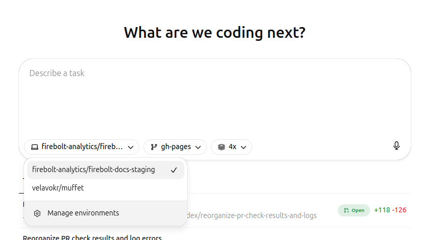
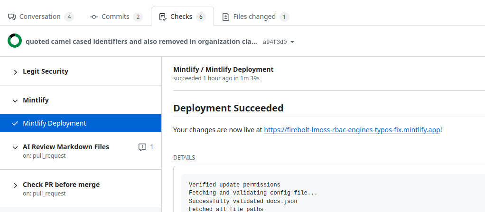

## About this repo
* This repository contains the source code for the Firebolt documentation (https://docs.firebolt.io/).
* Pages are in [MDX format](#about-mdx-format-and-mintlify-platform).
* Pages are hosted on [Mintlify](https://mintlify.com) platform. It offers [AI tooling](#ai-tools-in-mintlify), internal search and AI bot.
* Main branch is `gh-pages`. It is automatically published to https://docs.firebolt.io/.
* Main discussion channel is [#documentation](https://firebolt-analytics.slack.com/archives/C016HSVDP9U).
* Important: To improve the search and AI bot, set great [keywords](https://mintlify.com/docs/pages#internal-search-optimization) and [description](https://mintlify.com/docs/pages#descriptions) as it influences search and AI bot functionality.

## Known problems
* Mintlify sometimes doesn't generate previews for PRs. Check [here](#how-to-preview-remotely-in-mintlify) for workaround.
* The crawler link checker sometimes would fail on a fetch timeout.

## Quick start
* [Add a new page](#how-to-add-a-new-page).
* [Run local checks](#how-to-check-locally) using `make check-all`.
* [Preview the documentation locally](#how-to-preview-locally) using `make start-local`.
* [Preview the documentation remotely on Mintlify](#how-to-preview-remotely-in-mintlify).
* [Release changes](#how-to-release-changes).
* [Make AI work for you](#how-to-use-ai-tools-to-edit-documentation).

## Table of contents
<!-- TOC -->
  * [How to use AI tools to edit documentation](#how-to-use-ai-tools-to-edit-documentation)
    * [Devin](#devin)
    * [OpenAI Codex](#openai-codex)
  * [Guides for tooling](#guides-for-tooling)
    * [How to preview locally](#how-to-preview-locally)
    * [How to preview remotely in Mintlify](#how-to-preview-remotely-in-mintlify)
    * [How to check locally](#how-to-check-locally)
      * [Merge conflict markers check](#merge-conflict-markers-check)
      * [Navigation structure check](#navigation-structure-check)
      * [Link check](#link-check)
      * [SQL example check](#sql-example-check)
  * [Guides for editing](#guides-for-editing)
    * [How to add a new page](#how-to-add-a-new-page)
    * [How to move an existing page](#how-to-move-an-existing-page)
    * [How to add an interactive SQL example](#how-to-add-an-interactive-sql-example)
    * [How to release changes](#how-to-release-changes)
  * [Repository structure](#repository-structure)
  * [GitHub PR Workflow](#github-pr-workflow)
  * [About MDX format and Mintlify platform](#about-mdx-format-and-mintlify-platform)
    * [Key differences between MDX and MD formats](#key-differences-between-mdx-and-md-formats)
    * [Mintlify specifics](#mintlify-specifics)
    * [AI tools in Mintlify](#ai-tools-in-mintlify)
    * [Further references](#further-references)
<!-- TOC -->

## How to use AI tools to edit documentation

### Devin
[@Devin](https://devin.ai/) is an autonomous AI agent that can handle simple tasks such as documentation changes.
1. Tag [@devin](https://firebolt-analytics.slack.com/team/U08PTG2ADD3) in the App section of Slack or in a channel where it's added and give it a task.
2. Ask [@devin](https://firebolt-analytics.slack.com/team/U08PTG2ADD3) for changes and improvements in PR comments or in the Slack thread.

### OpenAI Codex
[OpenAI Codex](https://chatgpt.com/codex) is an autonomous AI agent that can handle simple tasks such as documentation changes.

1. Go to https://chatgpt.com/codex
2. Pick the "firebolt-analytics/firebolt-docs-staging" environment.
3. Describe the task.
4. When the task is ready, click it.
5. Choose the best variant and create a PR.
6. Use the chat box in OpenAI Codex interface (the link to the task can be found in the PR description) to ask it for changes and improvements.

## Guides for tooling

### How to preview locally
1. Run `make start-local`.
2. Open http://localhost:3000/ in your browser to preview the documentation.

### How to preview remotely in Mintlify
NB: There's a know bug when Mintlify skips redeploying the PR preview even when new changes were pushed to [docs-mdx/](docs-mdx). Here's what their support says about it:
> We've been able to investigate deeper and determined a few potential causes:
> 1. The PR you added pictures for is pointing at branch release/packdb-4.24. We only trigger preview deployments for PRs pointing at a deployBranch, which in their case is gh-pages
> 2. If the PR is opened with no changes to any docs content or docs.json, we won't create a preview deployment for it, which means any subsequent pushes to that PR won't update the preview deployment (because it doesn't exist)

1. Open a PR in the repository. Make sure to:
   * Have at lease some change in [/docs-mdx](/docs-mdx) directory. E.g. an insignificant change in a description of a page.
   * Temporarily set the `gh-pages` branch as the destination branch of the PR. This is just to trigger a preview generation, and can be changed once the preview build job in the CI/CD pipeline starts.
2. Wait for the CI/CD pipeline to run.
   * This will build the documentation and deploy it to a remote preview environment using `Mintlify` special workflow.
   * See the status of the deployment in the `Mintlify -> Mintlify Deployment` check in the pull request. There will be a link to the remote preview. 
3. Go to the preview by the link found in the build. The preview links are formed the following way: `https://firebolt-[your-branch-name-with-dashes].mintlify.app/` (e.g. `my_feature/new-page` has preview at `https://firebolt-my_feature-new-page.mintlify.app/`).

### How to check locally
Use `make check-all` or just `make` to run all checks.

#### Merge conflict markers check
`make check-markers` scans all files for Git merge conflict markers (`<<<<<<<`, `=======`, `>>>>>>>`).

#### Navigation structure check
`make check-navigation-regenerate` checks the navigation structure and adds all new pages [known_pages.json](known_pages.json).

It runs the following subchecks:
- `make check-group-structure` checks that the pages in [docs-mdx/docs.json](docs-mdx/docs.json) are organized into consistent groups and directory structure mirrors the navigational structure.
- `make check-lost-pages` checks that all MDX files are referenced in [docs-mdx/docs.json](docs-mdx/docs.json) unless they are explicitly listed in [hidden_pages.json](hidden_pages.json).
- `make check-redirect-loops` checks that there are no circular redirects in the documentation.
- `make check-lost-redirects-regenerate` checks that all known URLs (listed in [known_pages.json](known_pages.json)) either have a corresponding page in [docs-mdx/](docs-mdx) or a proper redirect in [docs-mdx/docs.json](docs-mdx/docs.json). It also updates [known_pages.json](known_pages.json) with new URLs.

#### Link check
`make check-links` verifies that no links in the documentation result in 404.

It runs the following subchecks:
  * `make check-internal-links` runs Mintlify's built-in broken link checker and validate internal links in the documentation.
  * `make check-links-using-crawler` to bring up a local site instance using `mint dev` and run [muffet](https://github.com/raviqqe/muffet) link crawler against it.

#### SQL example check
This checks that all `<QueryWindow/>` components in the documentation have pre-generated results that match the live Firebolt staging API results. See [here](#how-to-add-an-interactive-sql-example) on how to add a new interactive SQL example.
* `make check-sql` to check that all `<QueryWindow/>` components when run against live Firebolt staging API produce expected results.
* `make package-docs` to regenerate all results for all `<QueryWindow/>` components in the documentation.
* `make package-missing-docs` to generate results for all `<QueryWindow/>` components that don't have pre-generated results.

## Guides for editing
### How to add a new page
1. Before you start
   * Read the [MDX and Mintlify](#about-mdx-format-and-mintlify-platform) guide below.
   * See example at [function-template.mdx](function-template.mdx) or [here](docs-mdx/reference-sql/functions-reference/date-and-time/to-date.mdx).
2. Create the MDX file in the appropriate directory under [docs-mdx/](docs-mdx). Place images in [docs-mdx/assets/images](docs-mdx/assets/images). **No whitespace or upper case is allowed in the path.**
3. **Choose [keywords](https://mintlify.com/docs/pages#internal-search-optimization) and write great [description](https://mintlify.com/docs/pages#descriptions) to help Mintlify's search and AI bot to find the page.**
4. Add the file to the navigation structure in [docs-mdx/docs.json](docs-mdx/docs.json). **The navigation structure must reflect the directory structure.**
5. Run the checks (`make check-all` or `make`) to ensure everything is correct and automatically update the [known_pages.json](known_pages.json) file with the new URL.
6. Preview the page locally using `make start-local`.
7. Push the changes to the repository and open the PR. See [here](#how-to-release-changes) for how to release the changes.
8. Preview the results remotely (see how [here](#how-to-preview-remotely-in-mintlify)).

### How to move an existing page
NB: `mint rename` does a terrible job, do not use it.

1. Move the MDX file to the new location in [docs-mdx/](docs-mdx). **No whitespace or upper case is allowed in the path.**
2. Update all cross-references to the page in other MDX files.
3. Update the navigation structure in [docs-mdx/docs.json](docs-mdx/docs.json) with the new location. **The navigation structure must reflect the directory structure.**
4. Run `make check-links` and `make check-links-using-crawler` to find missed links.
5. Add a redirect from the old URL to the new URL in [docs-mdx/docs.json](docs-mdx/docs.json).
6. Run the checks (`make check-all` or `make`) to ensure everything is correct and automatically update the [known_pages.json](known_pages.json) file with the new URL.
7. Preview the page locally using `make start-local`.
8. Further steps as similar to [adding a new page](#how-to-add-a-new-page).

### How to add an interactive SQL example
The interactive examples run against a dedicated Firebolt documentation server. See an example [here](https://docs.firebolt.io/reference-sql/functions-reference/date-and-time/to-date) and its sources [here](docs-mdx/snippets/sql_examples/to_date_executable.mdx) and [here](docs-mdx/reference-sql/functions-reference/date-and-time/to-date.mdx).
1. Add `import {QueryWindow} from '/snippets/query-window.mdx';` at the top of the page if its not yet there. Don't add it more than once.
2. Add `<QueryWindow content={{"sql": "..(your SQL here)..", "result": ..(your result here)..}} />` where you want an interactive example on the page. For example:
    ```mdxjs
    import {QueryWindow} from '/snippets/query-window.mdx';
    
    <QueryWindow content={{
      "sql": "SELECT ABS(-200.50) AS result;",
      "result": {
        "data": [[200.5]],
        "meta": [{"name": "result", "type": "double"}],
        "query": { ... },
        "rows": 1,
        "statistics": { ... }
      }
    }} />
    ```
3. You can leave the `result` part empty and generate it using `make package-missing-docs`.
4. Preview the page locally using `make start-local` to ensure the example works as expected.
5. Further steps as similar to [adding a new page](#how-to-add-a-new-page).

### How to release changes
1. Open a pull request with the changes:
   * Use `gh-pages` branch if the changes should be published right away.
   * Use `release/packdb-X.YZ` branch (e.g. `release/packdb-4.24`) if the changes should be released with the next PackDB release.
2. Wait for the CI/CD pipleline to run and the Mintlify [preview deployment](#how-to-preview-remotely-in-mintlify) to complete.
3. The PR will appear in the [#documentation-prs](https://firebolt-analytics.slack.com/archives/C07H86T5R6U). Ask the owner team to review it.
4. Merge the PR when it's approved. The changes will be automatically published either to https://docs.firebolt.io (for `gh-pages` branch) or to https://firebolt-release-packdb-X-YZ.mintlify.app (for `release/packdb-X.YZ` branch).

## Repository structure
* [docs-mdx/](docs-mdx) contains all the MDX files for the documentation:
  * [docs-mdx/docs.json](docs-mdx/docs.json) defines the navigation structure of the documentation.
  * [docs-mdx/assets/](docs-mdx/assets) contains static assets like images, styles and scripts used in the documentation. All styles and scripts are embedded in the MDX files by mintlify. See [here](https://mintlify.com/docs/settings/custom-scripts). Note: there's no control over their order on the page.
  * [docs-mdx/snippets/](docs-mdx/snippets) contains reusable [snippets](https://mintlify.com/docs/reusable-snippets) and [components](https://mintlify.com/docs/react-components).
* [scripts/](scripts) contains checking scripts and utilities:
  * [scripts/check_group_structure.py](scripts/check_group_structure.py) checks that the pages in [docs-mdx/docs.json](docs-mdx/docs.json) are organized into consistent groups and directory structure mirrors the navigational structure.
  * [scripts/check_lost_pages.py](scripts/check_lost_pages.py) checks that all MDX files are referenced in [docs-mdx/docs.json](docs-mdx/docs.json) unless they are listed in [hidden_pages.json](hidden_pages.json).
  * [scripts/check_redirect_loops.py](scripts/check_redirect_loops.py) checks that there are no circular redirects in the documentation.
  * [scripts/check_lost_redirects.py](scripts/check_lost_redirects.py) checks that all known URLs (listed in [known_pages.json](known_pages.json)) either have a corresponding page in [docs-mdx/](docs-mdx) or a proper redirect in [docs-mdx/docs.json](docs-mdx/docs.json).
  * [scripts/check_sql_examples.py](scripts/check_sql_examples.py) checks that pre-generated results in `<QueryWindow/>` components are the same as the real results.
  * [scripts/check_merge_conflict_markers.sh](scripts/check_merge_conflict_markers.sh) checks that there are no Git merge conflict markers in the documentation files.
* [hidden_pages.json](hidden_pages.json) contains all pages that are intentionally not included in the navigation. This is to prevent accidental hiding of pages by forgeting to add them to [docs-mdx/docs.json](docs-mdx/docs.json).
* [known_pages.json](known_pages.json) contains all URLs that have ever existed in the documentation. This is used to check for lost redirects.
* [function-template.mdx](function-template.mdx) is an example page.
* [images/](images) contains images used in [README.md](README.md).

## GitHub PR Workflow

The [.github/workflows/pr-check.yml](.github/workflows/pr-check.yml) workflow runs four parallel jobs on every pull request:

* **check-basic-errors**: Merge conflict markers, legacy directory checks, navigation validation
* **check-broken-links**: Internal link validation using Mintlify
* **check-links-using-crawler**: External link validation (informational, doesn't block merge)
* **check-sql-examples**: SQL example validation (informational, doesn't block merge)
* **Mintlify**: This job runs the Mintlify deployment workflow to build and deploy the documentation to a [remote preview](#how-to-preview-remotely-in-mintlify).

## About MDX format and Mintlify platform
### Key differences between MDX and MD formats
* MDX is JSX-based, meaning:
  * All pages, custom tags and HTML tags are React components. Some HTML tags are not supported.
  * HTML tags need to be closed and lowercase (`<p></p>` instead of `<p>`, `<br/>` instead of `<BR>`).
  * Tag attributes are camel case (`className` instead of `class`, `frameBorder` instead of `frame-border` etc).
  * `style` HTML attributes are JSON objects and need to be wrapped in `{}`, e.g. `<span style={{"color": "red"}}></span>`.
* `{: ... }` and `` expressions are not supported. Use [components](http://mintlify.com/docs/components) or HTML tags instead.

### Mintlify specifics
* The navigation structure is defined in [docs-mdx/docs.json](docs-mdx/docs.json) and not in the MDX files themselves.
* Pages can be hidden by not including them in [docs-mdx/docs.json](docs-mdx/docs.json) and adding `noindex: true` to the frontmatter. 
  * `make check-lost-pages` build check requires that all pages are either included in [docs-mdx/docs.json](docs-mdx/docs.json) or listed in [hidden_pages.json](hidden_pages.json).
* There's section ToC in the left sidebar and page ToC in the right sidebar. Avoid adding ToC manually.
* Reusable snippets and components are defined in `docs-mdx/snippets/` and can be imported into MDX files.
* All styles and scripts found within [docs-mdx/](docs-mdx) are embedded into all pages, resulting in page bloat. Do not add script and style files unless absolutely necessary. See [here](https://mintlify.com/docs/settings/custom-scripts). There's no control over the order in which they end up on the page.

### AI tools in Mintlify
For AI Mintlify platform generates [.md](https://mintlify.com/docs/ai-ingestion) files and hosts [MCP server](https://mintlify.com/docs/mcp).

### Further references
* [Mintlify](https://mintlify.com) platform documentation:
  * [Page structure](https://mintlify.com/docs/pages)
  * [Navigation](https://mintlify.com/docs/navigation)
  * [Components](https://mintlify.com/docs/components)
  * [Reusable snippets](https://mintlify.com/docs/reusable-snippets)
  * [Custom scripts and styles](https://mintlify.com/docs/settings/custom-scripts)
* [MDX format documentation](https://mdxjs.com/docs/what-is-mdx/)
* [JSX format documentation](https://react.dev/learn/writing-markup-with-jsx) (it's under the hood of MDX)
