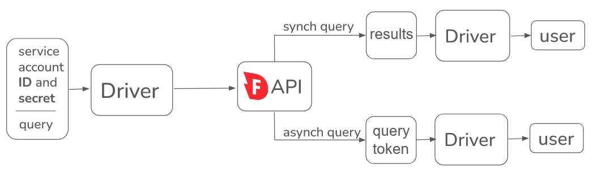

# API reference

The Firebolt API allows you to interact programmatically with Firebolt databases, enabling query execution, data retrieval, and engine management. API calls allow you to submit queries, retrieve results, and perform administrative tasks without using the user interface (UI). 

Firebolt provides official SDKs and drivers to simplify API interactions. These drivers act as an interface between your application and Firebolt, handling authentication, query submission, and result processing.



## **Drivers**
Drivers are software components that facilitate communication between applications and databases. Use a Firebolt drivers for:

- **Simplified API access** – Handles authentication and request formatting.
- **Optimized performance** – Enables efficient data streaming and query execution.
- **Secure authentication** – Uses service accounts for programmatic access. Firebolt provides multiple drivers and SDKs, including:

* [Node.js SDK]() &ndash; For JavaScript-based applications.
* [Python SDK]() &ndash; For Python-based applications and data workflows.
* [JDBC Driver]() &ndash; For Java applications.
* [SQLAlchemy]() &ndash; For ORM-based integrations in Python.
* [.NET SDK]() &ndash; For applications running on the .NET framework.
* [Go SDK]() &ndash; For applications using the Go programming language.

Firebolt also supports custom implementations if you need to build your own driver. Refer to the [developer documentation]() for details.

## **Prerequisites**
To submit API queries, you need:

1. **A Firebolt account** – [Sign up](https://go.firebolt.io/signup) if you do not have one.
2. **A Firebolt service account** – Required for programmatic access.
3. **A user associated with the service account** – The user must have the necessary permissions.
4. **A Firebolt database and engine** – Queries must be run on a valid database using an active engine.

## **Query types**
Firebolt supports two types of queries: synchronous and asynchronous queries.

### **Synchronous Queries**
A synchronous query waits for a response before proceeding. This mode is ideal for interactive queries that require immediate results, such as dashboard queries or user-initiated requests. Firebolt maintains an open HTTP connection for the duration of the query and streams results back as they become available.

### **Asynchronous Queries**
An asynchronous query runs in the background, allowing your application to continue executing other tasks. This is useful for long-running queries, such as `INSERT`, `VACUUM`, or `COPY INTO`, where waiting for a response is unnecessary. The query status can be checked periodically using a query token.

## **API Query Syntax**
Firebolt API queries are sent as JSON objects using a driver with the following structure:

```json
{
  "database": "<your_database_name>",
  "engine_name": "<your_engine_name>",
  "account": "<your_account_name>",
  "query": "SELECT * FROM my_table"
}

**Example API call**

The following code example connects to a Firebolt database using service account credentials, runs a SQL query to retrieve all records from `my_table`, and prints the query results:

```sql
from firebolt.db import connect
from firebolt.client.auth import ClientCredentials

id = "service_account_id"
secret = "service_account_secret"
engine_name = "your_engine_name"
database_name = "your_test_db"
account_name = "your_account_name"

query = "SELECT * FROM my_table;"

with connect(
    engine_name=engine_name,
    database=database_name,
    account_name=account_name,
    auth=ClientCredentials(id, secret),
) as connection:
    cursor = connection.cursor()
    cursor.execute(query)
    for row in cursor.fetchall():
        print(row)
```

