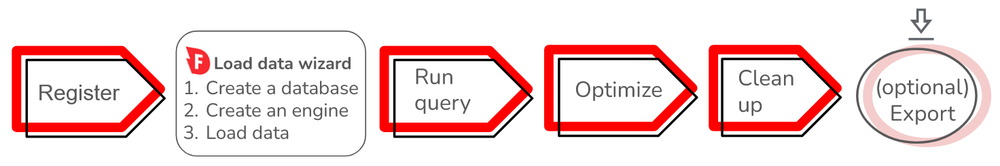
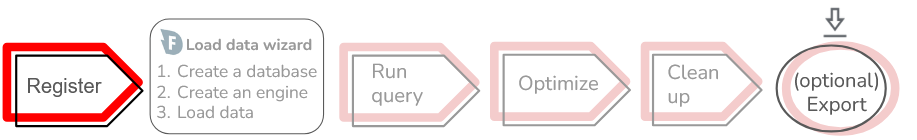
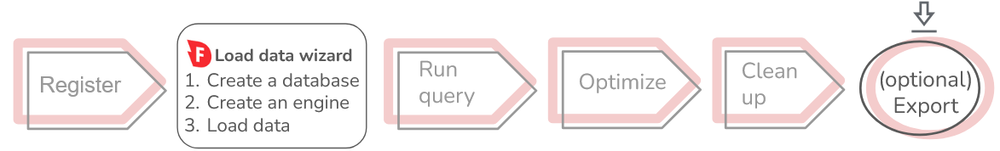
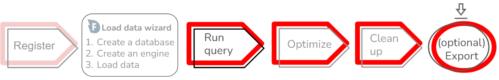

# Get started using a wizard
{:.no_toc}

The **Load data** wizard guides you through creating a database and engine, and loading data from an Amazon S3 bucket. You can specify basic configurations including what character to use as a file delimiter, which columns to import and their schema. After you load your data, continue your workflow in the SQL workspace to run and optimize a query, and export to an external table, as shown in the following diagram:

## Register with Firebolt

1. [Register](https://go.firebolt.io/signup) with Firebolt. Fill in your email, name, choose a password, and select ‘Get Started’.

2. Firebolt will send a confirmation to the address that you provided. To complete your registration, select ‘Verify’ in the email to take you to Firebolt’s [login page](https://go.firebolt.io/login). 

3. Type in your email and password and click ‘Log In’.

{: .note}
New accounts receive 600 Firebolt unit (FBU) credits ($200+) to get started exploring Firebolt’s capabilities.

Firebolt’s billing is based on engine runtime, measured in seconds. We also pass through AWS S3 storage costs at the rate of $23 per TB. The amount that you spend is dependent primarily on which engines you use and how long those engines are running.

You can view your total cost in FBU up to the latest second and in $USD up to the latest day. For more information, see the following **Create a Database** section. For more information about costs, see [Data Warehouse Pricing](https://www.firebolt.io/pricing). If you need to buy additional credits, connect Firebolt with your AWS Marketplace account. For more information about AWS Marketplace, see the following section: [Registering though AWS Marketplace section](./Getting-started-next-steps.md#register-through-the-aws-marketplace)

## Use the Load data wizard

 

You can use the **Load data** wizard to load data in either CSV or Parquet form.

 To start the **Load data** wizard, select the plus (+) icon in the Firebolt Workspace next to **Databases** in the left navigation pane and select **Load data**. The wizard will guide you through creating a database, an engine, and loading data. See [Load data using a wizard](../loading-data/loading-data-wizard.md#load-data-using-a-wizard) for detailed information about the workflow and the available options in the wizard.
 
 Even though the **Load data** wizard creates a database and engine for you, the [**Create a Database**](./introducing-the-sql-workspace.md#create-a-database) and [**Create an Engine**](./introducing-the-sql-workspace.md#create-an-engine) sections in the [Use SQL to load data](./get-started-sql-workspace.md) guide contains useful information about billing for engine runtime and schema.

To use the **Load data** wizard, select the plus (+) icon   For detailed information about how to use the Load data wizard, see [Load data](../loading-data/loading-data.md). 

## Run query, optimize, clean up and export

 

After you have loaded your data in the wizard, the rest of the steps in getting started are the same as if you ran your workflow in SQL. You can use either the Develop space in the Firebolt Workspace to enter SQL, or use the [Firebolt API](../query-data/using-the-api.md).

* For information about how to get started running a query, see [Run query](./get-started-sql-workspace.md#run-query).

* For informatiom about how to get started optimizing your workflow, see [Optimize your workflow](get-started-sql-workspace.md#optimize-your-workflow).

* For information about how to get started clean up resources and data, see [Clean up](./get-started-sql-workspace.md#).
* For information on how to export your data, see [Export data](get-started-sql-workspace.md#export-data).

## Next steps

To continue learning about Firebolt's architecture, capabilities, using Firebolt after your trial period, and setting up your organization, see [Resources beyond getting started](./get-started-next.md).