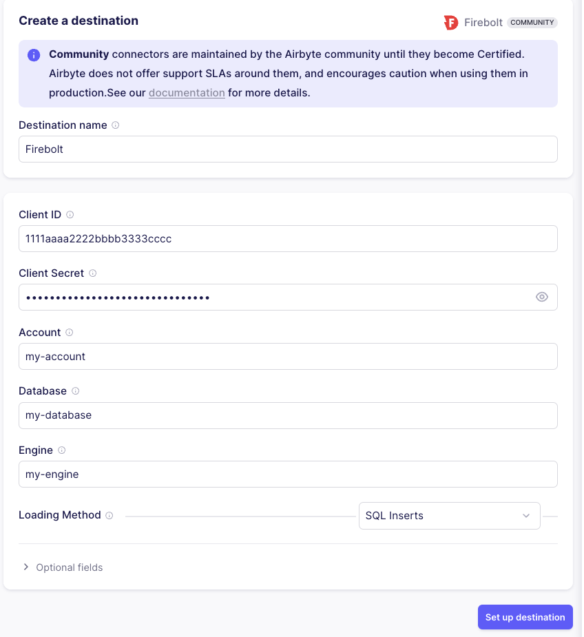
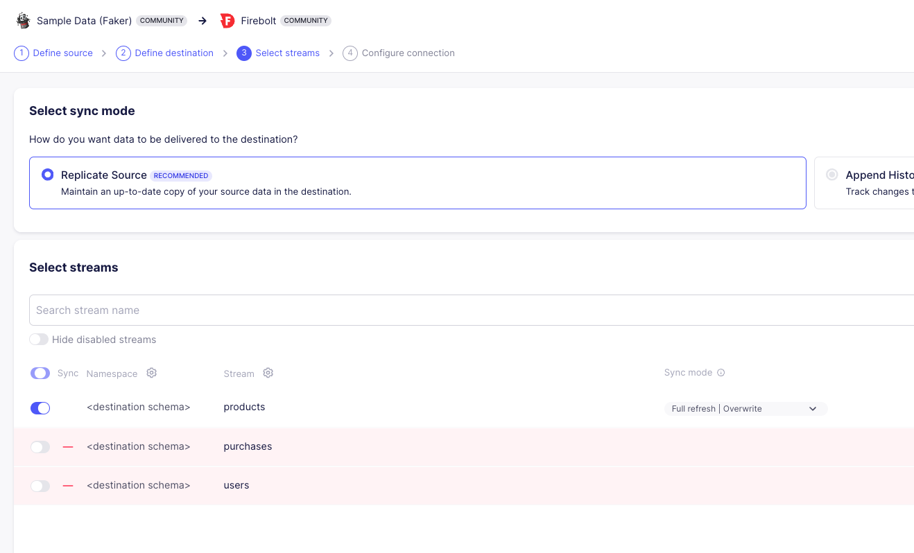
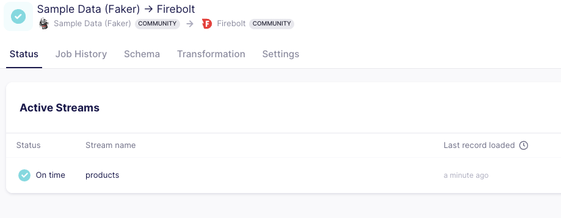

# Overview


Airbyte is an open-source data integration platform that significantly simplifies the ETL (Extract, Transform, Load) process, making it easier for users to manage and migrate their data across various sources. By providing a user-friendly interface and robust functionality, Airbyte enables seamless data movement and transformation, catering to a wide range of data integration needs. One of the key features of Airbyte is its extensive range of connectors, which allow it to integrate with numerous data sources and destinations.

Using Airbyte's Firebolt connector, users can efficiently and effortlessly load large amounts of data to and from Firebolt. This capability extends to integration with a wide array of data sources, thanks to Airbyte's extensive library of connectors. Whether your data resides in cloud storage, on-premises databases, SaaS applications, or other data warehouses, Airbyte facilitates smooth and reliable data transfer between these sources and Firebolt.

# Quickstart

There are several [ways](https://docs.airbyte.com/deploying-airbyte) to deploy Airbyte. In this tutorial we will the easiest way to start prototyping by using a [Docker Compose](https://docs.docker.com/compose/) deployment locally.

If you already have an airbyte deployment skip to the [configuration section](#step-2-configure-firebolt-connection-via-ui).


#### Prerequisites

1. **Docker**: Ensure you have Docker installed. You can download it from [here](https://www.docker.com/products/docker-desktop).
2. **Firebolt Account**: You need an active Firebolt account. Sign up [here](https://www.firebolt.io/) if you don’t have one.
3. **Firebolt Database and Table**: Make sure you have a Firebolt database and table with data ready for querying.
4. **Firebolt Service Account**: Create a [service account](../managing-your-organization/service-accounts.md) in Firebolt and note its id and secret.

#### Step 1: Deploy Airbyte Locally with Docker

1. Create a new directory for your Airbyte setup:
   ```bash
   git clone --depth=1 https://github.com/airbytehq/airbyte.git
   ```

2. Switch to the Airbyte directory:
   ```bash
   cd airbyte
   ```

3. Start Airbyte by running the following command in the terminal:
   ```bash
    ./run-ab-platform.sh
   ```

4. Open your browser and navigate to `http://localhost:8000` to access the Airbyte UI.

5. You will be asked for a username and password. By default the username is `airbyte` and the password is `password`. Before you deploy Airbyte in production make sure to change the password.

#### Step 2: Configure Firebolt Connection via UI

1. In the Airbyte UI, click on the **"Connections"** tab and select **"Create your first connection"**.
2. Click on **"New Destination"** and select **"Firebolt"** as the destination type.
3. Enter your Firebolt connection details:
   - Client ID: Your service account id.
   - Client Secret: Your service account secret.
   - Database: Your database name.
   - Account: Your firebolt [account](../managing-your-organization/managing-accounts.md).
   - Engine: Firebolt engine which will run the ingestion.
   - Host (Optional): For non-standard use cases. Should be left blank.
4. Select replication strategy. SQL is easier to setup but S3 is more performant on production loads. See the [Airbyte doc](https://docs.airbyte.com/integrations/destinations/firebolt) for more information.
5. Save.

   


#### Step 3: Create a Connection in Airbyte

1. In the Airbyte UI, click on the **"Connections"** tab and select **"Create your first connection"** (**"New Connection"** if you already have a connection defined).
2. Choose a source from which you want to extract data. We'll be using **Faker** to generate some sample data.
3. Leave fields as is and click **"Set up source"**.
4. Next in the destination screen select the Firebolt destination you configured earlier.
5. Select the streams you want to replicate and sync mode (Full refresh or Incremental). To save time select only "products" stream.
6. Finally specify the frequency of your data repication or manual if you want to trigger the job in UI or via an API call.
7. Click **"Set up connection"** to start syncing data from your source to Firebolt!

   

#### Step 4: Monitor and Manage Data Syncs

1. Use the Airbyte UI to monitor your data syncs and ensure that data is being transferred accurately and efficiently.
2. Adjust sync settings and transformations as needed to optimize your ETL process. You can leverage DBT to

   

### Output schema

The Firebolt Destination connector is a V1 connector, meaning it works with raw data. Refer to Airbyte’s [Destination V2 document](https://docs.airbyte.com/using-airbyte/core-concepts/typing-deduping#what-is-destinations-v2) to learn about the differences. Each stream is written into its own [Fact table](../../Overview/working-with-tables/working-with-tables.md#fact-and-dimension-tables) in Firebolt, containing three columns:

*`_airbyte_ab_id`: a UUID assigned by Airbyte to each processed event. The column type is TEXT.
* `_airbyte_emitted_at`: a TIMESTAMP indicating when the event was pulled from the source.
* `_airbyte_data`: a JSON blob representing event data, stored as TEXT, but can be parsed using [JSON functions](../../sql_reference/functions-reference/JSON/index.md).

### Further Reading

After setting up Airbyte with Firebolt, explore these resources to leverage additional features and enhance your data integration capabilities:

1. Learn how to use [Firebolt Source](https://docs.airbyte.com/integrations/sources/firebolt).
2. Ensure you're following [security guidelines](https://docs.airbyte.com/operating-airbyte/security).
3. Explore other [deployment options](https://docs.airbyte.com/deploying-airbyte).
4. Configure your [connections](https://docs.airbyte.com/cloud/managing-airbyte-cloud/configuring-connections).
