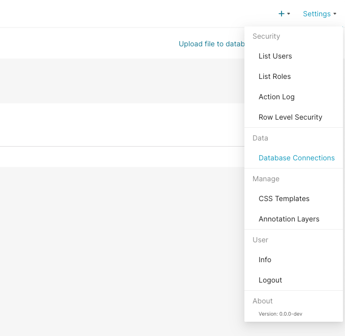
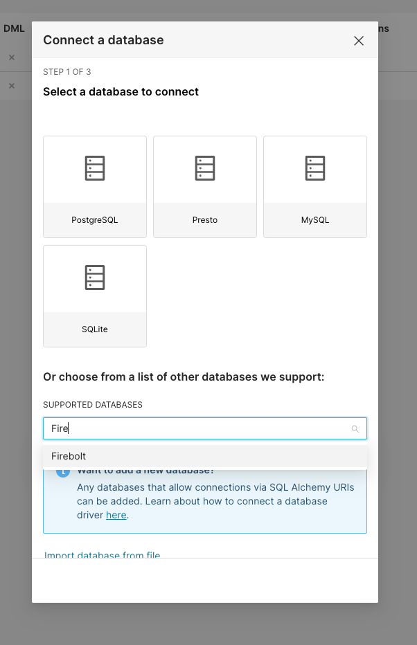
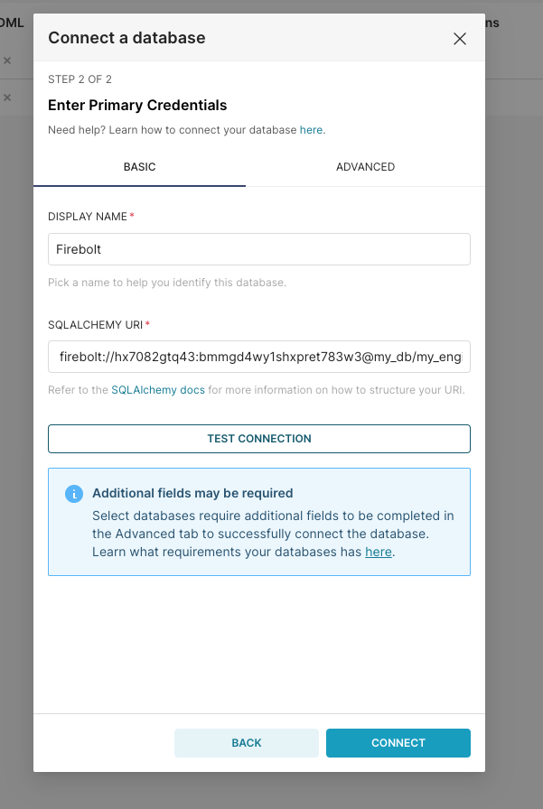
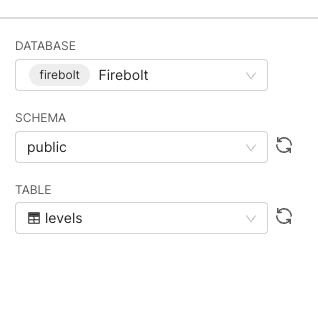
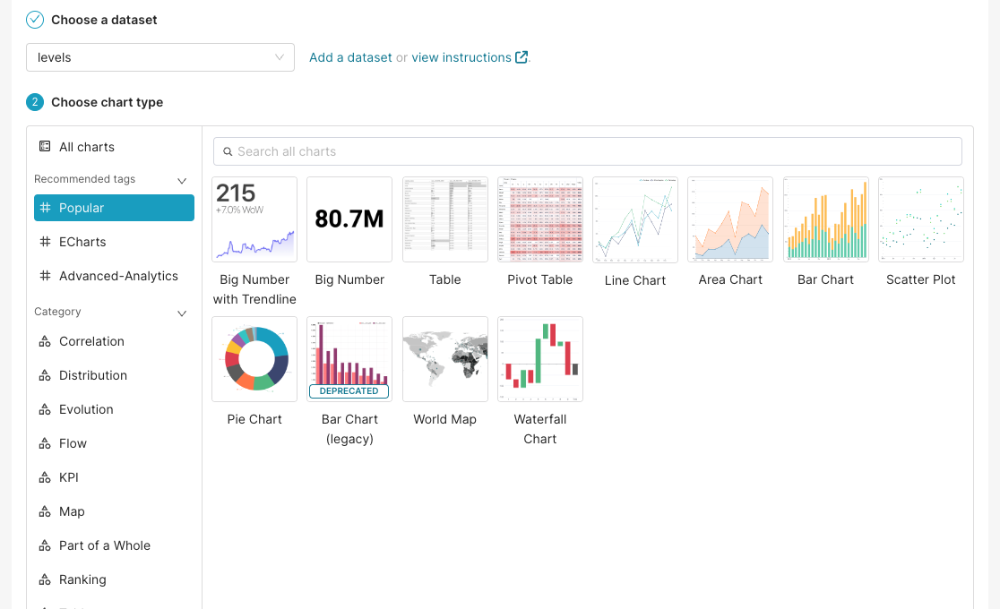
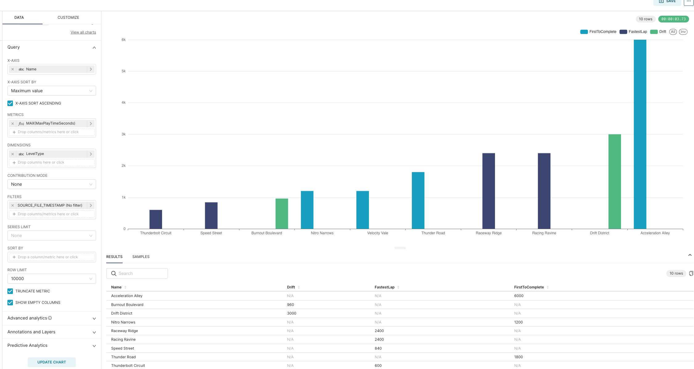

# Apache Superset

[Apache Superset](https://superset.apache.org) is an open-source data exploration and visualization platform that empowers users to create interactive, shareable dashboards and charts for analyzing and presenting data. It supports a wide range of data sources and provides an intuitive, web-based interface for data exploration, slicing, and dicing, with features like dynamic filtering, pivot tables, and drag-and-drop functionality. Superset also offers a rich set of visualization options and can be extended through custom plugins, making it a versatile tool for data analysts and business users to gain insights from their data and collaborate effectively.

With its exceptional speed and scalability, Firebolt allows users to handle vast amounts of data with minimal query latency, ensuring that Superset dashboards and visualizations load quickly, even when dealing with massive datasets. This integration between Firebolt and Superset creates a powerful combination for data professionals, offering them a streamlined and efficient workflow for extracting maximum value from their data.

# Prerequisites

Superset can be installed in several ways, including using a pre-built [Docker container](https://superset.apache.org/docs/installation/installing-superset-using-docker-compose), building it from [source](https://superset.apache.org/docs/installation/installing-superset-from-scratch) or deploying via [Kubernetes Helm chart](https://superset.apache.org/docs/installation/running-on-kubernetes).

The easiest way to get started is to run Superset via Docker.

You will need:

* [Docker](https://www.docker.com/) and [Docker Compose](https://docs.docker.com/compose/).
* [VirtualBox](https://www.virtualbox.org/) (Windows only).
* [Git](https://git-scm.com/).

# Quickstart

Follow this guide to setup Superset and get your first chart ready.

### Setup Superset
1. Clone Superset's GitHub [repository](https://github.com/apache/superset)
```shell
git clone https://github.com/apache/superset.git
```

2. Change directory to the root of the newly cloned repository and add the Firebolt driver
```shell
cd superset
touch ./docker/requirements-local.txt
echo "firebolt-sqlalchemy" >> ./docker/requirements-local.txt
```

3. Run Superset via Docker Compose
```shell
docker compose -f docker-compose-non-dev.yml up
```

4. (Optional) Verify firebolt driver is present in Superset container
```shell
docker exec -it <container_name> bash
pip freeze | grep firebolt
```
You should see `firebolt-sqlalchemy` in the output.

Once your Superset is booted up you should be able to access it in http://localhost:8088/

> **Note:** For more installation details, refer to [Adding New Database Drivers in Docker](https://superset.apache.org/docs/databases/docker-add-drivers) in the Superset documentation.

### Setup Firebolt connection

After the initial setup in Superset User Inteface head to the `Settings -> Database connections` in the top right corner.



On the next screen, press the `+ Database` button and select Firebolt from the dropdown. If you don't see Firebolt in the list, please refer to the [Setup Superset](#setup-superset) section for instructions on how to install the Firebolt driver and verify that the driver is present.




The connection expects a SQLAlchemy connection string of the form:

```
firebolt://{client_id}:{client_secret}@{database}/{engine_name}
```

To authenticate, use a service account ID and secret.
A service account is identified by a `client_id` and a `client_secret`.
Learn how to generate an ID and secret [here](../managing-your-organization/service-accounts.md).



Click the Test Connection button to confirm things work end to end. If the connection looks good, save the configuration by clicking the Connect button in the bottom right corner of the modal window.
Now you're ready to start using Superset!

### Build your first chart

> **Note:**  This section assumes you have followed Firebolt [tutorial](../getting-started.md) and loaded a sample data set into your database.

Now that you’ve configured Firebolt as a data source, you can select specific tables (Datasets) that you want to see in Superset.

Go to Data -> Datasets and select `+ Dataset`. There you can select your sample table by specifying Firebolt as your Database, your schema and the table name you chose.



Press "Create Dataset and Create Chart". On the next screen you can select your desired chart type. For this tutorial we will go with a simple Bar Chart.



In the next screen you can drag and drop your table columns into Metrics and Dimensions, specify filters or sorting orders. We will plot max play time per level grouping it by level type and sorting the x-axis in ascending order.



Your first chart is ready! You can now save it, add more data to it or change its type. You can also start building a dashboard with different charts telling a story. Learn more about this functionality and more by following the links below.

# Further reading

* [Creating your first Dashboard](https://superset.apache.org/docs/creating-charts-dashboards/creating-your-first-dashboard).
* [Exploring data](https://superset.apache.org/docs/creating-charts-dashboards/exploring-data).
* [Preset](https://preset.io/) - managed Superset.
