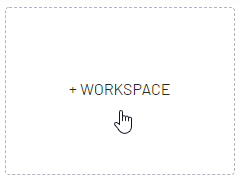
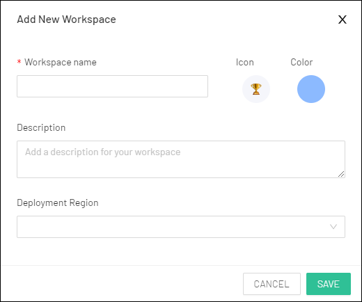
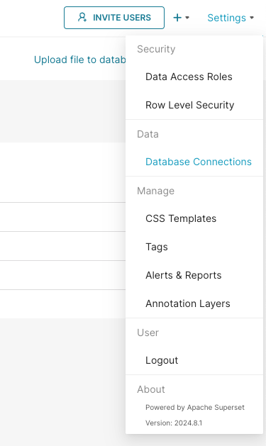

# Preset

[Preset](https://preset.io/) is a cloud-hosted data exploration and visualization platform built on top of the popular open-source project, [Apache Superset](https://superset.apache.org/). This fully managed service makes it easy to run Superset at scale with enterprise-ready security, reliability, and governance.

Boasting exceptional speed and scalability, Firebolt enables users to adeptly manage substantial data volumes with minimal query latency. The integration with Preset establishes a strong partnership for data professionals, presenting them with a streamlined and efficient workflow. This collaboration ensures prompt loading of Preset dashboards and visualizations, even when confronted with extensive datasets, thereby facilitating the extraction of maximum value from their data.

# Prerequisites

Preset is a managed service so most of the deployment requirements are handled by them.

You will only need:
* To [register](https://manage.app.preset.io/starter-registration/) a Preset account.
* To have a Firebolt account and service account [credentials](../managing-your-organization/service-accounts.md).
* [Load data](../loading-data/loading-data.md) you want to visualise.

# Quickstart

### Create a workspace

A workspace is an organizational unit, accessible by team members, that is created for a specific purpose. You can read Preset's [guidance](https://docs.preset.io/docs/about-workspaces) on workspaces to learn more.

1. To Create a Workspace, navigate to the empty card and select + Workspace.

    

2. Define Workspace name and settings

    

3. Save the workspace and enter it by clicking the card.

### Setup Firebolt connection


After the initial setup in Preset User Inteface head to the `Settings -> Database connections` in the top right corner.



On the next screen, press the `+ Database` button and select Firebolt from the dropdown.


The connection expects a SQLAlchemy connection string of the form:

```
firebolt://{client_id}:{client_secret}@{database}/{engine_name}?account_name={account_name}
```

To authenticate, use a service account ID and secret.
A service account is identified by a `client_id` and a `client_secret`.
Learn how to generate an ID and secret [here](../managing-your-organization/service-accounts.md).

Account name must be provided, you can learn about accounts in [Manage accounts](../managing-your-organization/managing-accounts.md) section.


Click the Test Connection button to confirm things work end to end. If the connection looks good, save the configuration by clicking the Connect button in the bottom right corner of the modal window.
Now you're ready to start using Preset!

### Build your first chart

To build a chart you can follow our guide in the [Superset section](connecting-to-apache-superset.md#build-your-first-chart), as the Preset works identically.

# Further reading

* [Creating a chart](https://docs.preset.io/docs/creating-a-chart) walkthrough.
* [Creating a Dashboard](https://docs.preset.io/docs/creating-a-dashboard).
* [Collaboration features of Preset](https://docs.preset.io/docs/sharing-and-collaboration).
* [Storytelling in charts](https://docs.preset.io/docs/storytelling-with-charts-and-dashboards-mini-guide).
