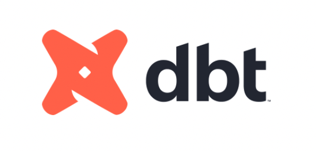

# Overview



[DBT](https://www.getdbt.com), or Data Build Tool, is a framework designed for managing and executing data transformations within modern data warehousing architectures. It facilitates the development and deployment of SQL-based transformations in a version-controlled environment, enabling collaboration and ensuring reproducibility of data pipelines. DBT streamlines the process of transforming raw data into analytics-ready datasets, accelerating the delivery of insights.

The Firebolt adapter for dbt brings together dbt's state-of-the-art development tools and Firebolt's next-generation analytics performance. On top of dbt's core features, the adapter offers native support for all of Firebolt's index types and has been specifically enhanced to support ingestion from S3 using Firebolt's external tables mechanics.


# Prerequisites

There are two ways to deploy DBT: self-hosted [DBT Core](https://docs.getdbt.com/docs/introduction#dbt-core) and managed [DBT Cloud](https://docs.getdbt.com/docs/cloud/about-cloud/dbt-cloud-features).

In this guide we'll setup a local installation of [DBT Core](https://docs.getdbt.com/docs/introduction#dbt-core). We will use Python's package manager `pip`, but there are ways to install DBT via [Homebrew](https://docs.getdbt.com/docs/core/homebrew-install), [Docker](https://docs.getdbt.com/docs/core/docker-install), and from [source](https://docs.getdbt.com/docs/core/source-install).

You will need:

* GitHub account
* Python 3.8+

# Quickstart

Following this guide, you will setup DBT with Firebolt and run your first DBT [model](https://docs.getdbt.com/docs/build/models).

### Setup DBT Core

1. Create a new Python [virtual environment](https://docs.python.org/3/library/venv.html)
    ```shell
    python3 -m venv dbt-env
    ```
2. Activate your venv
    ```shell
    source dbt-env/bin/activate
    ```
3. Install Firebolt's [adapter](https://github.com/firebolt-db/dbt-firebolt) for DBT
    ```shell
    python -m pip install dbt-firebolt
    ```
4. (Optional) Check that both dbt packages are installed
    ```shell
    python -m pip list | grep dbt
    ```
    This command should return `dbt-core` and `dbt-firebolt` and their versions.


### Setup connection to Firebolt

DBT uses a `profiles.yml` file to store the connection information. This file generally lives outside of your dbt project to avoid checking in sensitive information in to version control.

The usual place to create this file on Mac and Linux is `~/.dbt/profiles.yml`.

1. Open `~/.dbt/profiles.yml` with your preferred text editor.
2. Paste the following sample configuration:
    ```yaml
    jaffle-shop:
    target: dev
    outputs:
        dev:
        type: firebolt
        client_id: "<client-id>"
        client_secret: "<client-secret>"
        database: "<database-name>"
        engine_name: "<engine-name>"
        account_name: "<account-name>"
    ```
3. Replace the placeholders with your account's information.

    `<client-id>` and `<client-secret>` are key and secret of your service account. If you don't have one, follow the steps in the [Manage service accounts](../managing-your-organization/service-accounts.md) page to learn how to set one up.

    `<database-name>` and `<engine-name>` are the Firebolt's database and engine that you want your queries to run.

    `<account-name>` is a Firebolt account that you're connected to. Learn more [here](../managing-your-organization/managing-accounts.md).

### Setup Jaffle Shop, a sample dbt project

`jaffle_shop` is a fictional ecommerce store. This dbt project transforms raw data from an app database into a customers and orders model ready for analytics. [Our version](https://github.com/firebolt-db/jaffle_shop_firebolt) is designed to showcase Firebolt's integration with DBT.

1. Clone `jaffle-shop-firebolt` repository and change to the newly created directory.
    ```shell
    git clone https://github.com/firebolt-db/jaffle_shop_firebolt.git
    cd jaffle_shop_firebolt
    ```

2. Ensure your profile is setup correctly.
    ```shell
    dbt debug
    ```

    If you're seeing an error here, check that your `profile.yml` is [setup correctly](#setup-connection-to-firebolt), is in the right directory on your system, and that the [engine](../operate-engines/operate-engines.md). is running.
    Also check that you're still in `dbt-env` virtual Python environment that we've [setup earlier](#setup-dbt-core) and that both packages are present.


3. Install dependent packages.
    ```shell
    dbt deps
    ```

4. Run the external table model. If your database is not in `us-east-1` AWS region then refer to the [Readme](https://github.com/firebolt-db/jaffle_shop_firebolt) on how to copy the files.
    ```shell
    dbt run-operation stage_external_sources
    ```

5. Load sample CSV in your database.
    ```shell
    dbt seed
    ```

6. Run the models.
    ```shell
    dbt run
    ```

Now in your database you should see the tables `customers` and `orders` generated with the help of the dbt models! From here you can explore more capabilities of DBT, like incremental models, documentation generation and more by following the official guides from the section below.

# Limitations

Not every feature of DBT is supported in Firebolt. You can find an up-to-date list of features in the [adapter documentation](https://github.com/firebolt-db/dbt-firebolt?tab=readme-ov-file#feature-support).


# Further reading

* [Configuring Firebolt-specific features](https://docs.getdbt.com/reference/resource-configs/firebolt-configs).
* [Incremental models](https://docs.getdbt.com/docs/build/incremental-models).
* [Data tests](https://docs.getdbt.com/docs/build/data-tests).
* [Documenting your models](https://docs.getdbt.com/docs/collaborate/documentation).
