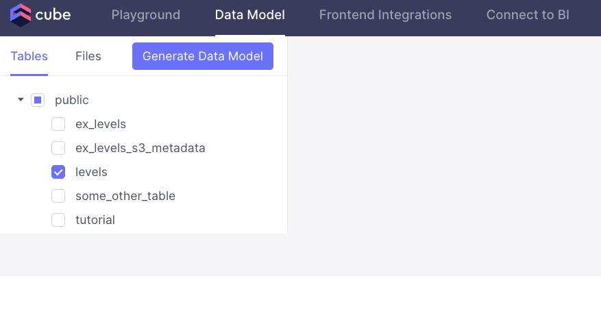
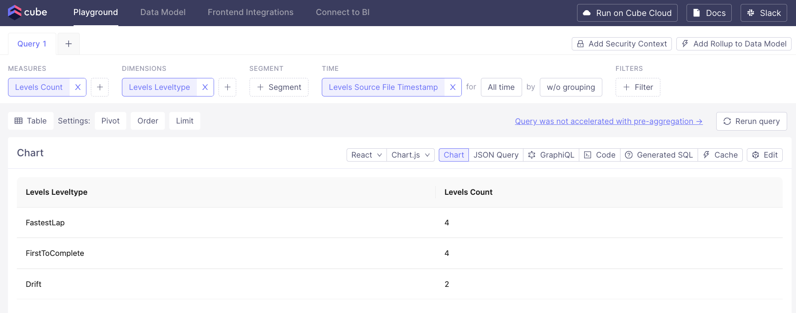

# Overview


Cube.js is an open-source analytical API platform that empowers developers to build custom and scalable analytics solutions. By acting as an intermediary between your data sources and front-end applications, Cube.js simplifies the process of querying large datasets and ensures efficient data management and visualization.

Integrating Cube.js with Firebolt significantly enhances the data processing capabilities of your analytics stack. Firebolt’s ability to execute complex queries with minimal latency aligns perfectly with Cube.js’s goal of delivering fast and responsive analytics. As a result, users benefit from a seamless and highly performant analytics experience, making it an ideal solution for businesses looking to scale their data operations without compromising on speed or efficiency.

# Quickstart: Connecting Cube.js to Firebolt

Follow these steps to quickly connect Cube.js to Firebolt and start building powerful analytics solutions using Docker. For this demo we'll be using [Cube Core](https://cube.dev/docs/product/getting-started/core). For other deployment options follow the Cube [documentation](https://cube.dev/docs/product/deployment).

#### Prerequisites

1. **Docker**: Ensure you have Docker installed. You can download it from [here](https://www.docker.com/products/docker-desktop).
2. **Firebolt Account**: You need an active Firebolt account. Sign up [here](https://www.firebolt.io/) if you don’t have one.
3. **Firebolt Database and Table**: Make sure you have a Firebolt database and table with data ready for querying. Follow [Getting started tutorial](../getting-started.md) to set up some sample data.
4. **Firebolt Service Account**: Create a [service account](../managing-your-organization/service-accounts.md) in Firebolt and note its id and secret.

#### Step 1: Create a Cube.js Project with Docker

1. Create a new directory for your Cube.js project:
   ```bash
   mkdir cubejs-firebolt
   cd cubejs-firebolt
   touch docker-compose.yml
   ```

2. Create a `docker-compose.yml` file with the following content:
   ```yaml
   version: "2.2"

   services:
     cube:
       image: cubejs/cube:latest
       ports:
        - 4000:4000
        - 15432:15432
       environment:
         CUBEJS_DEV_MODE: "true"
       volumes:
         - .:/cube/conf
   ```

#### Step 2: Start Cube.js

1. Run the Cube.js development server using Docker Compose:
   ```bash
   docker compose up -d
   ```

2. Open your browser and navigate to `http://localhost:4000`. You should see the Cube.js [playground](https://cube.dev/docs/product/workspace/playground).

#### Step 3: Configure Firebolt Connection via UI

The Playground has a database connection wizard that loads when Cube is first started up and no .env file is found. After database credentials have been set up, an .env file will automatically be created and populated with credentials.

1. Select **Firebolt** as the database type.
1. Enter your Firebolt credentials:
   - **Client ID**: Your service account ID
   - **Client Secret**: Your service account secret
   - **Database**: Your Firebolt database name
   - **Account**: Your [account](../managing-your-organization/managing-accounts.md) name
   - **Engine Name**: Your Firebolt engine name
1. Click "Apply" to set up the connection

#### Step 4: Generate Schema Using UI

You should see tables available to you from the configured database

1. Select the `levels` table.
1. After selecting the table, click Generate Data Model and pick either YAML (recommended) or JavaScript format.
1. Click build.

   

You can start exploring your data!

#### Step 5: Query data in Playground

Select measures, dimensions and filters to explore your data!

   

Congratulations! You have successfully connected Cube.js to Firebolt and can now start building high-performance analytics solutions. For more detailed configuration and advanced features, refer to the [Cube.js documentation](https://cube.dev/docs) and [Firebolt documentation](https://docs.firebolt.io/).


### Further Reading

After setting up Cube.js with Firebolt, you can explore and leverage several powerful features to enhance your analytics capabilities. Here are some resources to help you get started:

1. **Cube.js Data Blending**: Understand how to combine data from different sources for more comprehensive analysis.
   [Cube.js Data Blending Documentation](https://cube.dev/docs/product/data-modeling/concepts/data-blending)

1. **Cube.js Security**: Implement row-level security to ensure your data is accessed appropriately.
   [Cube.js Security Documentation](https://cube.dev/docs/security)

1. **Cube.js API**: Explore the Cube.js REST API to programmatically access your data and build custom integrations.
   [Cube.js API Reference](https://cube.dev/docs/rest-api)

1. **Cube.js Dashboard App**: Build and deploy powerful dashboards using Cube.js and your favorite front-end frameworks.
   [Cube.js Dashboard App Documentation](https://cube.dev/docs/dashboard-app)

These resources will help you unlock the full potential of Cube.js and create robust, high-performance analytics solutions.
