This section will walk you through the steps to create security credentials in AWS. These credentials will be used to load data from AWS S3 into Firebolt.

In order to enable Firebolt to load data from your S3 buckets, you must:
  1. Create a user
  2. Create appropriate permissions for this user
  3. Create access credentials to authenticate this user. 

## Create User

1. Log into your AWS Management console and go to the IAM section. You can do this by typing "IAM" in the search bar.

2. Once you are in the IAM section, click the **Create User**  button.

   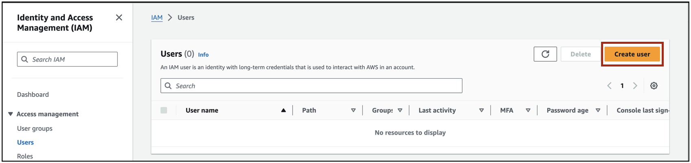{: width="800" .centered}

3. Enter a name for the user and click **Next**

    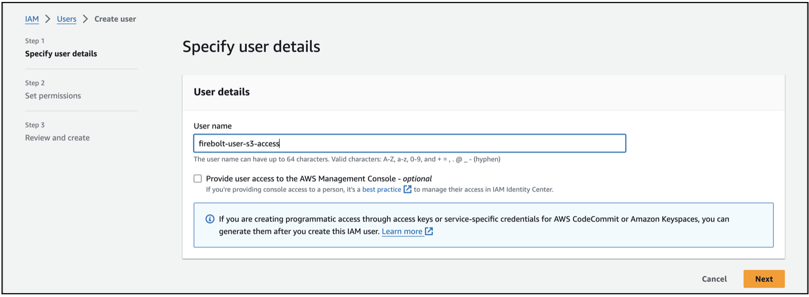{: width="800" .centered}

4. You can have the default permission option set to **Add user to group** and click **Next**

    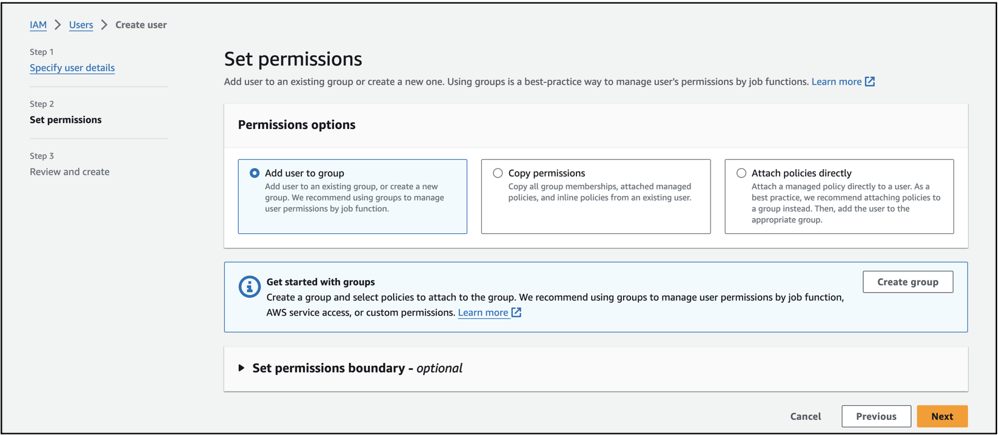{: width="600" .centered}

5. Click **Create User**

    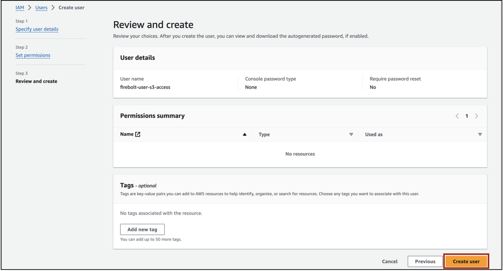{: width="800" .centered}

6. You will see a message **User created successfully**

    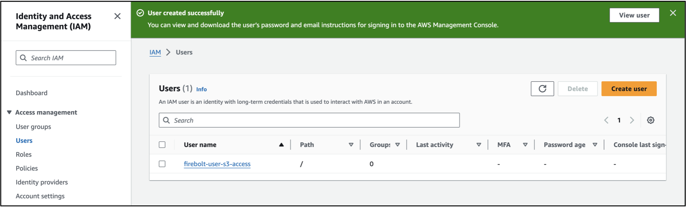{: width="800" .centered}

## Create S3 Access Permissions

Now that you have created the user, you will now assign this user appropriate permissions for S3. 

1. Click on the user name as shown below.

   {: width="800" .centered}

2. In the Permissions tab, click the **Add Permissions** drop-down and choose **Create inline policy**

   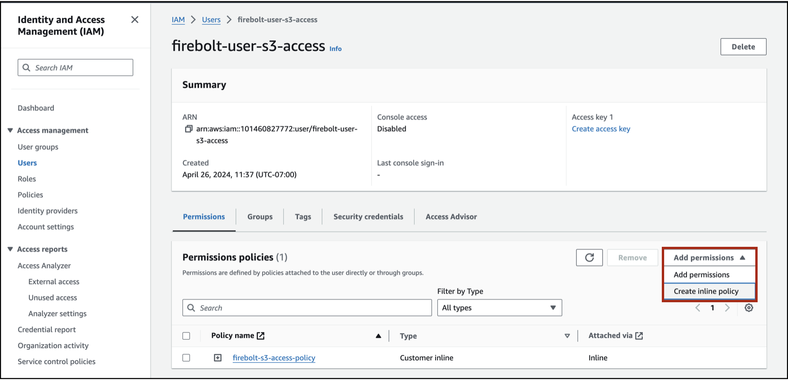{: width="800" .centered}

3. In **Specify Permissions** choose S3 as the service. 

   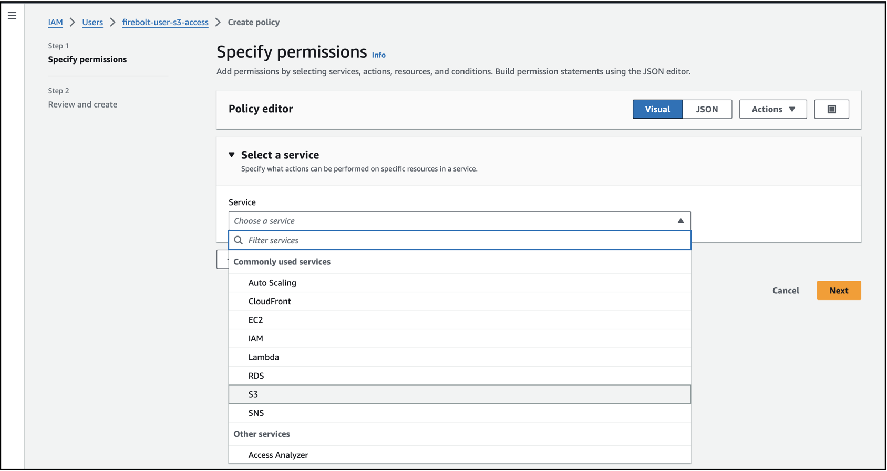{: width="800" .centered}

4. Choose JSON, paste the below JSON code in the policy editor and click **Next**

   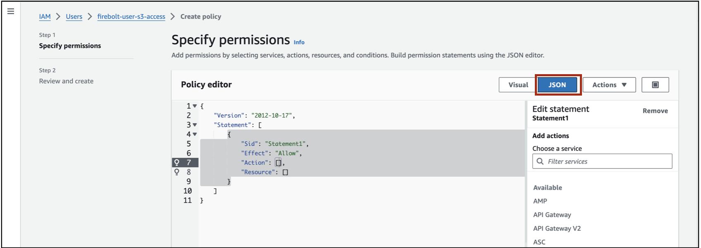{: width="800" .centered}

   ```javascript
   {
      "Version": "2012-10-17",
      "Statement": [
          {
              "Effect": "Allow",
              "Action": [
                  "s3:GetObject",
                  "s3:GetObjectVersion"
              ],
              "Resource": "arn:aws:s3:::<bucket>/<prefix>/*"
          },
          {
              "Effect": "Allow",
              "Action": "s3:GetBucketLocation",
              "Resource": "arn:aws:s3:::<bucket>"
          },
          {
              "Effect": "Allow",
              "Action": "s3:PutBucket",
              "Resource": "arn:aws:s3:::<bucket>"
          },
          {
              "Effect": "Allow",
              "Action": "s3:ListBucket",
              "Resource": "arn:aws:s3:::<bucket>",
              "Condition": {
                  "StringLike": {
                      "s3:prefix": [
                          "<prefix>/*"
                      ]
                  }
              }
          }
      ]
   }
   ```
<<<<<<< HEAD
**IMPORTANT:** In the above, for the "Resource" field, make sure to replace "bucket"  with the S3 bucket to which you want to provide access.
=======
**IMPORTANT:** Make sure to replace "<bucket>"  with the S3 bucket to which you want to provide access.
>>>>>>> rn/gh-pages

5. Enter a description for the policy and click **Create Policy**

   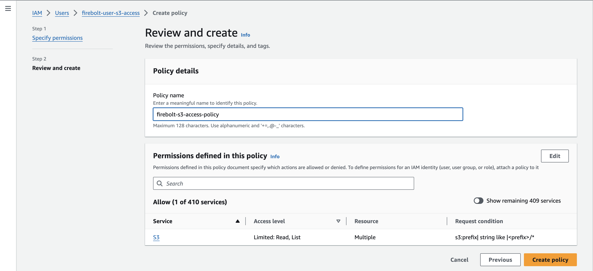{: width="800" .centered}

6. You will see a message that the policy has been successfully created.

## Create Access Key and Secret ID

Now that you have created a user, authorized the user with the appropriate S3 permissions, you will create access credentials for this user. These credentials will be used to authenticate the user.

1. Click on the **Security Credentials** tab as shown below.

   {: width="800" .centered}

2. In the **Access Keys** section click the **Create Access Key** button.

   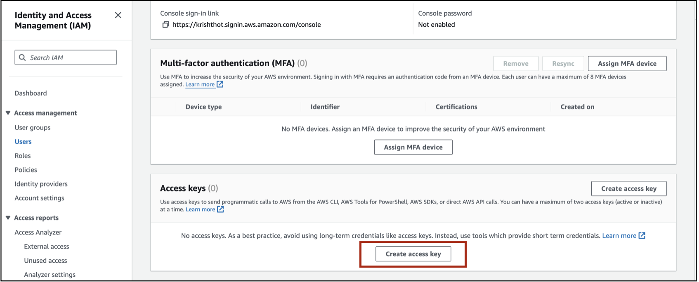{: width="800" .centered}

3. For the use case, choose the **Application running on AWS compute service**. You will see an alternative recommendation. You can check the box that says "I understand the above recommendation and want to proceed to create an access key" and click **Next**.

   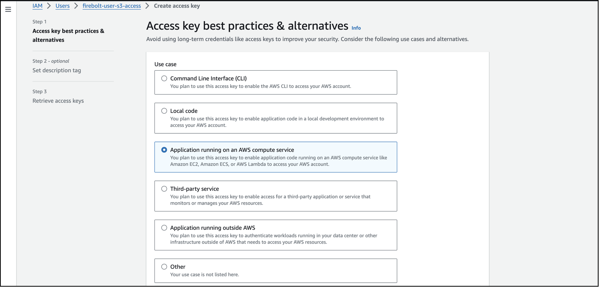

4. Set a description tag for the access key and click **Create Access Key**

   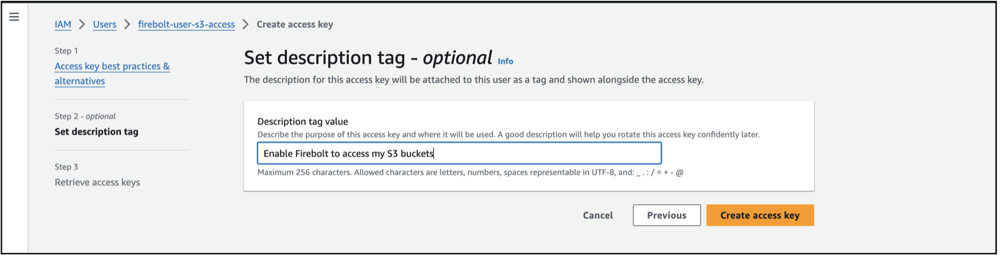{: width="800" .centered}

5. You will see a message that the access key has been created. Make sure to download the access key. You will need these credentials when you load S3 data into Firebolt.

    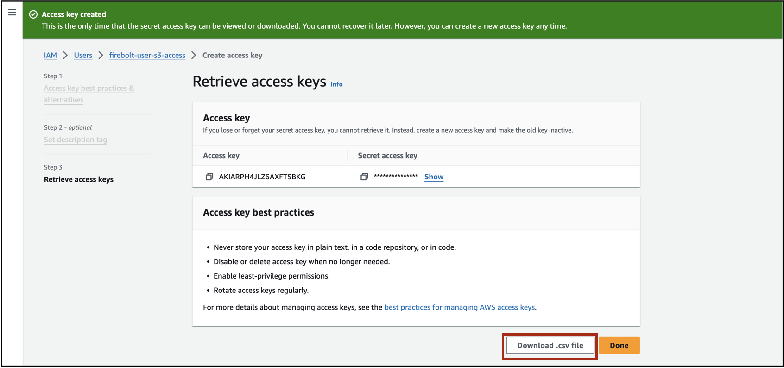{: width="800" .centered}

