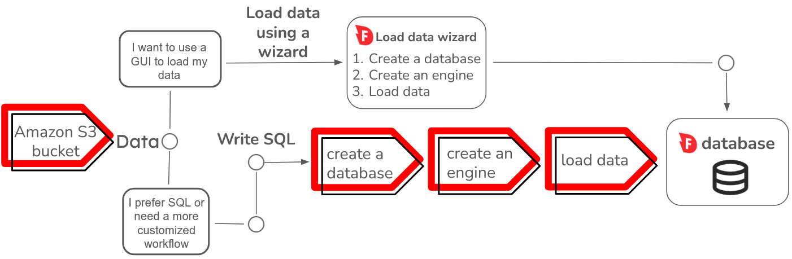
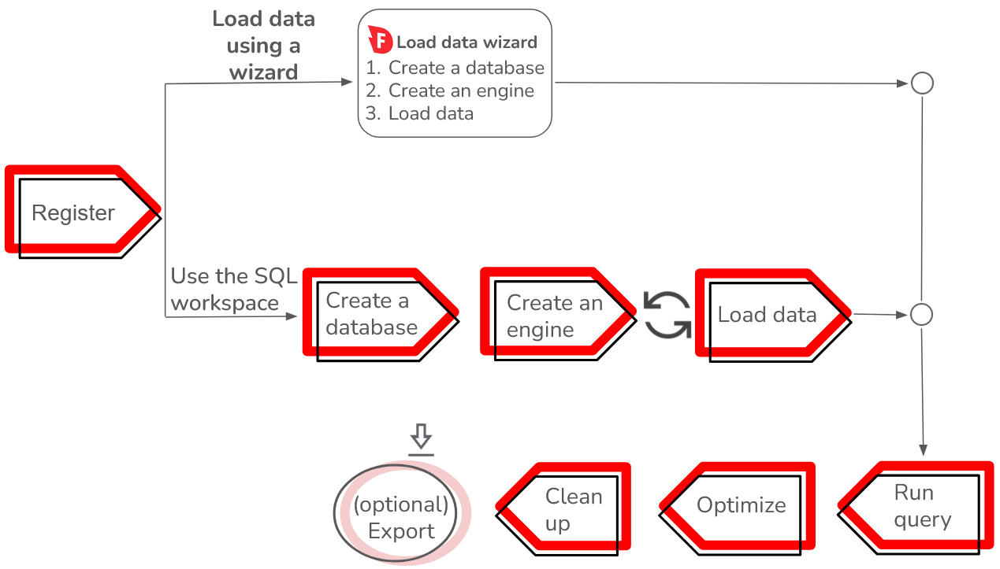

# Load data

You can load data into Firebolt from an Amazon S3 bucket using two different workflows.

If you want to get started quickly, load data using a **wizard** in the **Firebolt Workspace**. If you want a more customized experience, you can write **SQL scripts** to handle each part of your workflow. This guide shows you how to load data using both the wizard and SQL, and some common data loading workflows and errors.

 

{: .note}
Before you can load data, you must first register with Firebolt, then create a database and an engine. For information about how to register, see [Get Started](../getting-started.md). See the following sections for information about how to create a database and engine.

## Load data using a wizard
You can use the **Load data** wizard in the **Firebolt Workspace** to load data in either CSV or Parquet format, and choose from a variety of different loading parameters which include the following:

 * Specifying a custom delimiter, quote character, escape character, and other options.
 * How to handle errors during data load.
 * Specifying a primary index.
  
 The **Load data** wizard guides you through creating an engine and database as part of the loading process.

See [Load data using a wizard](loading-data-wizard.md) for information about the options available in the **Load data** wizard.

 
## Load data using SQL
You can use SQL to load data in CSV, Parquet, TSV, AVRO, JSON Lines or ORC formats. Prior to loading data, you must also create a database and engine using either of the following options:

- Use buttons in the **Firebolt Workspace** to create a database and engine. For more information, see the [Create a Database](../../Guides/getting-started.md#create-a-database) and [Create an Engine](../../Guides/getting-started.md#create-an-engine) sections in the [Get Started](../getting-started.md) guide.

- Use the SQL commands [CREATE DATABASE](../../sql_reference/commands/data-definition/create-database.md) and [CREATE ENGINE](../../sql_reference/commands/engines/create-engine.md).
  
See [SQL to load data](loading-data-sql.md) for information and code examples to load data using SQL.

## Optimizing during data loading
Optimizing your workflow for Firebolt starts when you load your data. Use the following guidance:

1. A primary index uniquely identifies rows in a table, and is usually based on columns with a high number of unique values, or high cardinality. Having a primary index is  critical to query performance at Firebolt because it allows a query to locate data without scanning an entire dataset. If you are familiar with your data and query history well enough to select an optimal primary index, you can define it when creating a table. If you don't, you can still load your data without a primary index. Then, once you know your query history patterns, you must create a new table in order to define a primary index.

   You can specify primary indexes in either the **Load data** wizard or inside SQL commands. The [Load data using a wizard](loading-data-wizard.md) guide discusses considerations for selecting and how to select primary indexes. The [Load data using SQL](loading-data-sql.md) discusses considerations for selecting and shows code examples that select primary indexes.

2. If you intend to use [aggregate functions](../../sql_reference/functions-reference/aggregation/index.md) in queries, you can calculate an aggregating index when loading your data. Then queries use these pre-calculated values to access information quickly. For an example of calculating an aggregating index during load, see [Load data using SQL](loading-data-sql.md). For an introduction to aggregating indexes, see the [Aggregating indexes](../../Guides/getting-started.md#aggregating-indexes) section of the **Get Started** guide. For more advanced information, see [Aggregating indexes](../working-with-indexes/using-aggregating-indexes.md).
<!--3. When you've loaded data and are running queries, consider using data stored on Firebolt's local solid state drive (SSD) caches instead of reading data from an Amazon S3 bucket. This optimization strategy can greatly speed up queries for large datasets with millions of rows or more. For more information, see the [Warm data and cache eviction](../getting-started.md#warm-data-and-cache-eviction) section in the **Get Started** guide.-->

## Next steps 
After you load your data, you can start running and optimizing your queries. A typical workflow has the previous steps followed by data and resource cleanup as shown in the following diagram:

* [Load data using a wizard](loading-data-wizard.md) 
* [Load data using SQL](loading-data-sql.md)