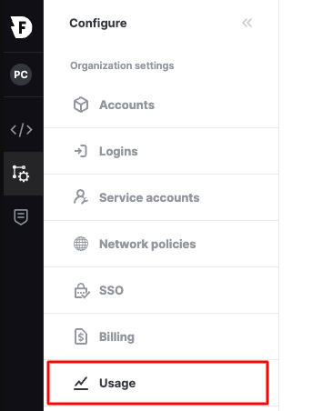

# Billing

Firebolt bills are based on the consumption of resources within each account in your organization. This includes the total amount of data stored and engine usage.

* **Data storage** usage is calculated on the daily average amount of data (in bytes) stored under your Firebolt account name for indexes and raw compressed data.

* **Engine resources** usage is calculated with **one-second granularity** between the time Firebolt starts to provision the engine and when the request to terminate the engine is submitted. Warmup time for caching indexes and raw data is counted in engine usage time.

## Invoices

Invoices for Firebolt engines and data are submitted through the AWS Marketplace. The final monthly invoice is available on the third day of each month through the AWS Marketplace. A billing cycle starts on the first day of the month and finishes on the last day of the same month.

## Viewing billing information

Users with the **Org Admin** role can monitor the cost history of each account in the organization.

**To view cost information for your organization**

* In the configure space choose **Usage**.  

  

The **Usage** page shows accrued charges for **Storage** and **Compute** for the most recent month to date. Choose the month for which you want to view billing history. To view a summary of daily charges, choose **Day in month** from the list. Choose **Month in year** to view a summary of monthly charges.

**To view current bill estimate and update AWS connection**

* In the configure space choose **Billing**.

The current bill estimate for the entire organization is displayed alongside the ability to connect the organization with a different AWS Marketplace account by choosing Update AWS connection.

Firebolt billing is reported to the AWS Marketplace at the beginning of the next day. By default, the **Accounts & Billing** page displays the engine usage breakdown based on billing time. If you prefer to see the engine usage by actual usage day, you can click the **Engines breakdown** selector under the **Usage cost by engine** table and click **Actual running time**. 