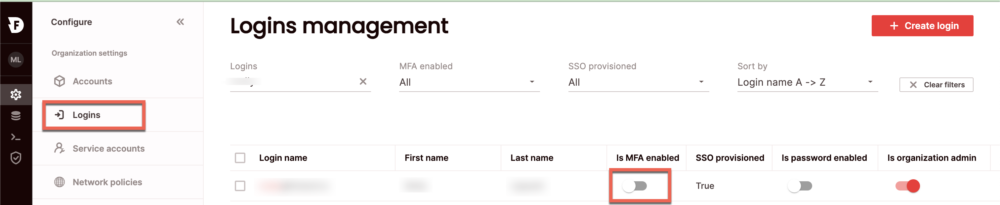
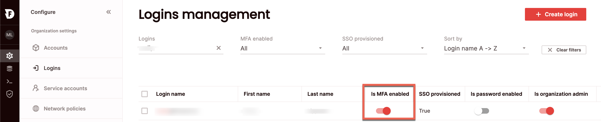
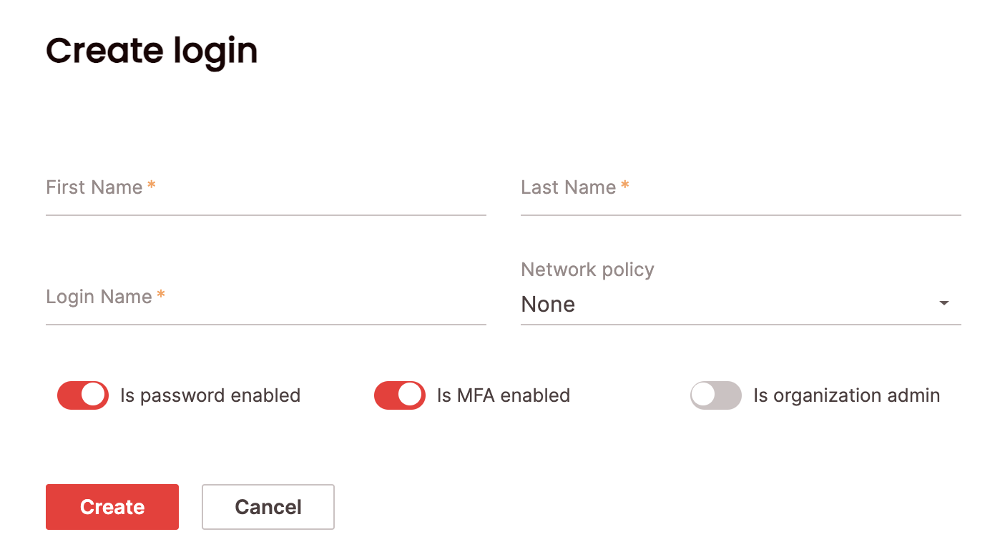

# Enable multi-factor authentication (MFA)

Enable multi-factor authentication (MFA) as an additional layer of security to protect data that is accessible through Firebolt. With MFA enabled, users must authenticate with a one-time code generated by their mobile device upon login. MFA can be enabled per login. 

{: .note}
Enabling MFA for a login requires the org_admin role.

## Enable MFA for a login

### SQL
 To enable MFA for a login using SQL, use the [`ALTER LOGIN`](../../sql_reference/commands/access-control/alter-login.md) statement. For example:

```ALTER LOGIN "alex@acme.com" SET IS_MFA_ENABLED = TRUE;```

Multi-factor authentication can also be set for new logins, with the [`CREATE LOGIN`](../../sql_reference/commands/access-control/create-login.md) command. For example: 

```CREATE LOGIN "betsy@acme.com" SET IS_MFA_ENABLED = TRUE;```

### UI 
To enable MFA for a login in the UI:



1. Click **Configure** to open the configure space, then choose **Logins** from the menu.

2. Search for the relevant login using the top search filters or by scrolling through the logins list. Toggle on **Is MFA enabled**.



MFA can also be enabled when creating a login, by toggling **Is MFA enabled** in the **Create login** window: 

