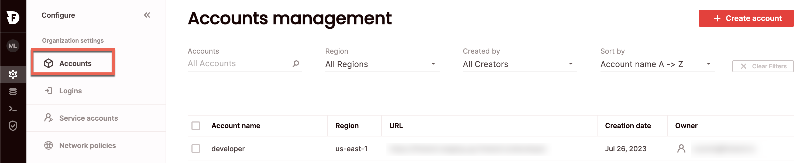
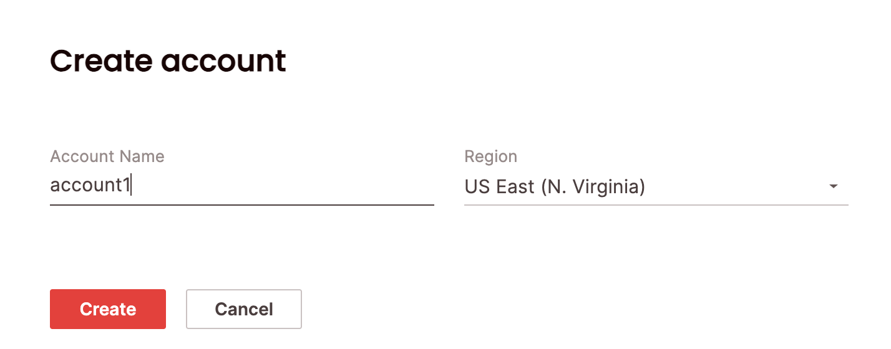
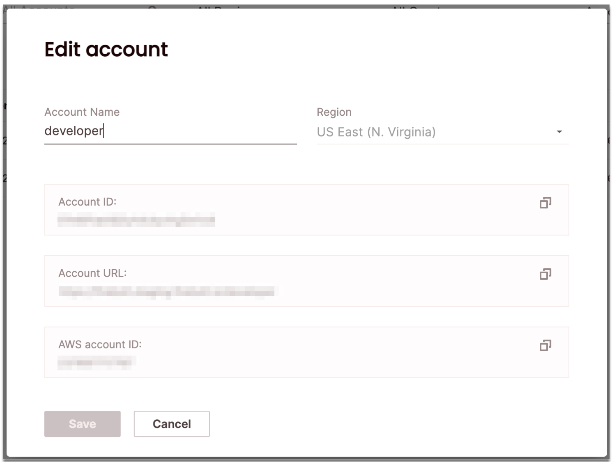
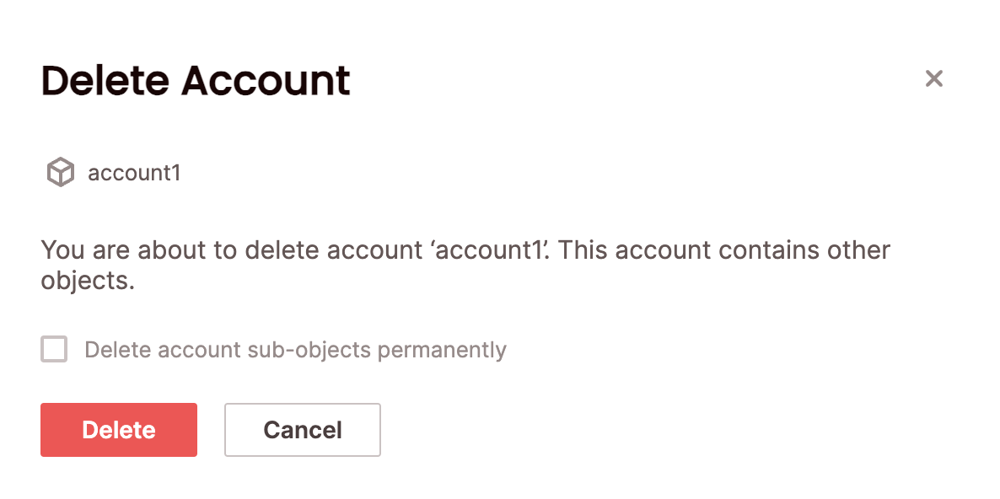

# Managing accounts

Your organization comes prepared with one account for your convenience. You can add more accounts, edit existing accounts, or delete accounts using SQL or in the UI.

## Create a new account

{: .note}
Creating an account requires the org_admin role.

### SQL
 To create an account using SQL, use the [`CREATE ACCOUNT`](../../sql_reference/commands/database-objects/create-account.md) statement. For example:

```CREATE ACCOUNT my_account WITH REGION = “us-east-1”;```

### UI 
To create an account via the UI:
1. Click **Configure** to open the configure space, then choose **Accounts** from the menu:



2. From the Accounts page, choose **Create Account**.
Type a name for the account and choose a region. You won't be able to change the region for this account later, so choose carefully.



3. Choose **Create**. 

Then you will see your new account on the Accounts page. A user with the accountAdmin role is created for the user who created the account and linked to their login (to allow that end user access to the account).

{: .note}
There can be up to twenty accounts per organization. If you need to create more, please contact the Firebolt support team.

## Edit an existing account

{: .note}
Editing an account requires the account_admin or org_admin role.

### SQL 
To edit an existing account using SQL, use the [`ALTER ACCOUNT`](../../sql_reference/commands/database-objects/alter-account.md) statement. For example:

```ALTER ACCOUNT my_account RENAME TO my_dev_account;```

### UI
To edit an account via the UI:
1. Click **Configure** to open the configure space, then choose **Accounts** from the menu.

2. Search for the relevant account using the top search filters or by scrolling through the accounts list. Hover over the right-most column to make the account menu appear then choose **Edit account**.
Edit the name of the account:



3. Choose **Save**. 

## Delete an existing account

{: .note}
Deleting an account requires the account_admin or org_admin role.

### SQL 
To delete an existing account using SQL, use the [`DROP ACCOUNT`](../../sql_reference/commands/database-objects/drop-account.md) statement. For example:

```DROP ACCOUNT my_account;```

### UI
To delete an account via the UI:
1. Click **Configure** to open the configure space, then choose **Accounts** from the menu.

2. Search for the relevant account using the top search filters or by scrolling through the accounts list. Hover over the right-most column to make the account menu appear then choose **Delete account**. 
If your account is not empty (for example, if it contains other objects such as users/databases/engines/etc.), you will need to confirm that you will also delete the sub-objects by selecting **Delete account sub-objects permanently**.



3. Choose **Confirm**.

The account will be removed from the **Accounts** page.

