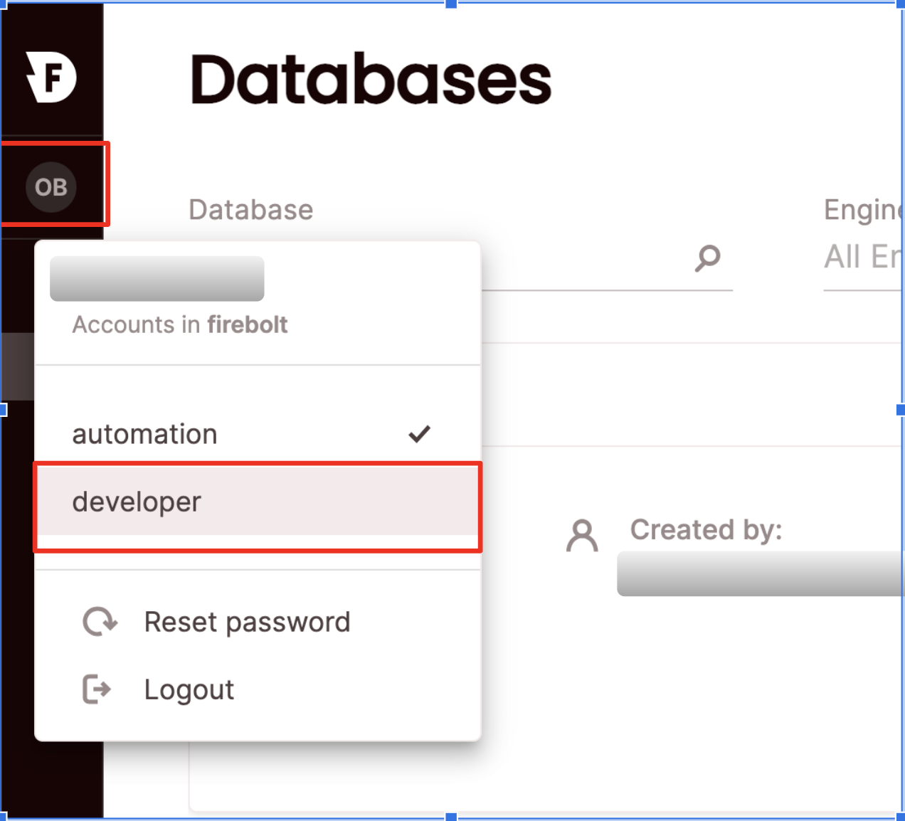

# Manage accounts

Your organization comes prepared with one account for your convenience. You can add more accounts, edit existing accounts, or delete accounts using SQL or in the UI.

To view all accounts, click **Configure** to open the configure space, then choose **Accounts** from the menu, or query the [information_schema.accounts](../../sql_reference/information-schema/accounts.md) view. 

## Create a new account

{: .note}
Creating an account requires the org_admin role.

### SQL
 To create an account using SQL, use the [`CREATE ACCOUNT`](../../sql_reference/commands/data-definition/create-account.md) statement. For example:

```sql
CREATE ACCOUNT my_account WITH REGION = “us-east-1”;
```

### UI 
To create an account via the UI:


1. Click **Configure** to open the configure space, then choose **Accounts** from the menu.

2. From the Accounts management page, choose **Create Account**.
Type a name for the account and choose a region. You won't be able to change the region for this account later, so choose carefully.

3. Choose **Create**. 


Then you will see your new account on the **Accounts management** page. 

{: .note}
There can be up to twenty accounts per organization. If you need to create more, please contact the Firebolt support team.

## Edit an existing account

{: .note}
Editing an account requires the account_admin or org_admin role.

### SQL 
To edit an existing account using SQL, use the [`ALTER ACCOUNT`](../../sql_reference/commands/data-definition/alter-account.md) statement. For example:

```sql
ALTER ACCOUNT my_account RENAME TO my_dev_account;
```

### UI
To edit an account via the UI:
1. Click **Configure** to open the configure space, then choose **Accounts** from the menu.

2. Search for the relevant account using the top search filters or by scrolling through the accounts list. Hover over the right-most column to make the account menu appear then choose **Edit account**.
Edit the name of the account.

3. Choose **Save**. 


## Delete an existing account

{: .note}
Deleting an account requires the account_admin or org_admin role.

### SQL 
To delete an existing account using SQL, use the [`DROP ACCOUNT`](../../sql_reference/commands/data-definition/drop-account.md) statement. For example:

```sql
DROP ACCOUNT my_account;
```

### UI
To delete an account via the UI:
1. Click **Configure** to open the configure space, then choose **Accounts** from the menu.

2. Search for the relevant account using the top search filters or by scrolling through the accounts list. Hover over the right-most column to make the account menu appear then choose **Delete account**. 
If your account is not empty (for example, if it contains other objects such as users/databases/engines/etc.), you will need to confirm that you will also delete the sub-objects by selecting **Delete account sub-objects permanently**.

3. Choose **Confirm**.


The account will be removed from the **Accounts management** page.


## Switch accounts

### SQL
TBD

### UI
Click on your login button, the current account will be marked. 
Choose an account you would like to switch to.





