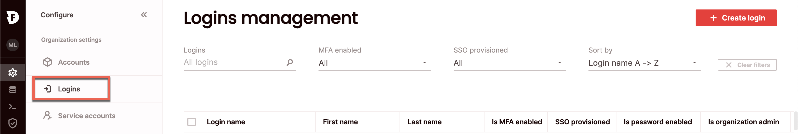
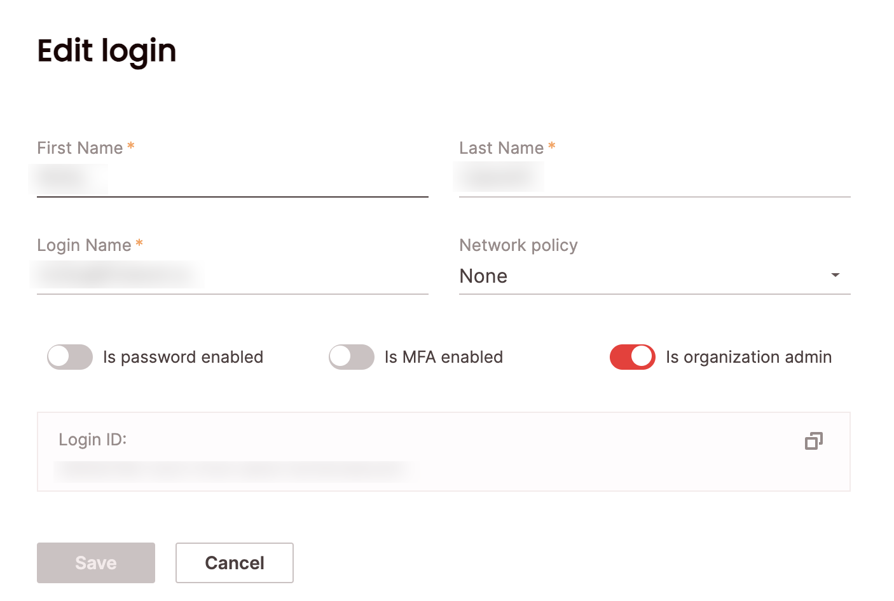
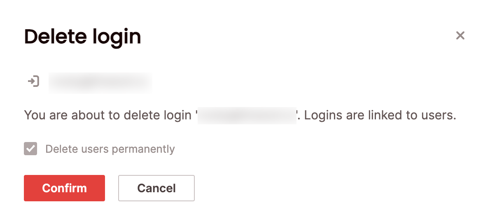

# Managing logins
{: .no_toc}

Logins are managed at the organization level and are used for authentication. Logins are a combination of a login name (email), first name, last name, and password, unless you've configured [Single Sign-On (SSO)](sso/sso.md). Moreover, logins can be configured with advanced authentication properties such as [MFA](mfa.md) and [network policies]. Logins are linked to users at the account level, so that roles may be managed separately per account. A user must be linked to either a login or a service account for programmatic use to gain access to Firebolt. You can add, edit or delete logins using SQL or in the UI. 

To view all logins, click **Configure** to open the configure space, then choose **Logins** from the menu, or query the [information_schema.logins](../../Reference/information-schema/logins.md) view. 

{: .note}
Managing logins requires the org_admin role.

## Create a new login

### SQL 
To create a login using SQL, use the [`CREATE LOGIN`](../../sql_reference/commands/database-objects/create-login.md) statement. For example:

```CREATE LOGIN "alexs@acme.com" WITH FIRST_NAME = "Alex" LAST_NAME = "Summers";```

### UI
To create a login via the UI:
1. Click **Configure** to open the configure space, then choose **Logins** from the menu:



2. From the Logins management page, choose **Create Login**.
3. Enter the following details:
    - First name: specifies the first name of the user for the login. 
    - Last name: specifies the last name of the user for the login.
    - Login name: specifies the login in the form of an email address. This must be unique within your organization.
4. Optionally, you can:
    - Associate a [network policy](network-policies.md) with the login by choosing a network policy name under the **Network policy attached** field.
    - Enable password login, which specifies if the login can authenticate Firebolt using a password.
    - Enable multi-factor authentication (MFA). Read more about how to configure MFA [here].
    - Set the login as **organisation admin**, which enables fully managing the organization.

## Edit an existing login

### SQL 
To edit an existing login using SQL, use the [`ALTER LOGIN`](../../sql_reference/commands/database-objects/alter-login.md) statement. For example:

```ALTER LOGIN "alexs@acme.com" SET IS_ORGANIZATION_ADMIN = true;```

### UI
To edit a login via the UI:
1. Click **Configure** to open the configure space, then choose **Logins** from the menu.

2. Search for the relevant login using the top search filters, or by scrolling through the list of logins. Hover over the right-most column to make the login menu appear, then choose **Edit login details**.
Edit the desired fields and choose **Save**.



## Deleting an existing login

### SQL 
To delete an existing login using SQL, use the [`DROP LOGIN`](../../sql_reference/commands/database-objects/drop-login.md) statement. For example:

```DROP LOGIN "alexs@acme.com";```

### UI
To delete a login via the UI:
1. Click **Configure** to open the configure space, then choose **Logins** from the menu.

2. Search for the relevant login using the top search filters, or by scrolling through the logins list. Hover over the right-most column to make the login menu appear, then choose **Delete login**.

If the login is linked to users, you will need to confirm that you will also be deleting those users by choosing **Delete users permanently**.

