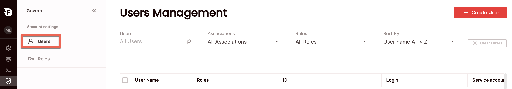

# Manage users
{: .no_toc}

Users are managed at the account level and are linked to logins or service accounts for programmatic use to gain access to Firebolt. Roles are granted to users to determine access to objects in Firebolt. You can add, edit or delete users using SQL or in the UI. 

To view all users, click **Govern** to open the govern space, then choose **Users** from the menu, or query the [information_schema.users](../../sql_reference/information-schema/users.md) view. 

{: .note}
Managing users requires either the account_admin or security_admin role.

## Create a new user

### SQL 
To create a user using SQL, use the [`CREATE USER`](../../sql_reference/commands/access-control/create-user.md) statement. For example:

```sql
CREATE USER alex;
```

### UI
To create a user via the UI:



1. Click **Govern** to open the govern space, then choose **Users** from the menu.
2. From the Users management page, choose **Create user**.
3. Enter the new user's name. This user name can be any string - it can contain spaces, and non-alpha-numeric characters such as exclamation points (!), percent signs (%), at sign(@), dot sign (.), underscore sign (_), minus sign (-), and asterisks (*), but if the string contains these spaces or non-alphanumeric characters, it must be enclosed in single or double quotes. 

4. Optionally, you can:
  - Choose **Associate a login** or **Associate a service account**, then choose the relevant login or service account from the list.
  - Choose a **default database** for the user.
  - Choose a **default engine** for the user. 
  - Choose **roles** to be granted to the user. 

## Edit an existing user

### SQL 
To edit an existing user using SQL, use the [`ALTER USER`](../../sql_reference/commands/access-control/alter-user.md) statement. For example:

```sql
ALTER USER "alex" RENAME TO "alexs";
```
or 
```sql
ALTER USER alex SET LOGIN_NAME="alexs@acme.com";
```

### UI
To edit a user via the UI:
1. Click **Govern** to open the govern space, then choose **Users** from the menu.
2. Search for the relevant user using the top search filters or by scrolling through the users' list. Hover over the right-most column to make the user menu appear, then choose **Edit user**.
3. Edit the desired fields and choose **Save**.


## Deleting an existing user

### SQL 
To delete an existing user using SQL, use the [`DROP USER`](../../sql_reference/commands/access-control/drop-user.md) statement. For example:

```sql
DROP USER "alex";
```

### UI
To delete a user via the UI:
1. Click **Govern** to open the govern space, then choose **Users** from the menu.
2. Search for the relevant user using the top search filters or by scrolling through the users list. Hover over the right-most column to make the user menu appear, then choose **Delete user**.
3. Choose **Confirm**.


