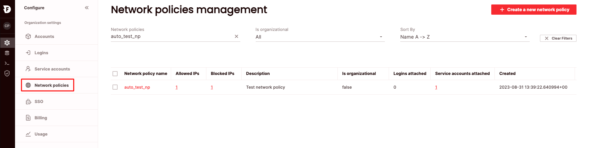
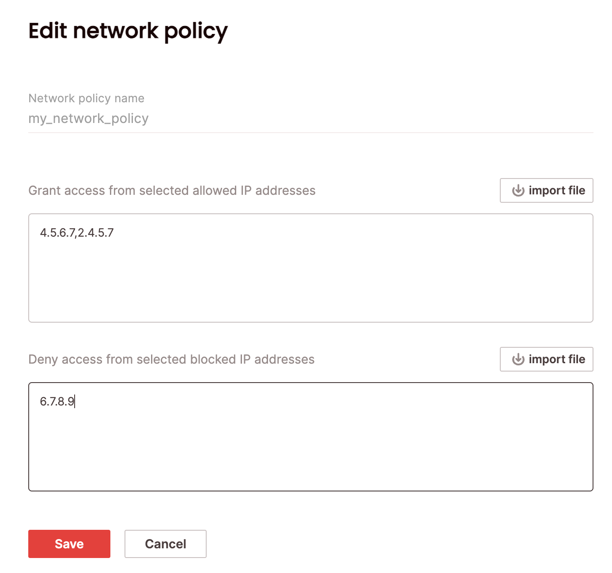
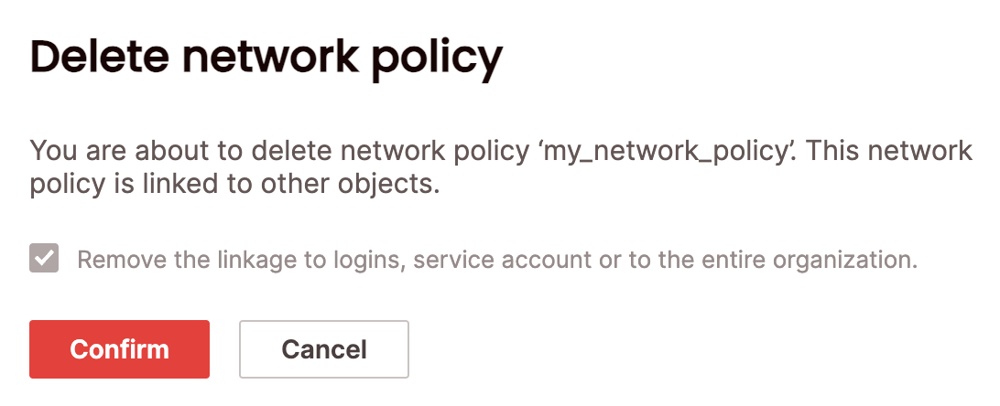

# Managing network policies
{: .no_toc}

By default, Firebolt accepts traffic from any IP address. As an additional layer of security, you can configure individual Firebolt logins or service accounts so their traffic must originate only from the IP addresses that you specify. For each configuration (network policy), you specify a list of IP addresses from which traffic is allowed (the allow list) and a list of IP addresses from which traffic is denied (the blocked list). A network policy is a collection of allowed and blocked lists of IP addresses.

Network policies can be configured on the organization level and also per login or service account. When evaluating a network policy, Firebolt validates the login/service account IP addresses first by the policy set at organization level. If there is no network policy on the organization level (or the organization-level network policy does not allow access), then the network policy is validated at the login/service account level. If a network policy does not allow access, the user will receive a `401 Unauthorized` response.

The IP allow and blocked lists used to specify a network policy are specified as comma-separated IPv4 addresses and/or IPv4 address ranges in CIDR format. You can apply the same list to one or many users, and each user can have unique lists. You can specify lists manually or import lists of addresses and ranges from a CSV file saved locally. You can add, edit or delete network policies using SQL or in the UI. 

To view all network policies, click **Configure** to open the configure space, then choose **Network policies** from the menu, or query the [information_schema.network_policies](../../sql_reference/information-schema/network-policies.md) view. 

{: .note}
Managing network policies requires the org_admin role.

## Create a network policy

### SQL 
To create a network policy using SQL, use the [`CREATE NETWORK POLICY`](../../sql_reference/commands/access-control/create-network-policy.md) statement. For example:

```CREATE NETWORK POLICY my_network_policy ALLOWED_IP_LIST = (‘4.5.6.1’, ‘2.4.5.1’) BLOCKED_IP_LIST = ('6.7.8.1') COMMENT = 'my new network policy'```

### UI
To create a network policy via the UI:



1. Click **Configure** to open the configure space, then choose **Network policies** from the menu.
2. From the Network policies management page, choose **Create a new network policy**. 
3. Enter a network policy name. To add to the allow list, enter comma-separated IPv4 addresses, or IPv4 address ranges in CIDR format under **Grant access from selected allowed IP addresses**, or choose **import file** to read IP addresses from a CSV file. 
4. Enter addreses for the block list in the **Deny access from selected blocked IP addresses**. 
5. Choose **Save**.

For each user, the Allowed IPs and Blocked IPs are updated to reflect the total number of IP addresses from each list that you specified for that user. Network policies created in UI are automatically attached to the organization to which the policy creator is logged in. 

## Edit a network policy

### SQL 
To edit a network policy using SQL, use the [`ALTER NETWORK POLICY`](../../sql_reference/commands/access-control/alter-network-policy.md) statement. For example:

```ALTER NETWORK POLICY my_network_policy SET ALLOWED_IP_LIST = (‘4.5.6.7’, ‘2.4.5.7’) BLOCKED_IP_LIST = (‘6.7.8.9’) COMMENT = 'updated network policy'```

### UI
To edit a network policy via the UI:
1. Click **Configure** to open the configure space, then choose **Network policies** from the menu.
2. Search for the relevant network policy using the top search filters or by scrolling through the list. Hover over the right-most column to make the network policy menu appear,then choose **Edit network policy**. 
3. Edit allowed and blocked IP addresses and choose **Save**.



## Delete a network policy

### SQL
To delete a network policy using SQL, use the [`DROP NETWORK POLICY`](../../sql_reference/commands/access-control/drop-network-policy.md) statement. For example:

```DROP NETWORK POLICY my_network_policy [ RESTRICT | CASCADE ]```

### UI
To delete a network policy via the UI: 

1. Click **Configure** to open the configure space, then choose **Network policies** from the menu.
2. Search for the relevant network policy using the top search filters or by scrolling through the list. Hover over the right-most column to make the network policy menu appear, then choose **Delete network policy**. You will need to confirm that you will also be removing links to the network policy by choosing **Remove the linkage to logins, service accounts, or to the entire organization**
3. Choose **Confirm**.

