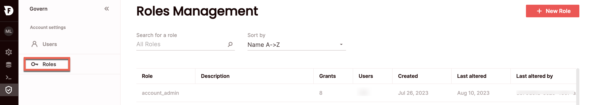
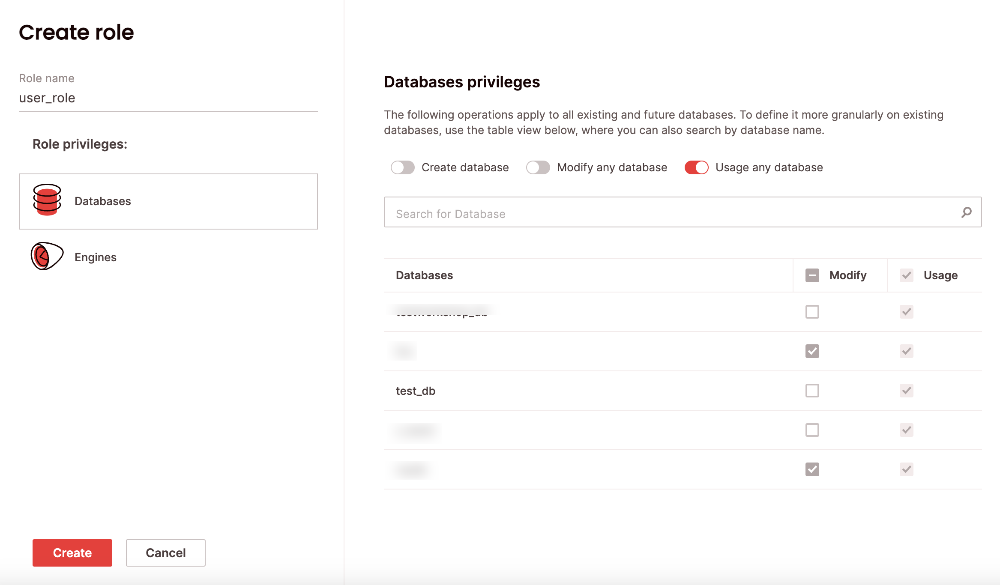
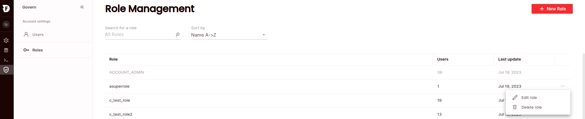
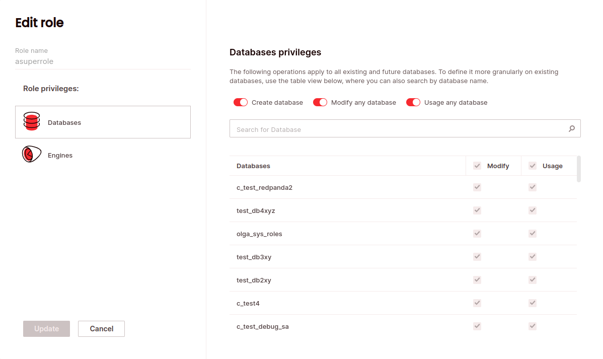
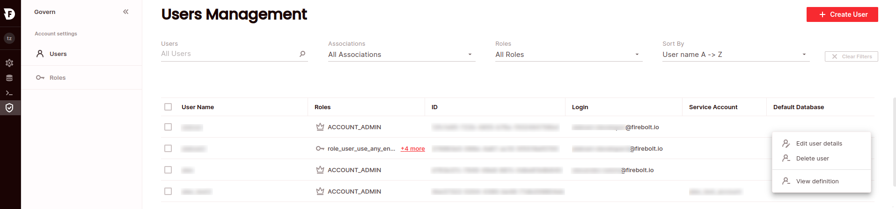
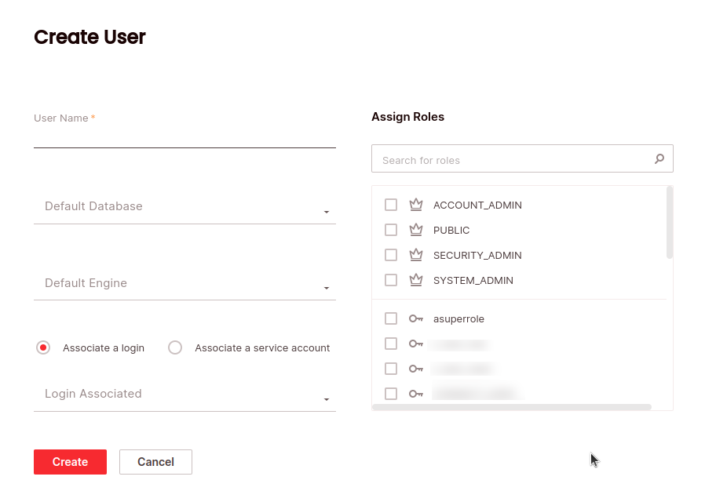

# Managing role-based access control
{: .no_toc}

Role-based access control provides the ability to control privileges and determine who can access and perform operations on specific objects in Firebolt. Access privileges are assigned to roles which are, in turn, assigned to users. 

A user interacting with Firebolt must have the appropriate privileges to use an object. Privileges from all roles assigned to a user are considered in each interaction in Firebolt. 

To view all roles, click **Govern** to open the govern space, then choose **Roles** from the menu, or query the [information_schema.applicable-roles](../../Reference/information-schema/applicable-roles.md) view. 

The key concepts to understanding access control in Firebolt with database-level RBAC are: < this should be a visualization > 

  **Secured object:** an entity to which access can be granted: database, engine subscription.

  **Role:** An entity to which privileges can be granted. Roles are assigned to users.

  **Privilege:** a defined level of access to an object.

  **User:** A user identity recognized by Firebolt. It can be associated with a person or a program. A user can be assigned multiple roles.


## System-defined roles

Roles are assigned to users to allow them to complete tasks on relevant objects to fulfill their business needs. Firebolt comes with system-defined roles per account.

| Role Name      | Description                                                                                                                                                                                                             | 
|:---------------|:------------------------------------------------------------------------------------------------------------------------------------------------------------------------------------------------------------------------|
| public         | Enables querying any database in the account.                                                   |
| security_admin | Enables managing all account roles (with the ability to manage grants) and users. |
| system_admin   | Enables managing databases, engines, schemas, tables, views, external tables, and grants, as well as setting database and engine properties. In addition, the system_admin role enables access to the observability functionality on all engines. |
| account_admin  | Enables all the privileges of the system_admin and security_admin roles alongside the ability to manage the account. |

System defined roles can neither be modified nor dropped. Users with the `account_admin` role can grant roles to other users.

## Custom roles

A user with either the `account_admin` or `security_admin` role can create custom roles. You can create a custom role using SQL, or via the UI.  

## Privileges
A set of privileges can be granted for every securable object. See which privileges are available for accounts, databases and engines below. To view all privileges, query the [information_schema.object_privileges](../Reference/information-schema/object-privileges.md) view. 

### Account
Privileges can be granted for accounts to allow creating databases and engines.

| Privilege         | Description                                    |
|:------------------|:-----------------------------------------------|
| CREATE ENGINE     | Enables creating new engines in the account.   |
| CREATE DATABASE   | Enables creating new databases in the account. |

#### Database
Privileges can be granted for databases to allow usage and modification of databases per account. 

| Privilege          | Description |
| :---------------   | :---------- |
| USAGE              | Enables querying tables and views, and attaching engines to the database. |
| MODIFY             | Enables:<br>Creating or dropping tables, views, and indexes on the database.<br>Inserting data into the database's tables.<br>Altering the properties of a database.<br>Dropping a database. |

#### Engine
Privileges can be granted for engines to allow usage, operation and modification of engines per account. 

| Privilege          | Description |
| :---------------   | :---------- |
| USAGE              | Enables using the engine to execute queries. |
| OPERATE            | Enables stopping and starting the engine. |
| MODIFY             | Enables dropping or altering any properties of the engine. |

## Create role

### SQL
To create a custom role using SQL, use the [`CREATE ROLE`](../../sql_reference/commands/database-objects/create-role.md) statement. For example:

```CREATE ROLE user_role;```

### UI
To create a custom role via the UI:



1. Click **Govern** to open the govern space, then choose **Roles** from the menu.
2. From the Roles management page, choose **New role**. 
3. Enter a role name. 
4. Choose the object type you want to grant privileges on for the role from the left-hand list; databases or engines.
4. Choose the privileges you want to grant for each object type. You can use the toggles at the top to grant privileges over all databases or engines, or you can define privileges more granularly on existing databases or engines using the table views, where you can also search by database or engine name.



## Delete role
To delete a custom role using SQL, use the [`DROP ROLE`](../../sql_reference/commands/database-objects/drop-role.md) statement. For example:

```DROP ROLE user_role;```

### UI
To delete a custom role via the UI:

1. Click **Govern** to open the govern space, then choose **Roles** from the menu.
2. Search for the relevant role using the top search filters or by scrolling through the list. Hover over the right-most column to make the role menu appear, then choose **Delete role**. 
3. Choose **Confirm**.


## Grant privileges to a role

### SQL 
To grant a privilege to a role using SQL, use the [`GRANT`](../../sql_reference/commands/database-objects/grant.md) statement. For example:

```GRANT USAGE ON DATABASE my_db TO user_role;```

### UI
To grant a privilege to a role via the UI:
1. Click **Govern** to open the govern space, then choose **Roles** from the menu:



2. Search for the relevant role using the top search filters, or by scrolling through the list of logins. Hover over the right-most column to make the role menu appear, then choose **Edit role**. 
3. Choose the privileges tab for the object type you want to manage privileges for, then select the desired privileges. To grant privileges over all objects of that type, choose the topmost line.
4. Click **Update**.



## Grant role

### SQL
To grant a role to a user or another role using SQL, use the [`GRANT ROLE`](../../sql_reference/commands/database-objects/grant.md) statement. For example:

```GRANT ROLE user_role TO ROLE user2_role;```

### UI
To grant a role to a user via the UI:
1. Click **Govern** to open the govern space, then choose **Users** from the menu:



2. Search for the relevant user using the top search filters, or by scrolling through the list of logins. Hover over the right-most column to make the user menu appear, then choose **Edit User Details**. 
3. Check all the roles you want assigned to the user.
4. Click **Update**.



## Revoke privileges 

### SQL 
To revoke a privilege from a role using SQL, use the [`REVOKE`](../../sql_reference/commands/database-objects/revoke.md) statement. For example:

```REVOKE USAGE ON DATABASE my_db FROM user_role;```

### UI
To revoke a privilege from a role via the UI, follow the [same steps above](#grant-privileges-to-a-role) that you would to grant privileges. 

## Revoke role 

### SQL 
To revoke a role from a user or another role using SQL, use the [`REVOKE ROLE`](../../sql_reference/commands/database-objects/revoke.md) statement. For example:

```REVOKE ROLE user_role USER alex;```

### UI
To revoke a role from a user or another role via the UI, follow the [same steps above](#grant-role) that you would to grant a role.  