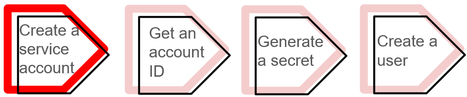
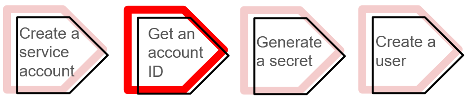
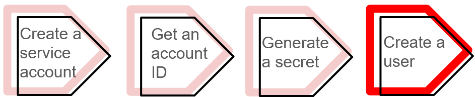

# Manage programmatic access to Firebolt
{: .no_toc}

Service accounts in Firebolt are used exclusively for **programmatic access**, allowing applications, scripts, or automated systems to securely interact with Firebolt resources. Unlike regular logins for individuals, each service account has an ID and a secret for authentication.

{: .note}
To manage service accounts, you must have the **organization admin** role, which grants full administrative control over Firebolt, including managing users, roles, network policies, and other organization-wide settings. This role ensures proper access management, security, and compliance with organizational policies.

Administrators use service accounts to control how external tools and applications access Firebolt, ensuring access is limited to necessary resources. Service accounts are associated with specific users within the organization, giving administrators control over what data and permissions they have. This helps enforce security rules, track usage, and audit system access in a clear and controlled way.

You can access a Firebolt database programmatically using either of the following:

*  The [Firebolt API](https://docs.firebolt.io/godocs/Guides/query-data/using-the-api.html#firebolt-api) - directly interacts with Firebolt’s data warehouse using HTTP requests.
*  The [Firebolt drivers](https://docs.firebolt.io/godocs/Guides/developing-with-firebolt/) - use a third party tool or programming language to integrate with Firebolt’s data warehouse. Firebolt supports several languages including Python, Node, .Net, and Go.

Service accounts must be linked to a [user account](https://docs.firebolt.io/godocs/Guides/managing-your-organization/managing-users.html). The service account provides access to the organization, and the associated user provides access to an account within the organization. To use Firebolt programmatically, you must authenticate with an ID and a secret. These are generated when you create a service account. You can add, delete and generate secrets for service accounts using SQL scripts in the **Develop Space** or through the user interface (UI) in the **Configure Space**. 

Follow these steps to **gain programmatic access to Firebolt**:
1. [Create a service account](#create-a-service-account).
2. [Get a service account ID](#get-a-service-account-id).
3. [Generate a secret](#generate-a-secret).
4. [Create a user](#create-a-user).

After completing the previous steps, the following sections show you how to **manage programmatic access through your service account**:
1. [Test your new service account](#test-your-new-service-account).
2. [Edit your service account](#edit-your-service-account).
3. [Delete your service account](#delete-your-service-account).

## Create a service account



You can create a service account using SQL scripts in the **Develop Space** or through the user interface (UI) in the **Configure Space**.

### Create a service account using the UI
Login to Firebolt’s [Workspace](https://go.firebolt.io/login). If you haven’t yet registered with Firebolt, see the [Get Started](https://docs.firebolt.io/Guides/getting-started/) guide. If you encounter any issues, reach out to support@firebolt.io for help. Then, do the following:

1. Select the **Configure** icon () in the left navigation pane to open the **Configure Space**. 
2. Select Service accounts on the left sub-menu bar.
3. Select the **+ Create a service account** button at the top right of the **Configure Space**.
4. In the **Create a service account** window that appears, enter the following:
  * Name - The name of the service account. 
  * [Network policy](https://docs.firebolt.io/Guides/security/network-policies.html) - A security feature that defines a list of allowed and blocked IP addresses or ranges to manage access at the organization level, login level, or for service accounts.
  * Description - A description for the service account.
5. Toggle **Is organization admin** to designate the service account as an account with administrative privileges in your organization. In Firebolt, the organization admin role provides full administrative privileges over the organization, allowing management of users, service accounts, network policies, and other organization-wide settings.
6. Select **Create** to finish creating the service account.

### Create a service account using SQL
Login to Firebolt’s [Workspace](https://go.firebolt.io/login). If you haven’t yet registered with Firebolt, see [Get Started](https://docs.firebolt.io/Guides/getting-started/). If you encounter any issues, reach out to support@firebolt.io for help. Then, do the following:

1. Select the **Develop** icon (). 
2. By default, when you login to **Firebolt’s Workspace** for the first time, Firebolt creates a tab in the **Develop Space** called **Script 1**. The following apply:
*  The database that **Script 1** will run using is located directly below the tab name. If you want to change the database, select another database from the drop-down list.
*  An engine must be running to process the script in a selected tab. The name and status of the engine that **Script 1** uses for computation is located to the right of the current selected database. 

    Select **system** from the drop-down arrow next to the engine name. The system engine is always running, and you can use it to create a service account. You can also use an engine that you create.

3. Use the syntax in the following example code to create a service account in the **SQL Script Editor**: 

    ```sql
    CREATE SERVICE ACCOUNT IF NOT EXISTS "service_account_name" WITH DESCRIPTION = 'service account 1';
    ```

    For more information, see the [CREATE SERVICE ACCOUNT](https://docs.firebolt.io/sql_reference/commands/access-control/create-service-account.html) command.

## Get a service account ID



Your new service account is listed in the **Configure Space** in the **Service accounts** on the left sub-menu bar. Note the ID of this service account under the **ID** column in the **Service accounts management** table. You will use this ID for authentication.

## Generate a secret


Each service account requires a secret to access Firebolt programmatically. You can generate a secret using SQL scripts in the **Develop Space** or through the UI in the **Configure Space**. If you generate a new secret, your previous secret will no longer work.

### Generate a secret using the UI

1. Select the **Configure** icon () in the left navigation pane to open the **Configure Space**.
2. Select **Service accounts** from the left sub-menu bar.
3. Select the three horizontal dots (...) to the right of the service account that you want to generate a secret. 
4. Select **Create a new secret**. 
5. Select the copy icon from the pop-up window **New secret for service account** that displays the new secret to copy the secret to your clipboard. This secret is not stored anywhere. Once you close the pop-up window, you will no longer be able to retrieve this secret.

### Generate a secret using SQL

Use the syntax in the following example code to generate a secret for a service account in the **SQL Script Editor** in the **Develop Space**:

```sql
CALL fb_GENERATESERVICEACCOUNTKEY('service_account_name')
```

The `CALL fb_GENERATESERVICEACCOUNTKEY` command in the previous code example returns both the service account ID and secret. Once you retrieve this secret, you cannot retrieve it again later.

## Create a user



Once you create the service account, it must be associated with a user. Your organization may have multiple Firebolt accounts, each with its own set of resources, databases, and users. Each service account can only be linked to one user per Firebolt account, but it can be assigned to different users across multiple accounts. This setup allows the service account to work across multiple accounts, while ensuring it is linked to only one user per account.

You can create a user using SQL scripts in the **Develop Space** or through the UI in the **Govern Space**. 

### Create a user using the UI

1. Select the Govern icon () in the left navigation pane to open the **Govern Space**.
2. Select Users from the left sub-menu bar.
3. Select the **+ Create User** button at the top right of the **Govern Space**.
4. In the **Create User** window, enter the following:

    * **User Name** - The name of the user to associate with the service account.
    * **Default Database** - (Optional) The name of the database that is associated with the user.
    * **Default Engine** - (Optional) The name of the engine that is associated with the user.

   Toggle the radio button next to **Associate a service account**.

5. Select the name of the service account to associate with the user from the drop-down list under **Service Account Associated**. This drop-down list contains only service accounts that are not already assigned to a user in the current account.

### Create a user using SQL

Use the syntax in the following example code to generate a secret for a service account in the **SQL Script Editor** in the **Develop Space**:

```sql
CREATE USER alex WITH SERVICE_ACCOUNT = service_account_name;
```
The previous code example creates a user with the username `alex`, and associates it with a service account by its `service_account_name`.

For more information, see [Manage users](https://docs.firebolt.io/godocs/Guides/managing-your-organization/managing-users.html#create-a-new-user).


## Test your new service account

Once you have set up your service account, use the following code example to send a request to Firebolt’s REST API, and receive an authentication token:

```bash
curl -X POST --location 'https://id.app.firebolt.io/oauth/token' \
--header 'Content-Type: application/x-www-form-urlencoded' \
--data-urlencode 'grant_type=client_credentials' \
--data-urlencode 'audience=https://api.firebolt.io' \
--data-urlencode "client_id=${service_account_id}" \
--data-urlencode "client_secret=${service_account_secret}"
```

In the previous code example, use the service account ID and secret from the previous **Generate a secret** step for `service_account_id` and `service_account_secret`.

The following is an example response to the REST API request:

**Response:** 

```json
{
  "access_token":"eyJz93a...k4laUWw",
  "token_type":"Bearer",
  "expires_in":86400
}
```

In the previous example response, the following apply:

* The `access_token` is a unique token that authorizes your API requests that acts as a temporary key to access resources or perform actions. You can use this token to authenticate with Firebolt’s platform until it expires. 
* The `token_type` is `Bearer`, which means that the access token must be included in an authorization header of your API requests using the format: `Authorization: Bearer <access_token>`. 
* The token `expires_in` indicates the number of seconds until the token expires.

Use the returned `access_token` to authenticate with Firebolt.

## Edit your service account 

You can edit your service account using SQL scripts in the **Develop Space** or through the UI in the **Configure Space**.

### Edit your service account using the UI

1. Select **Configure** icon () in the left navigation pane to open the **Configure Space**.
2. Select **Service accounts** from the left sub-menu bar.
3. Select the three horizontal dots (...) to the right of the service account that you want to edit.
4. Select **Edit service account**.

    In the **Edit service account** pop-up window, you can edit the following:
    * **Name** - The name of the service account.
    * **Network policy** - The network policy associated with the service account that defines whether an IP address is allowed or blocked from interacting with Firebolt resources.
    * **Description** - The description of the service account.
    * **Is organization admin** - Toggle on or off to identify the service account as an organizational admin.

    Select **Save** to keep your edits.

### Edit your service account using SQL

Use [ALTER SERVICE ACCOUNT](https://docs.firebolt.io/sql_reference/commands/access-control/alter-service-account.html), as shown in the following example to edit a service account in the **SQL Script Editor** in the **Develop Space**:

```sql
ALTER SERVICE ACCOUNT service_account_name SET NETWORK_POLICY = my_network_policy
```

In the previous code example, the service account’s network policy is set to a new value.

## Delete your service account

You can delete your service account using SQL scripts in the **Develop Space** or through the UI in the **Configure Space**.

{: .note} You can’t delete a service account if it is linked to users. You must first unlink the service account from all users. You can view all users linked to a service account by navigating to the **Users** section in the **Govern Space**. In the **Users Management** table, each **User Name** has the name of a **Service Account** if it is associated with one. To unlink a user account, select the three horizontal dots (...) to the right of the **User Name**, and select **Edit user details**. Then, toggle off **Associate a service account**.

 
### Delete your service account using the UI

1. Select the **Configure** icon () in the left navigation pane to open the **Configure Space**.
2. Select **Service accounts** from the left sub-menu bar.
3. Select the three horizontal dots (...) to the right of the service account that you want to delete. 
4. Select **Delete service account**. 

### Delete your service account using SQL

 Use [DROP SERVICE ACCOUNT](https://docs.firebolt.io/sql_reference/commands/access-control/drop-service-account.html), as shown in the following example to delete a service account in the **SQL Script Editor** in the **Develop Space**:

 ```sql
DROP SERVICE ACCOUNT service_account_name;
```


