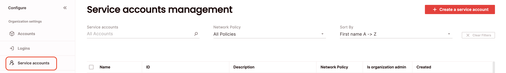
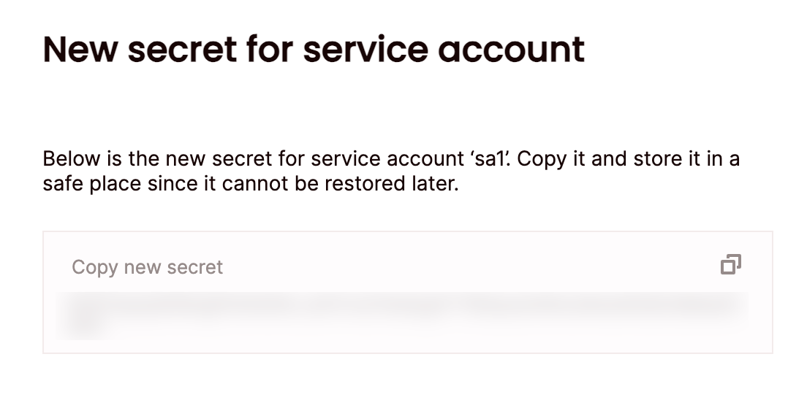

# Manage service accounts
{: .no_toc}

Create a service account for programmatic access **only** to Firebolt. Service accounts must be linked to users. It's required to associate the service account to a user, in order to obtain access. For each service account, a secret is generated to use for authentication. You can add, edit, delete and generate secrets for service accounts using SQL or in the UI. 

To view all Service Accounts click **Configure**, then choose **Service Accounts**.  

{: .note}
Managing service accounts requires the org_admin role.

## Creating a service account 

### SQL 
To create a service account using SQL, use the [`CREATE SERVICE ACCOUNT`](../../sql_reference/commands/access-control/create-service-account.md) statement. For example:

```sql
CREATE SERVICE ACCOUNT IF NOT EXISTS "sa1" WITH DESCRIPTION = 'service account 1';
```

### UI
To create a service account via the UI:



1. Click **Configure** to open the configure space, then choose **Service accounts** from the menu.
2. From the Service accounts page, choose **Create a service account**.
3. Enter a unique name for your service account. This name must start with a letter, and may contain only alphanumeric characters, or the underscore(_) character.
4. Optionally, you can:
  - Choose a **network policy** to apply from the list of existing [network policies](../security/network-policies.md) configured for your organization. 
  - Specify a description for the service account.
  - Set the service account as organisation admin, which enables fully managing the organization.
5. Choose **Create**. 

{: .note}
At this point, it's required to create a user and associate the service account to it. 

## Generating a secret for a service account
A service account secret is used to generate an access token for accessing Firebolt API programmatically with the service account. 

### SQL 
To generate a secret for a service account using SQL, use the ```CALL fb_GENERATESERVICEACCOUNTKEY(`<name>`)``` statement, where `<name>` is the name of the service account. The command returns both the service account ID and secret. For example:

```sql
CALL fb_GENERATESERVICEACCOUNTKEY('sa1')
```

### UI
To generate a secret for a service account via the UI:

1. Click **Configure** to open the configure space, then choose **Service accounts** from the menu.
2. Search for the relevant service account using the top search filters, or by scrolling through the list of service accounts. Hover over the right-most column to make the service account menu appear, then choose **Create a new secret**.
3. The **New secret for service account** menu with the newly generated secret will appear.



**Make a note of the secret once generated** - it can't be retrieved later.  If the secret is lost (or needs to be rotated), you can always generate a new secret, calling the same generation function, or by creating a new secret in the UI. 

{: .note}
Generating a new secret for your service account user replaces any previous secret (which cannot be used once a new one is generated). Make a note of the secret and keep it in a secured location.

## Authenticate with a service account via the REST API
1. Create a service account with the `IS_ORGANIZATION_ADMIN` property set to `TRUE` using either the UI or SQL. 
2. Obtain the service account ID and secret. 
3. Create a user and assign desired roles for the service account. Link the service account with this created user. 
4. Authenticate using the service account via Firebolt’s REST API, send the following request to receive an authentication token:

```bash
curl -X POST --location 'https://id.app.firebolt.io/oauth/token' \
--header 'Content-Type: application/x-www-form-urlencoded' \
--data-urlencode 'grant_type=client_credentials' \
--data-urlencode 'audience=https://api.firebolt.io' \
--data-urlencode "client_id=${service_account_id}" \
--data-urlencode "client_secret=${service_account_secret}"
```

**Response:** # ignore Response
```json
{
  "access_token":"eyJz93a...k4laUWw",
  "token_type":"Bearer",
  "expires_in":86400
}
```

where:

| Property               | Data type | Description                                                                                |
|:-----------------------| :-------- |:-------------------------------------------------------------------------------------------|
| service account id     | TEXT      | The service account ID ([created here](#creating-a-service-account)).                      |
| service account secret | TEXT      | The service account secret ([generated here](#generating-a-secret-for-a-service-account)). |


Use the returned access_token to authenticate with Firebolt.

## Editing a service account 

### SQL 
To edit a service account using SQL, use the [`ALTER SERVICE ACCOUNT`](../../sql_reference/commands/access-control/alter-service-account.md) statement. For example:

```sql
ALTER SERVICE ACCOUNT sa1 SET NETWORK_POLICY = my_network_policy
```

### UI 
To edit a service account via the UI:

1. Click **Configure** to open the configure space, then choose **Service accounts** from the menu.
2. Search for the relevant service account using the top search filters, or by scrolling through the list of service accounts. Hover over the right-most column to make the service account menu appear, then choose **Edit service account**.
3. Edit the desired fields and choose **Save**.

## Deleting a service account 

### SQL 
To delete a service account using SQL, use the [`DROP SERVICE ACCOUNT`](../../sql_reference/commands/access-control/drop-service-account.md) statement. For example:

```sql
DROP SERVICE ACCOUNT sa1;
```

### UI 
To delete a service account via the UI:
1. Click **Configure** to open the configure space, then choose **Service accounts** from the menu.
2. Search for the relevant service account using the top search filters, or by scrolling through the list of service accounts. Hover over the right-most column to make the service account menu appear, then choose **Delete service account**.
{: .note}
If the service account is linked to any users, deletion will not be permitted. The service account must be unlinked from all users before deletion. 


