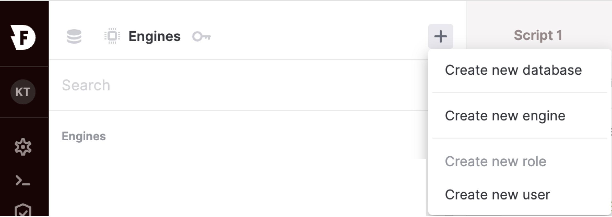
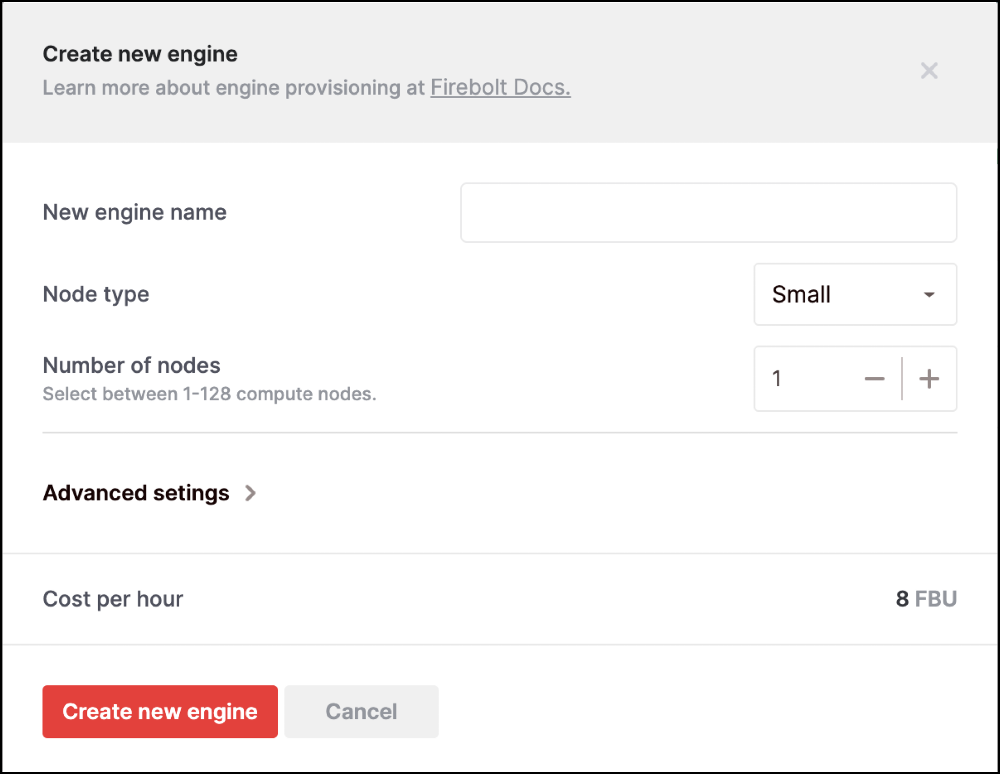
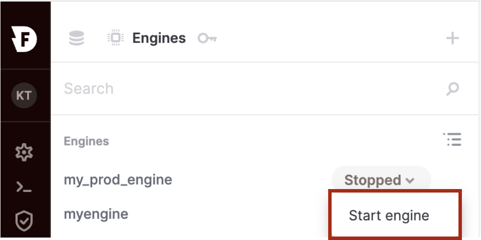
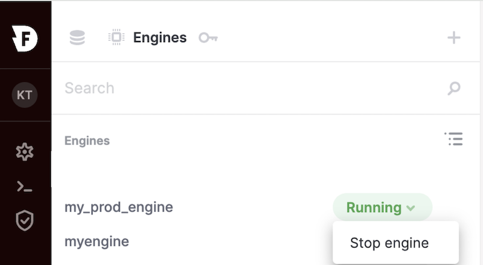
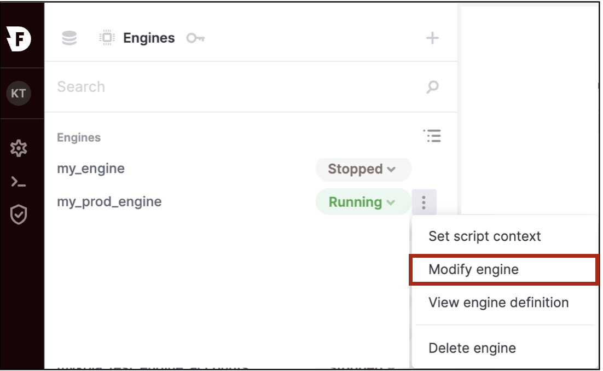
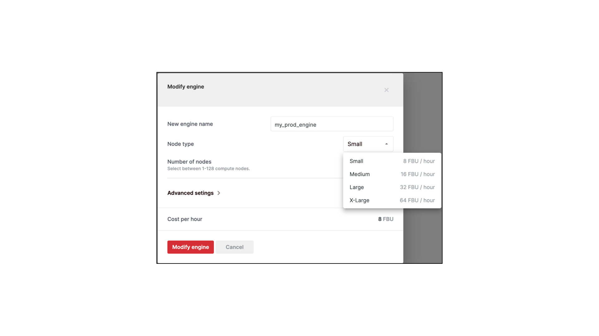
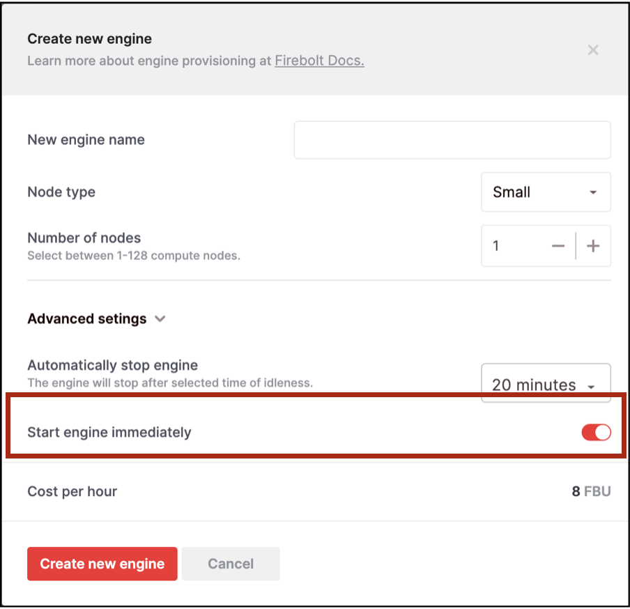
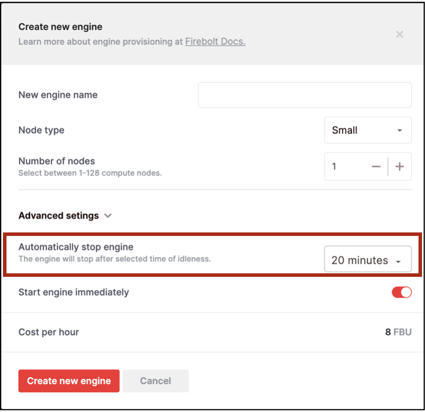

---
redirect_from:
  - /working-with-engines/working-with-engines-using-the-firebolt-manager.html
  - /working-with-engines/working-with-engines-using-ddl.html
  - /working-with-engines
layout: default
title: Work with engines using DDL
description: Learn how to create, modify and run Firebolt engines.
nav_order: 2
parent: Operate Engines
---
# Work with engines using DDL

You can create, run, and modify engines from the UI or SQL API. Firebolt allows dynamic scaling of engines without stopping them. 

{: .note}
 All engine operations below can be performed using a System Engine. 

## Create engines
### Create an engine using the UI <br /> 
{: .fs-6}
1. Select **Engines**. <br />
{: width="600" .centered}
 <br /> 

1. Select the (+) icon and choose **Create new engine**. <br />
{: width="600" .centered}
 <br /> 

1. Enter the engine name, type, and number of nodes. Select **Create new engine**. <br />
{: width="600" .centered}
 <br />  

### Create an engine using the API <br /> 
{: .fs-6}
To create an engine, use the [CREATE ENGINE]() command. <br />

The following code example creates an engine with one cluster containing two nodes of type 'S'.
```sql
CREATE ENGINE myengine;
```  

The following code example creates an engine with two nodes of type 'M'.
```sql
CREATE ENGINE myengine WITH
TYPE="M" NODES=2 CLUSTERS=1;
```  
<br />

{: .note}
When creating an engine via the UI, Firebolt preserves the case of the identifier. For example, an engine named **MyEngine** will retain its casing. To reference this engine in SQL commands, enclose the name in quotes: `"MyEngine"`. For more information, visit the [Object Identifiers]() page.

## Start or resume an engine
### Start an engine using the UI <br />
{: .fs-6}
1. In the **Engines** list, find the engine you want to start. 
2. Open the dropdown menu next to the engine and select **Start engine**. <br />
{: width="600" .centered} <br /> 
3. The engine status changes to **Running** once started. 

### Start an engine using the API <br />
{: .fs-6}
To start your engine, use the [START ENGINE]() command:

```sql
START ENGINE myengine;
```  

## Stop an engine
### Stop an engine using the UI <br />
{: .fs-6}
1. In the **Engines** list, find the engine you want to stop. 
2. Open the dropdown menu and select **Stop engine**.<br />
{: width="600" .centered}
 <br /> 

### Stop an engine using the API <br />
{: .fs-6}
To stop an engine, use the [STOP ENGINE]() command:

```sql
STOP ENGINE myengine;
```

To stop an engine immediately without waiting for running queries to complete, use:

```sql
STOP ENGINE myengine WITH TERMINATE=TRUE;
```

{: .note}
Stopping an engine clears its cache. Queries run after restarting will experience a cold start, potentially impacting performance until the cache is rebuilt. 

## Resize engines
### Scale engines up or down using the UI <br /> 
{: .fs-6}
1. In the **Engines** list, find the engine to modify. 
2. Open the dropdown menu and select the **More options** icon (). 
3. Choose **Modify engine**.<br />
{: width="600" .centered}<br />
4. Choose the new node type and select **Modify engine**.<br />
{: width="600" .centered}
 <br /> 

### Scale engines up or down using the API <br />
{: .fs-6}
Use the [ALTER ENGINE]() command to change the node type:

```sql
ALTER ENGINE my_prod_engine SET TYPE = “M”;
```
The previous example updates all nodes in the engine to use the 'M' type. 

### Scale engines out or in using the UI
{: .fs-6}
1. In the **Engines** list, find the engine to modify. 
2. Open the dropdown menu, select the **More options** icon (), and choose **Modify engine**.<br /> 
{: width="600" .centered}<br /> 
3. Adjust the number of nodes using the (-) and (+) buttons. 

### Scale engines out or in using the API
 {: .fs-6}
 Use the [ALTER ENGINE]() command to change the number of nodes:

```sql
ALTER ENGINE my_prod_engine SET NODES = 3;
```

The previous example updates the engine so that it uses three nodes. 

## Concurrency scaling
You can use the clusters attribute to scale engine concurrency. Set the `MIN_CLUSTERS` and `MAX_CLUSTERS` parameters to enable auto-scaling. The engine adjusts the clusters based on workload between the defined minimum and maximum. 

{: .note}
In preview mode, engines are limited to a single cluster. Contact [Firebolt support](mailto:support@firebolt.io) to try multi-cluster engines. 

During scaling operations, old and new compute resources may run concurrently, consuming additional FBUs. 

## Automatically start or stop an engine
You can configure an engine to start automatically after creation and to stop after a set idle time. 

### Configure automatic start/stop using the UI
{: .fs-6}
1. In the **Create new engine** menu, open **Advanced Settings**. 
2. Disable **Start engine immediately** to prevent the engine from starting upon creation.<br />
{: width="600" .centered}<br />
1. To configure automatic stopping, enable **Automatically stop engine** and set your idle timeout. The default is 20 minutes. Toggle the button off to disable auto-stop. <br /> 
{: width="600" .centered} <br /> 

### Configure automatic start/stop using the API
 {: .fs-6}
 Use the [CREATE ENGINE]() command to set auto-start and auto-stop options:
 
 ```sql
CREATE ENGINE my_prod_engine WITH 
INITIALLY_STOPPED = true AUTO_STOP = 10;
```

The previous example creates an engine that remains stopped after creation and auto-stops after 10 minutes of inactivity. 

To modify the auto-stop feature later, use the [ALTER ENGINE]() command: 

```sql
ALTER ENGINE my_prod_engine SET AUTO_STOP = 30;
```

{: .note}
The `INITIALLY_STOPPED` function can only be set during engine creation and cannot be modified afterward. 


