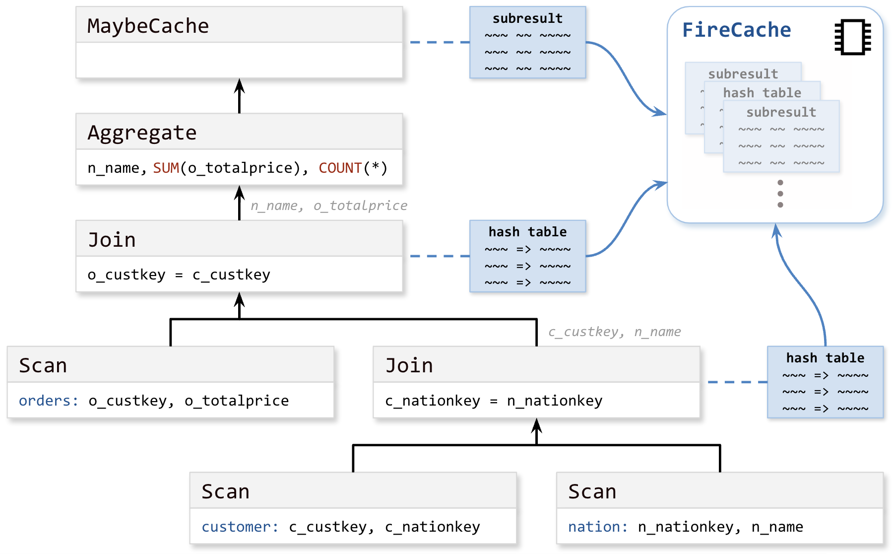

# Subresult Reuse in Firebolt

Workloads using repetitive query patterns can benefit tremendously from reuse / caching. Firebolt can cache subresults of arbitrary operators in the query plan, in particular also hash tables of hash-joins.
These subresults are placed in our in-memory FireCache which can use up to 20% of the available RAM. If a sub-plan is used in a different query, Firebolt's caching system recognizes this and uses potentially cached subresults even if the rest of the query differs. Here is how we determine which subresults to cache:
- Firebolts optimizer may add so-called `MaybeCache` operators above any node in the plan. As the name suggests, this operator may cache a subresult – if it is not too large. It may later fetch from the cache and reuse a subresult if the exact same subplan (with the same data being scanned) is evaluated again.
Currently, the optimizer places a `MaybeCache` operator 1) at the top of the plan, for a full result cache and 2) at nodes where “sideways information passing” is happening to speed up joins (where the probe-side has an index on the key that is being joined on).
The `MaybeCache` operator is versatile, it can be placed anywhere in the plan. 
- Firebolt places any subresult hash-tables built for `Join` operators in the FireCache if they are not too large. The reasoning behind this is that these hash tables are relatively expensive to compute and it is very advantageous to reuse them in case similar queries come in consecutively.

Subresult reuse in Firebolt is fully transactional. As soon as data in a base table changes (through any operation such as INSERT, UPDATE, or DELETE), old cache entries are no longer used.

# Example 

Let us have a look at the following made up query based on the [TPC-H benchmark](https://www.tpc.org/tpch/) schema (see, e.g., page 13 [here](https://www.tpc.org/TPC_Documents_Current_Versions/pdf/TPC-H_v3.0.1.pdf)).

```SQL
SELECT n_name as nation, SUM(o_totalprice), COUNT(*)
  FROM orders, customer, nation
 WHERE o_custkey = c_custkey AND c_nationkey = n_nationkey
 GROUP BY ALL;
```

The simplified plan for this example query would look like this:



A `MaybeCache` has been placed at the top of the plan and it places the subresult collected on the first run into the FireCache, as do both `Join` operators with their respective hash tables.
On a subsequent run of exactly the same query (over unchanged data), the `MaybeCache` fetches the subresult from the cache and the entire evaluation can be skipped. This means the latency drops to very low milliseconds. In this example this corresponds to a speed boost of more than 100x (on a single node, medium engine running over TPC-H with scale factor 100).

If we add `... AND o_orderdate >= '1998-01-01'::Date ...` to the `WHERE` condition, the `MaybeCache` operator cannot be used because the query plan below it has changed. On the other hand, the subplan below the upper `Join`, has not changed! Therefore the previously computed and cached hash table can be reused in that `JOIN` operator. This saves us from evaluating the subplan and building the hash table again.
In the example, this leads to a speed boost of > 5x on subsequent queries (even when each query has a different date restriction).

# Recognizing Subresult Reuse in Query Telemetry

Firebolt transparently leverages subresult reuse. If you want to see whether subresult reuse helped to speed up your query, look for `Nothing was executed` in the [EXPLAIN (ANALYZE)](../../sql_reference/commands/queries/explain.md) output. This shows that an operator was not executed because an operator above it retrieved the subresult from the FireCache. For example, in this `EXPLAIN (ANALYZE)` outut, `MaybeCache` retrieved the resut from the cache and skipped execution of the entire query:

```
[0] [MaybeCache]
|   [RowType]: date not null, text not null, bigint not null, double precision null
|   [Execution Metrics]: output cardinality = 10000, thread time = 0ms, cpu time = 0ms
 \_[1] [Projection] ref_2, ref_1, ref_0, ref_3
   |   [RowType]: date not null, text not null, bigint not null, double precision null
   |   [Execution Metrics]: Optimized out
    \_[2] [SortMerge] OrderBy: [ref_2 Ascending Last, ref_1 Ascending Last, ref_0 Ascending Last, ref_3 Ascending Last] Limit: [10000]
      |   [RowType]: bigint not null, text not null, date not null, double precision null
      |   [Execution Metrics]: Nothing was executed
[...]
```

# Disabling Subresult Reuse

While testing, it's recommended to disable the subresult cache using the `enable_subresult_cache` [system setting](../../Reference/system-settings.md) in order to measure the performance of your query without caching:

```sql
-- Disable the subresult cache
SET enable_subresult_cache = false;
-- This query does not use the subresult cache
SELECT checksum(*) FROM production_table;
```
