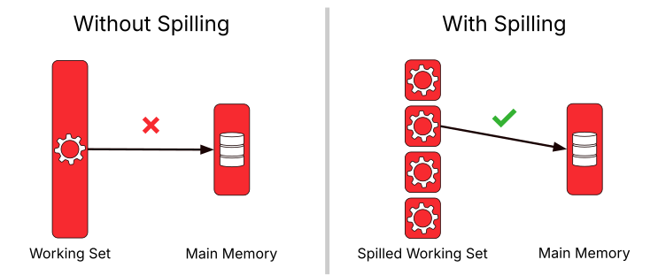

# Understand spilling

Most query execution operators in Firebolt can react dynamically to memory pressure and take measures to prevent query failure. While on a technical level there are two different mechanisms at play, they share the same goal: allowing an engine to successfully finish the vast majority of queries that would otherwise fail with an "Out of memory" error. Both mechanisms (called "spilling" and "flushing") are applied automatically when necessary without any user intervention.

Firebolt implements spilling for aggregations and joins, and we will explore it in more detail in the sections below.

## How Spilling Works

The fundamental idea of spilling is to write intermediate state to disk in a partitioned way when the data set is too big to process entirely in memory, and then process the partitions in memory one by one. The following sketch illustrates this:



Spilling-enabled operators continuously monitor how much memory remains available for use on each node of the engine. When they detect that the available amount is likely to be insufficient to complete the query, they temporarily stop accepting new data and start spilling part or all of the state that they have built up to the local SSD cache. This frees up memory to continue processing input data. If the available memory once again falls below the amount required to finish the operation, the operator spills additional parts of its state. Once the operator has read all of its input data, it needs to read the spilled data back from the SSD cache to produce the correct output. Because we already know that we do not have enough memory to process everything in memory, we read the spilled data *partition by partition*. These partitions are designed to be processed individually, without needing to refer to any other partitions to produce the operator's result for a given partition. By using 256 partitions, we can process up to 200 times more data with spilling than in memory.

Note that spilling only kicks in when absolutely necessarily. This makes sure that when the working set of a query fits fully into main-memory, it is executed as efficiently as possible.

## Implications of Spilling

When an operator spills, it has to write a significant amount of data to the SSD cache and later read it back. This comes at a performance cost. If the engine has only slightly too little memory, using a bigger engine -- whether by scaling up or by scaling out -- can avoid the need for spilling and result in significantly reduced latency.

## Observability

If a query made use of spilling, you will see a non-zero value in the `spilled_bytes` column of [information_schema.engine_query_history](../../sql_reference/information-schema/engine-query-history.md) describing how many bytes were spilled to the SSD cache in total by all spilling operators in the query.   Additionally, you can monitor the amount of spilled data on the SSD cache at any particular time in the `spilled_bytes` column of [information_schema.engine_metrics_history](../../sql_reference/information-schema/engine-metrics-history.md) or in the "engine monitoring" section of the Firebolt Web Interface.

## Example

You can easily test spilling for yourself with the following query on an engine with a single node of type "small":
```sql
SELECT min(x), max(x), x FROM generate_series(1, 1000000000) r(x) GROUP BY x;
```

This aggregation uses one billion groups, and the aggregate state is too large to process in memory on a single small node. As a result, the engine spills some data to disk (around 8 GB) before merging it again. You can observe how the `spilled_bytes` metric in `information_schema.engine_metrics_history` increases while the aggregation processes and spills input, and then starts decreasing again as spilled data is merged and deleted.

## Limitations

Not all queries can benefit from spilling. Spilling is not implemented for the `ORDER BY` operator and for [window functions](../../sql_reference/functions-reference/window/index.md). Additionally, aggregations where the size of a single key's state exceeds the available memory, such as a `count(distinct)` without a `GROUP BY` clause on a column with a huge amount of distinct values, cannot currently spill. Such queries could still fail with an out-of-memory error if spilling in other queries or operators cannot free up enough memory for these non-spilling-enabled operators.

Spilling is also limited by the available SSD cache. Once the cache is full and no non-essential data remains to be evicted from cache, spilling cannot proceed, and the query will fail.  Of course, any leftover spilled files will be cleaned up in such cases, ensuring that the SSD cache capacity is made available again for caching or spilled data from other queries.

## Technical details: spilling vs. flushing

Many operators, such as filters or projections (function evaluations), do not keep significant amounts of data in memory at any given time.

Some operators have an over-pressure relief valve and can *flush* excess data. This applies to both insertion operators, which can reduce the amount of tablet merging applied during insert and thereby reduce their memory requirements, as well as partial aggregations in a distributed aggregation plan, which can flush their partially aggregated data to the merge stage early to continue the aggregation there. Because distributed aggregations are partitioned, this distributes the excess load over the cluster, and additionally reduces total memory usage because the merge stage eliminates any duplication found in the different nodes' inputs.

Other operators do not have this ability, and must *spill* data to the SSD cache to avoid going out of memory and later process the data piece by piece to produce the result.  This affects all operators that need to fully process the input data before they can start producing output. Firebolt implements this for the joins as well as the merge stage of aggregations.
