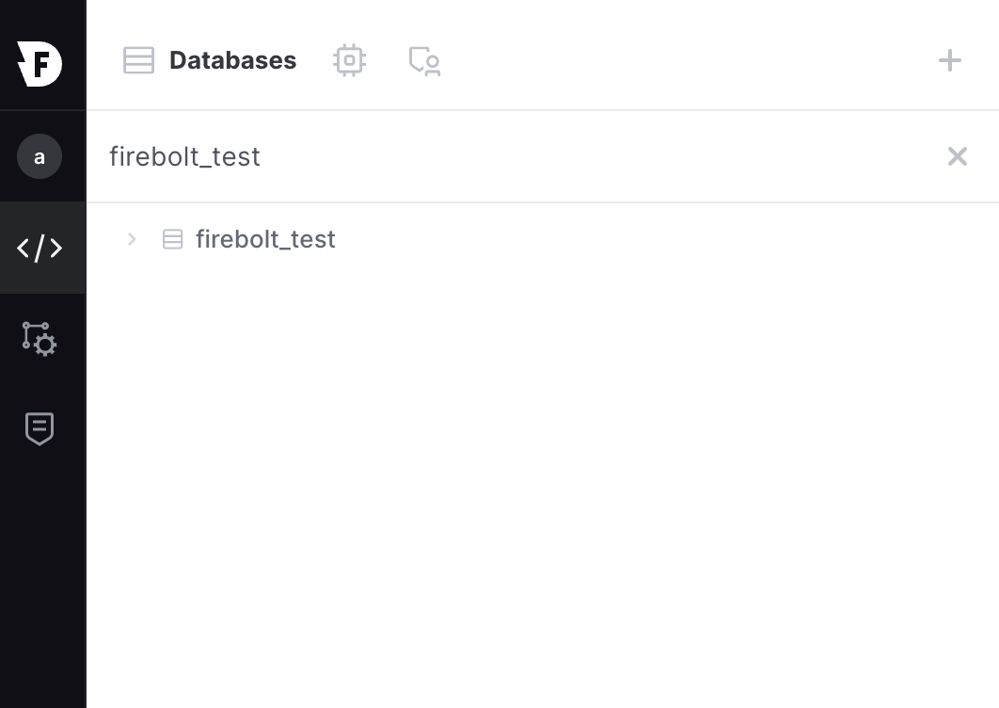
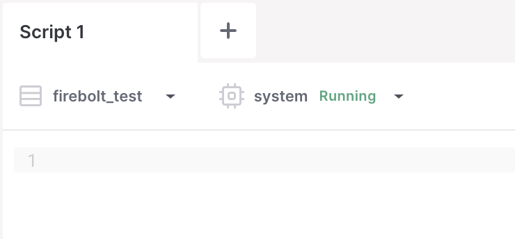
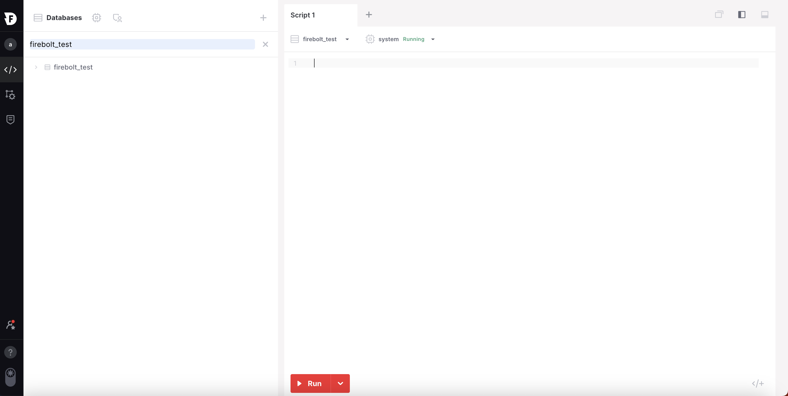
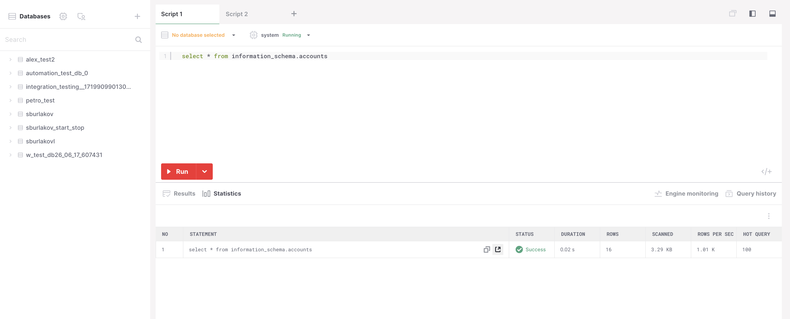
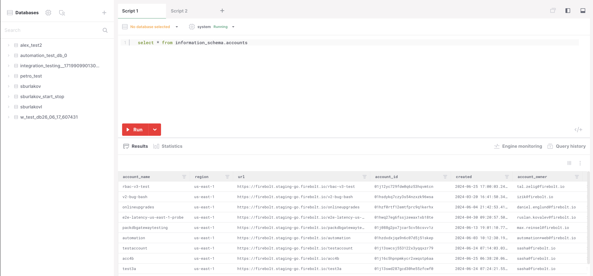
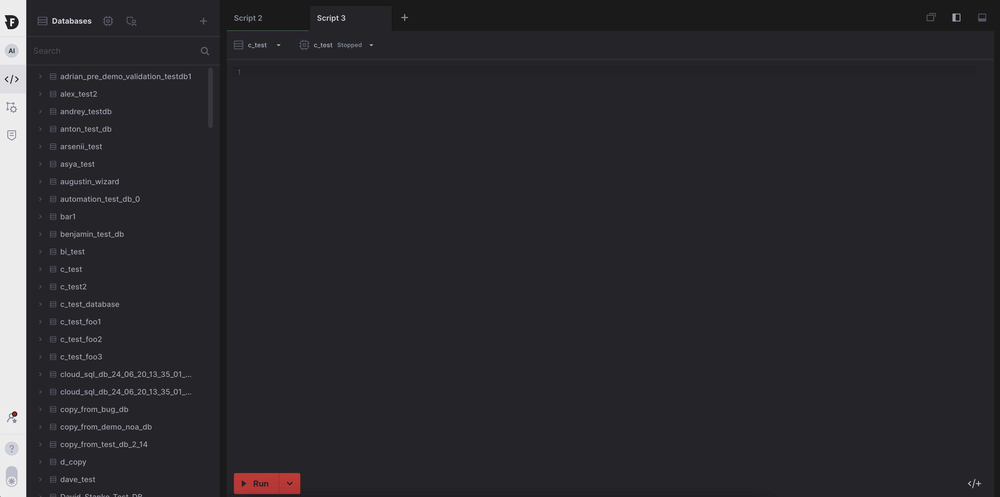

# Use the Develop Space
{: .no_toc}

* Topic ToC
{:toc}

The **Firebolt Workspace** has a **Develop Space** that you use to edit and run SQL scripts and view query results.

## Open the Develop Space

You can launch the space for a database by clicking the **Develop** icon from the left navigation pane or clicking the "+" icon next to "Script 1". 

  

  

**Starting the Develop Space for the last database you worked with**

1.  Choose the **>_** icon from the left navigation pane.

    

    The space for the database that you last worked with will open, and the database will be selected from the list.

2. To switch to different database's space, choose from the dropdown menu in the Databases panel. 

## A quick tour

The **Develop Space** is organized into two panels.

* The left panel is the explore panel. You can use it to navigate to different databases and to work with different scripts in your database.

* The center panel is the document editor. You can use it to edit scripts, save them, and run scripts. When you run a script, the results will be shown in the bottom part of the pane.

     

## Using the document editor

The document editor uses tabs to help you organize your SQL scripts. You can switch tabs to work with different scripts and run them. You can have multiple query statements on the same tab. Each statement must be terminated by a semi-colon (`;`).

### Using auto-complete

As you enter your code in a script tab, Firebolt suggests keywords and object names from the chosen database. Press the tab key to add the first suggestion in the list to your script, or use arrow keys to select a different item from the list and then press the tab key.

### Using script templates

Script templates are available for common tasks, such as creating fact or dimension tables. Place the cursor in the editor where you want to insert code, choose the **</+** icon, and then select a query template from the list.

<!--- need to insert screenshot--->

### Using the CREATE EXTERNAL TABLE template to import data

To create an external table, which is the first step for ingesting data into Firebolt, choose the **Import Data** button from the object pane or choose the download icon and then choose **Import data** as shown in the example below.

<!--- need to insert screenshot--->

Firebolt creates a new tab with a `CREATE EXTERNAL TABLE` statement.

## Managing scripts

* [To rename a script](#scriptrename)
* [To copy a script](#scriptcopy)
* [To export a script and download it as a .sql file](#scriptexport)

**Renaming a script**

* Choose the vertical ellipses next to the script name in the left pane, choose **Rename script**, type a new name, and then press ENTER.

**Copying a script**

* Choose the vertical ellipses next to the script name in the left pane, choose **Duplicate script**, and then press ENTER. Firebolt saves a new script with the pattern `<original_script>_copy. 

**Exporting a script and downloading it as a .sql file**

*   Choose the vertical ellipses next to the script name in the left pane, and then choose **Export script**.

    Firebolt downloads the file to your browser's default download directory using the file pattern `<your_script_name>.sql`.

## Running scripts and working with results

At the bottom of each script tab, you can choose **Run** to execute SQL statements. SQL statements can only run on running engines. If an engine isn't running, you can select it from the list and then choose the **Start** button for that engine. For more information about engines, see [Operate engines](../operate-engines/operate-engines.md)

You can run all statements in a script or select snippets of SQL to run.

**Running all SQL statements in a script**

* Position the cursor anywhere in the script editor and then choose **Run**. All SQL statements must be terminated by a semi-colon (`;`) or an error occurs.

**Running a snippet of SQL as a statement**

* Select the SQL code you want to run as a statement and then choose **Run**. Behind the scenes, Firebolt automatically appends a semi-colon to the selected SQL code so it can run as a statement.

### Viewing results

After you run a script or query statement, more results appear below the script editor, along with statistics about query execution. The statistics section will provide further information on your statement such as its status, duration, and more. 

### Viewing multi-statement script results
<!--- second paragraph has to be rephrased--->
When you run a script that has multiple SQL statements with result sets (`SELECT` statements), each result is shown on a separate line with statistics about statement execution. The first statement that ran is numbered 1 and at the bottom of the list.

To view the results table for a result set, choose the table icon as shown in the example below.

### Exporting results to a local hard drive

You can export up to 10,000 rows of query results to your local hard drive after you run a query.

1. Choose the download icon (see image below).  

2. Choose **Export table as CSV** or **Export table as JSON**.  
Firebolt downloads the file type that you chose to the default download location for your browser.  
<!--- need to insert screenshot--->

It is possible to export the results of a single query alongside the results summary of all queries run in your script (with the statistics).
<!--- add a section about filtering columns--->

## Switching between light and dark mode

Click on the toggle at the bottom of the left navigation pane to switch between light and dark mode. 

