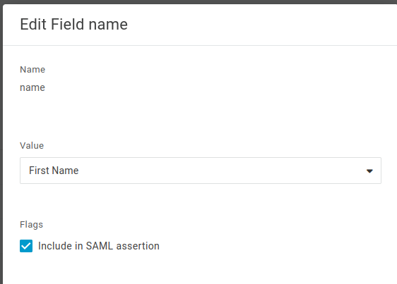
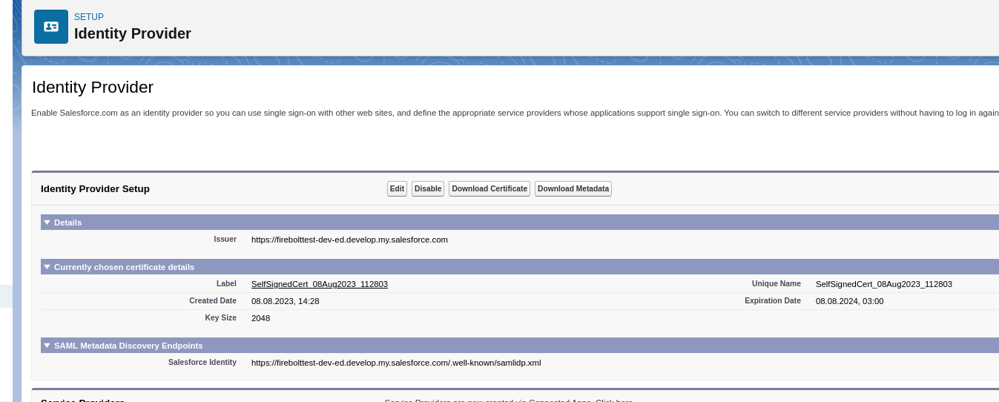
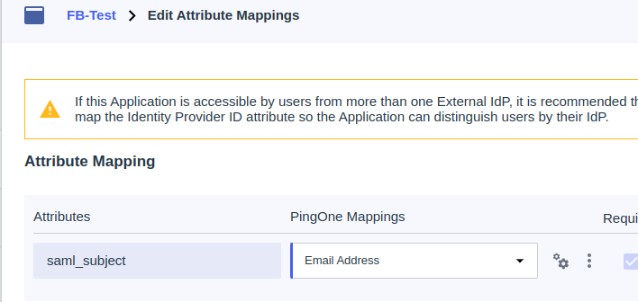

# Configure your IdP

Before you can set up SSO with Firebolt, follow the required configuration steps in your identity provider to work with the application.

{: .caution}
Before creating a SAML integration in your IDP, you must configure the Audience URI. Otherwise, SAML assertions will not pass, and SSO will not allow users to sign in.

Firebolt supports the following identity providers (IDPs):
- Okta
- OneLogin
- Salesforce
- PingFederate (Ping Identity)
- Custom

If your IDP is not on the above list but supports SAML 2.0, contact the Firebolt support team for further assistance. 

## Okta

### Configure Okta application
1. In Okta Admin Console, go to **Applications > Applications**.
2. Click **Create App Integration**.
3. Select **SAML 2.0** as the Sign-in method and click **Next**.
4. In the general configuration, fill in the following fields:
    -  **Single sign-on URL.** 
   
    This URL has the following format `https://id.app.firebolt.io/login/callback?connection=<org_name>-<provider>&organization=<organization_identifier>` 
    
    Contact Firebolt to get your organization_identifier. 
    
    **Example:** https://id.app.firebolt.io/login/callback?connection=vsko-okta&organization=org_82u3nzTNQPA8RyoM
    - **Audience URI (SP Entity ID).** 
   
    This URI has the following format: `urn:auth0:<tenant_name>:<org_name>-<provider>`, where `<tenant_name>` is app-firebolt-v2, `<org_name>` is the name of organization provider and `<provider>` is the provider value set in Firebolt configuration step. 

    **Example:** ```urn:auth0:app-firebolt-v2:vsko-okta```
5. Save the configuration.
6. Open the details of the created app integration, and select the **SAML** tab. Click **More details** to expand additional information.
7. Copy the value for **Identity Provider Single Sign-On URL** and download the signing certificate.

### Example - Firebolt organization configuration to work with Okta

Values for SQL to create the SSO connection are as follows:
```sql
ALTER ORGANIZATION vsko SET SSO = '{
  "signOnUrl": "https://vsko.okta.com/app/vsko_app_1/exk8kq6ikd3Is13KO4x7/sso/saml",
  "issuer": "okta",
  "provider": "okta",
  "label": "Okta Company App",
  "fieldMapping": {
    "given_name": "name",
    "family_name": "surname"
  },
  "certificate": "<certificate>",
}';
```

where
- ```signOnUrl``` is the Identity Provider Single Sign-On URL value copied during Okta setup, 
- ```issuer``` is the name of the issuer, 'okta'  in this case, 
- ```provider``` is the IDP name, ‘okta’ in this case,
- ```label``` is text that will appear on the **Sign in** form (this defaults to '<organization_name>-<provider>' if a value is not provided, for instance ‘acme-okta’), 
- ```certificate``` is the X.509 Certificate copied during Okta setup, and
- ```field_mapping``` includes additional fields to be mapped from SAML assertion, based on what was configured during setup. For example:

```json
{
  "given_name": "name",
  "family_name": "surname"
}
```

## OneLogin

### Configure OneLogin application

1. In OneLogin, open **Dashboard**, and click **Apps > Add Apps**.
2. Search for **SAML**, and select **SAML Test Connector (IdP w/attr)**.
3. Change the Display Name of the app and click **SAVE**. This is the name of the app that will appear in the OneLogin portal.
4. Open the **SSO** tab and copy the value for the **SAML 2.0 Endpoint (HTTP)**. Note that logout endpoint is not used at this time.
5. Click on the **View Details** link at the X.509 Certificate field and copy/download the certificate.
6. Open the **Configuration** tab and fill in the following values:
    - **Audience** - a URI in the following format: `urn:auth0:<tenant_name>:<org_name>-<provider>`, where `<tenant_name>` is app-firebolt-v2, `<org_name>` is the name of organization, and `<provider>` is the provider value set in Firebolt configuration step. **Example:** `urn:auth0:app-firebolt-v2:vsko2-onelogin`
    - **ACS (Consumer) URL Validator** - a valid regular expression. This field is used to ensure OneLogin posts the response to the correct URL, and it validates the ACS URL field.
    - **ACS (Consumer) URL and Recipient** - the post-back URL for your organization. This is the url in the following format: `https://id.app.firebolt.io/login/callback?connection=<organization_name>-<provider>&organization=<organization_identifier>`. The organization_identifier is needed to select the correct organization during redirects. The authentication flow will fail if this is provided incorrectly or not provided. Contact the Firebolt support team to retrieve your organization_identifier. **Example:** https://id.app.firebolt.io/login/callback?connection=vsko2-onelogin&organization=org_82u3nzTNQPA8RyoM


### Example - Firebolt organization configuration to work with OneLogin

Values for SQL to create the SSO connection are as follows:
```sql
ALTER ORGANIZATION vsko SET SSO = '{
  "signOnUrl": "https://vsko-test.onelogin.com/trust/saml2/http-post/sso/aa",
  "issuer": "onelogin",
  "provider": "onelogin",
  "label": "OneLogin Company App",
  "fieldMapping": {
    "given_name": "name",
    "family_name": "surname"
  },
  "certificate": "<certificate>",
}';
```

where
- ```organization_name``` is the name of the organization in Firebolt, 
- ```signOnUrl``` is the SAML 2.0 Endpoint (HTTP) value copied during OneLogin setup,
- ```issuer``` is the name of the issuer, 'onelogin' in this case, 
- ```provider``` is the IdP name, ‘onelogin’ in this case, 
- ```label``` is text that will appear on the **Sign in** form (this defaults to `<organization_name>-<provider>` if a value is not provided, for instance ‘acme-onelogin`) 
- ```certificate``` is the X.509 Certificate copied during OneLogin setup, and 
- ```field_mapping``` includes additional fields to be mapped from the SAML assertion, based on what was configured during OneLogin setup. For exaxmple:

```json
{
  "given_name": "name",
  "family_name": "surname"
}
```

This corresponds to the following setup in OneLogin, where name/surname in OneLogin corresponds to values in JSON:



## Salesforce

### Configure Salesforce application



1. In Salesforce, search for the 'Identity provider' setting. Make sure that 'Identity Provider Setup' is enabled. You can use default certificate. 

2. From the **Identity Provider** page, click **Download Metadata**. Open the downloaded xml file and find the SingleSignOnService binding, Location attribute, which ends with `../HttpPost`. It will look like: `https://<your-salesforce-account>.my.salesforce.com/idp/endpoint/HttpPost`. Save this value to be used as the SignOnURL in Firebolt SSO configuration.
3. Click **Download Certificate**, and convert the downloaded .crt file to PEM format. You could do this using the following command:
```openssl x509 -in original.crt -out sfcert.pem -outform PEM```
where ```original.crt``` is the name of the downloaded .crt file.
4. Click on the provided link to create a new connected app in Salesforce. 
5. You will be redirected to the **Manage Connected Apps / New Connected App** view. Fill in required fields **Connected App Name, API Name** (for instance, type ‘Firebolt’) and **Contact email**.
6. Move to **Web App Settings,** and check the **Enable SAML** box.
7. Fill in the Entity Id field with value: `urn:auth0:firebolt-app-v2:<organization_name>-<provider>`, 
where
- ```<organization_name>``` is the name of the organization in Firebolt, and 
- ```<provider>``` is the IdP name, 'salesforce' in this case
For example: 
`urn:auth0:app-firebolt-v2:acmeorg-salesforce`

8. Fill the ACS URL field with a URL in the following format (contact Firebolt to get your organization_identifier) `https://id.app.firebolt.io/login/callback?connection=<organization_name>-<provider>&organization=<organization_identifier>`
For example:
`https://id.app.firebolt.io/login/callback?connection=acmeorg-salesforce&organization=org_82u3nzTNQPA8RyoM`

9. Keep **Subject Type** as Username, and **Name ID Format** as unspecified. Click **Save**.

### Example - Firebolt organization configuration to work with Salesforce

Values for SQL to create the SSO connection are as follows:
```sql
ALTER ORGANIZATION acmeorg SET SSO = '{
  "signOnUrl": "https://firebolttest-dev-ed.my.salesforce.com/idp/endpoint/HttpPost",
  "issuer": "salesforce",
  "provider": "salesforce",
  "label": "Salesforce Company App",
  "certificate": "<certificate>"
}';
```

where 
- ```signOnURL``` is the SAML 2.0 endpoint value copied during Salesforce setup, 
- ```issuer``` is the name of the issuer, 'salesforce' in this case,
- ```provider``` is the IdP name, 'salesforce' in this case,
- ```label``` is text that will appear on the **Sign in** form (this defaults to ‘<organization_name>-<provider>’ if a value is not provided, for instance ‘acme-salesforce`), and 
- ```certificate``` is the X.509 certificate in PEM format downloaded during setup.

## PingFederate (Ping Identity)

### Configure PingFederate application

1. Click **Connections / Applications** in the administration menu. Then on the **Applications** page click **+** to create a new application. 
2. Type in the application name (for instance, Firebolt) and description. THen select **SAML Application**, and click **Configure**.
3. Choose **Manually Enter** to provide application metadata. 
    - Fill the **ACS URLs** field with a URL in the following format (contact Firebolt to get your organization_identifier): 
    `https://id.app.firebolt.io/login/callback?connection=<organization_name>-<provider>&organization=<organization_identifier>`
    For example: `https://id.app.firebolt.io/login/callback?connection=acmeorg-pingfederate&organization=org_82u3nzTNQPA8RyoM`
    - Fill in **Entity ID** with the value: `urn:auth0:firebolt-app-v2:<organization_name>-<provider>`, 
    where
    - ```<organization_name>``` is the name of the organization in Firebolt, and 
    - ```<provider>``` is the provider value set in Firebolt configuration step
    For example: 
    `urn:auth0:app-firebolt-v2:acmeorg-pingfederate`

4. Click **Save**.
5. From the **Configuration** tab:
    - Download the signing certificate in X509 PEM format
    - Save the value of Single SignOn Service
6. Open the **Attribute Mappings** tab, and edit the saml_subject to map to Email Address. Then **Save**.



### Example - Firebolt organization configuration to work with PingFederate
Values for SQL to create the SSO connection are as follows:
```sql
ALTER ORGANIZATION acmeorg SET SSO = '{
  "signOnUrl": "https://auth.pingone.eu/74d536da-4d98-4fdd-83ae-63af461eb826/saml20/idp/sso",
  "issuer": "pingfederate",
  "provider": "pingfederate",
  "label": "PingFederate Company App",
  "certificate": "<certificate>"
}';
```

where
- ```signOnURL``` is the Single Sign On Service URL obtained during PingFederate configuration,
- ```issuer``` is the name of the issuer, 'pingfederate' in this case,
- ```provider``` is the IdP name, 'pingfederate' in this case,
- ```label``` is the text that will appear on the **Sign in** form (this defaults to `<organization_name>-<provider` if a value is not provided, for instance ‘acme-pingfederate`)
- ```certificate``` is the X.509 certificate in PEM format downloaded in setup.

## Custom

To use a SAML 2.0 compliant service or application as your IDP for single sign on (SSO) with FIrebolt, complete the following steps:
1. In the service/application interface, define a custom SHA-256 application for Firebolt. Follow the specific instructions of the service/application in order to define such a custom application.
2. In the interface, create a user for each end-user that needs to access Firebolt. When creating the users, make sure to specify the email address for each of those users. Firebolt uses those email addresses to create the corresponding logins in Firebolt. See [setting up SSO](sso.md) for more information.
3. Obtain values for Audience URI and ACS (Consumer) URL to use in the IDP setup from Firebolt support team. 

    IMPORTANT: The SSO authentication will not work if these values are not setup properly in your IDP.
    
    If, for instance your organization name is `acmeorg` and provider name you specify is `custom`:
    - Example of ACS URL: `https://id.app.firebolt.io/login/callback?connection=acmeorg-custom&organization=<organization_identifier>`
    - Example of Audience URI: `urn:auth0:app-firebolt-v2:acmeorg-custom`
4. Obtain the SSO URL (This is the URL endpoint to which Firebolt sends the SAML requests.) and certificate (used to verify the communication between the IDP and Firebolt) for your custom IDP. You will need the **SSO URL value** and **certificate** to set up SSO.

