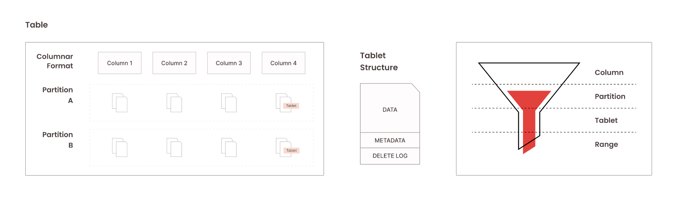
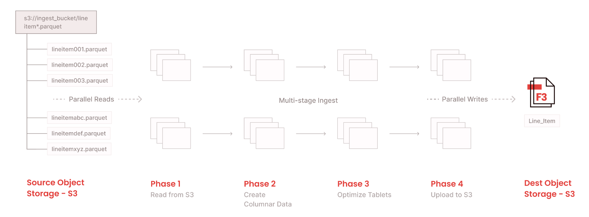

# Data management lifecycle in Firebolt

At Firebolt, the focus is on delivering the highest levels of performance and efficiency while minimizing the heavy lift that needs to be done by an end user. The foundational elements of Firebolt provide the full data management capabilities needed by modern data applications, including an optimized storage layer, parallel-pipelined data ingestion, primary and aggregated indexes, streamlined deletes and updates, and core database semantics. 

Delivering consistent performance and efficiency requires careful considerations, modeling and optimal indexing strategy. With automated index maintenance, Firebolt enables a hands-free approach to delivering consistent performance without the operational burden, even for cases where data modification functionality is needed. Various types of DML statements can impact system performance as it can result in storage fragmentation, negating the effectiveness of indexes. However, Firebolt addresses this with the choice of user-controlled or system-controlled backend optimization. 

This topic explains how Firebolt delivers full data management capabilities, including how to: 
1) create a simple table, 
2) ingest data into it using bulk insert and singleton insert capabilities, and finally, 
3) modify the data by performing delete and update operations. 

Learn also what happens behind the scenes, how data is being stored internally and how internal data structures evolve as data gets manipulated and changed, as well as how Firebolt handles concurrency, managing indexes and optimizing storage.

* Topic Toc
{: toc}

## Transactions and concurrency
Before getting into how data manipulation and changes work in Firebolt, it is important to first explain transactions and concurrency controls that are implemented within the system.
In Firebolt, each request/statement is treated as a new implicit transaction. As such, every statement has a transaction ID and timestamp associated with it. Furthermore, Firebolt leverages an optimistic concurrency method and implements Multi Version Concurrency Control (MVCC) to handle concurrent requests coming into the system.

Optimistic concurrency comes with increased throughput, because multiple transactions can complete frequently without interfering with each other. Each transaction verifies that no other transaction has modified the same data concurrently. If the check reveals conflicting modifications, the committing transaction rollback (and can be restarted). MVCC implementation keeps multiple copies of data items, to handle concurrent and potentially contradicting data changes. This way, each transaction sees a snapshot of the database at a particular instant in time, and any changes made by one transaction will not be seen by other transactions until the changes have been completed.
All of this is implemented in the product to ensure Firebolt can satisfy performance, scale, and throughput requirements that data intensive applications need.

## Creating tables
Let’s start by creating a simple table called rankings.
```sql
CREATE TABLE IF NOT EXISTS rankings (
    GameID INTEGER,
    PlayerID INTEGER,
    MaxLevel INTEGER,
    TotalScore BIGINT,
    PlaceWon INTEGER,
    TournamentID INTEGER,
    SOURCE_FILE_NAME TEXT,
    SOURCE_FILE_TIMESTAMP TIMESTAMP) 
PRIMARY INDEX GameID, TournamentID, PlayerID;
```

The statement also contains a [primary index](using-indexes.md#primary-indexes) definition. While primary index creation is optional in Firebolt, defining primary indexes on all tables is encouraged. Primary indexes, and indexes in general, are critical for delivering performance and achieving efficient query execution.

How do indexes help with delivering this performance? Each table in Firebolt is composed of internal objects called tablets. Tablets store data in columnar format with built-in data compression, reducing disk io and resulting in efficient, performant query processing. Input data gets automatically converted into this columnar data format as the data gets ingested into the table. The size of individual tablets and the number of tablets per table is automatically determined and managed by the Firebolt system. When a table is defined as a partitioned table, individual tablets are bound to a particular partition, as tablets cannot span multiple partitions. 

  

Defining a primary index on a table forces data sorting within each tablet. Primary indexes can be defined using one or multiple columns, and data ordering follows that index definition. Implementing proper primary indexes and having data ordered correctly is critical for many reasons. First, since each tablet contains granular metadata information about data stored within the tablet itself, scalar predicates and semi-join queries that use primary index columns can be optimized by scanning only the data that is required (as a data pruning process). Second, only tablets needed to satisfy the query can be touched, even though a table may contain many tablets behind the scenes – unneeded tablets are skipped during querying time (as a  tablet pruning process). Finally, the ordered dataset typically compresses to a smaller size, leading to reduced IO operations. 

In addition, in situations where users create partitioned tables, queries containing filters on partitioned columns can eliminate unnecessary data scans by querying only partitions needed for results (as a partition pruning process). 
All techniques mentioned above lead to efficiency when querying and processing data.

## Inserting data
To support loading data from a data lake (Amazon S3) into Firebolt tables, Firebolt provides utilities for loading data in bulk. Users can perform both initial and incremental data ingestion using either a [`COPY`](../sql_reference/commands/data-management/copy-to.md) statement or [`INSERT INTO SELECT FROM <external_table>`](../sql_reference/commands/data-management/insert.md) syntax. 

In addition, Firebolt supports singleton inserts via a `INSERT INTO VALUES` statement. Typical scenarios where singleton inserts come handy are:
- Refreshing tables with small amounts of dimensional data, and
- Implementing slowly changing dimension patterns.

Let’s review how these utilities work in more detail, and their corresponding performance.

### Bulk inserts
In Firebolt, bulk data ingestion utilities are designed to be inherently scalable. There are 4 major stages that each loading process goes through: 

1) reading data from Amazon S3, 
2) converting data into tablets and columnstore, 
3) merging tablets to optimize tablet quality (needed for efficient tablet pruning), and 
4) uploading tablets into Amazon S3. 

As a distributed system and query engine, Firebolt supports both parallel and pipelined data processing, to scale loading processes. At the node level, Firebolt fully employs intra-node parallelism by having multiple reader/writer processes. Data loading parallelism automatically increases as the engine increases in scale (multi-node parallelism). Pipelined execution ensures that all deployed resources are kept busy while data is being streamed across transformation stages mentioned above. This way, users can ingest large amounts of data into Firebolt tables while utilizing deployed resources as efficiently as possible.

  

As the bulk data load gets executed, Firebolt creates new tablets behind the scenes while preserving necessary metadata information about the data being ingested. Factors such as min/max values, tablet size, data offsets and ranges, tablet location, etc., are kept as metadata artifacts and used during query execution to deliver differentiated performance characteristics.

Performing data ingestion comes with transactional semantics and ACID guarantees. Each COPY execution is treated as a separate transaction. With snapshot isolation support by default, data reads (and other operations) can be executed as the data are being ingested into  tables. Different data readers will not see ingested data until the data ingestion process finishes and the transaction gets committed. Similarly, the same table can be loaded simultaneously with multiple ingestion processes.

### Singleton insert
While singleton insert is a supported pattern in Firebolt, using bulk insert utilities is recommended to optimize performance of large data ingestion. 

Data inserted by a singleton insert statement gets stored within a single tablet. From the tablet quality perspective, this creates a suboptimal situation, and can lead to table fragmentation in cases where many singleton inserts are executed. This in turn can lead to suboptimal query performance. One way to mitigate this situation is to use a mini batch pattern (a collection of `INSERT INTO VALUES` statements separated by a comma) whenever possible. When a batch of `INSERT INTO VALUES` statements are executed, Firebolt tries to create a single tablet, which will improve tablet quality and reduce table fragmentation.

To minimize operational overhead and system maintenance that table fragmentation can cause, Firebolt implements a built-in optimization process that merges tablets with suboptimal size. This optimization process is fully autonomous and runs in the background. The background process searches on  a periodic basis for suboptimal tablets and merges them while keeping tablet optimal size in mind. In addition, Firebolt supports the [`VACUUM`](../sql_reference/commands/data-management/vacuum.md) command that allows users full control to defragment tables on-demand.

#### Singleton insert statement example
```sql
INSERT INTO rankings (GameID, PlayerID, MaxLevel, TotalScore, PlaceWon, TournamentID) VALUES (10, 231, 10, 1000020, 1, 5);
```

#### Bulk insert statement example
```sql
INSERT INTO rankings SELECT * FROM rankings_ext; 
//rangings_ext object referenced in above SQL statement is an external table pointing to S3 data
```

## Deleting data
Firebolt supports storing as much data as needed for as long as needed. However, there are situations where data does need to be deleted. Situations like data corrections that occur in the systems of records, or GDPR compliance where a single (or multiple) customer record(s) must be deleted to preserve privacy, have led to support for [`DELETE`](../sql_reference/commands/data-management/delete.md) statements in Firebolt.

Firebolt supports deleting a single record in a table or deleting data in bulk. In addition to the tablet level metadata, each tablet comes with a delete log. As the records get deleted, the delete log is maintained. Given rich tablet-level metadata, only tablets that are affected by the delete operation are touched. In cases where `DELETE` query uses a primary key(s) as a predicate, Firebolt leverages primary key information to quickly find tablets and records that are affected by the DELETE operation, leading to performant deletes. Similarly, deleting all data that belongs to one or more partitions is almost instantaneous, as deleting data in these cases is only a metadata operation in Firebolt. 

Having frequent deletes in the system could lead to tablet fragmentation, so there's a background process that continuously and automatically optimizes tablets behind the scenes. For more information, refer to [optimizing storage](#optimizing-storage) below.

{: .note}
For optimal performance, leverage primary key(s) for deleting the data whenever possible.

#### Bulk delete statement example
```sql
DELETE FROM rankings WHERE PlayerID = 231;
```

#### Singleton delete statement example
```sql
DELETE FROM rankings WHERE GameID = 10 AND TournamentID = 5 AND PlayerID = 231;
```

## Updating data
In real life, data updates happen often. Individuals regularly update their contact information as their residency changes, prospects change their contact preference for marketing campaigns, an order changes its status as it goes through the fulfillment process, all causing data stored in the data warehouses to be updated. 

An [`UPDATE`](../sql_reference/commands/data-management/update.md) can be represented as a composite operation of `DELETE` followed by an `INSERT` operation. This holds true for both singleton as well as bulk update statements. Firebolt supports both simple as well as complex update functionality, including complex predicates and multi-table joins. Similarly, any column defined in a Firebolt table can be updated, including partitioning columns. While updating values for a partitioning column may lead to a longer execution time (depending on the number of records that exist in the partition, as updated data may need to be moved to newly assigned partitions), this functionality simplifies usage and avoids the need for manual workarounds to be done by our users.

#### Update statement example
```sql
UPDATE rankings SET GameID = 11 WHERE GameID = 10 AND TournamentID = 5 AND PlayerID = 231;
```

## Optimizing storage
As mentioned in earlier sections, certain data modification scenarios (deletes/updates) could lead to situations where tables get fragmented. To help spot fragmentation situations and identify tables that are fragmented, Firebolt provides a view called [`information_schema.tables`](../sql_reference/information-schema/tables.md). 

The `information_schema.tables` view provides a number of useful columns, such as the number of rows, compressed and uncompressed table size, among others. For our purposes here, two columns are of interest as fragmentation metrics: 1) `number_of_tablets` and 2) `fragmentation`. As the name suggests, the `number_of_tablets` column projects information about the total number of tablets in each table. The fragmentation column specifies the table fragmentation percentage (number between 0-100). As a best practice and general guidance, it's recommend to keep fragmentation below 80.

Tables that are fragmented have been identified, now what?
There are two paths that Firebolt provides to tackle fragmentation state: 

1) the user-driven option of using a `VACUUM` statement, and 
2) system-driven clean up that runs in the background. 

Both options lead to optimizing fragmented tablets and merging them into tablets with ideal sizes. `VACUUM` functionality leverages the user-defined engine to perform this optimization task, while system-driven behavior runs completely autonomously and uses Firebolt-provided capacity. The column `number_of_tablets` can be used to identify the total number of tablets before and after optimization tasks are performed. Similarly, the fragmentation metrics from `information_schema.tables` can be used to monitor progress and assess effectiveness of the background process to keep the table in a healthy state.

The background process is recommended due to ease of the management and administration, but both options are available to users to fit their desired behavior and needs.

## Maintaining indexes
Aggregating indexes are one of the key features in Firebolt that help accelerate query performance. Users can create these indexes while using one or more Firebolt supported [aggregate functions](../sql_reference/functions-reference/aggregation/index.md), such as `COUNT, SUM, AVG, MIN, MAX, COUNT(DISTINCT)`, etc. One of the key promises that databases have is that indexes are automatically maintained and updated as the data in the base table change – this is no different with Firebolt. However, data modifications (and specifically deletes) are not the friendliest operations when it comes to maintaining aggregated indexes. Aggregated functions such as `COUNT, SUM, AVG` are composable aggregates, and as such can be easily updated/modified as data changes. However, aggregates such as `MIN, MAX, COUNT(DISTINCT)` do not fall into that category. 

Traditional materialized views are very vulnerable to the same problems described above. For certain non-composable aggregates (such as `MIN/MAX/COUNT(DISTINCT`) other data warehousing systems fall short, as they require the whole materialized view to be recreated. Depending on the size of a base table, this materialized view rebuilding process could be a very costly and lengthy operation.  In cases where rows get deleted from the base table and a `MIN` or `MAX` aggregate is being used in the materialized views, new minimum/maximum values need to be recalculated. Not in Firebolt.