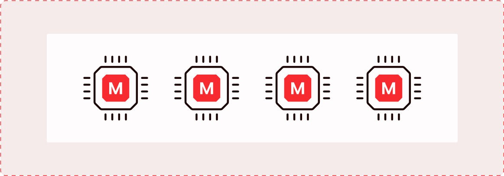
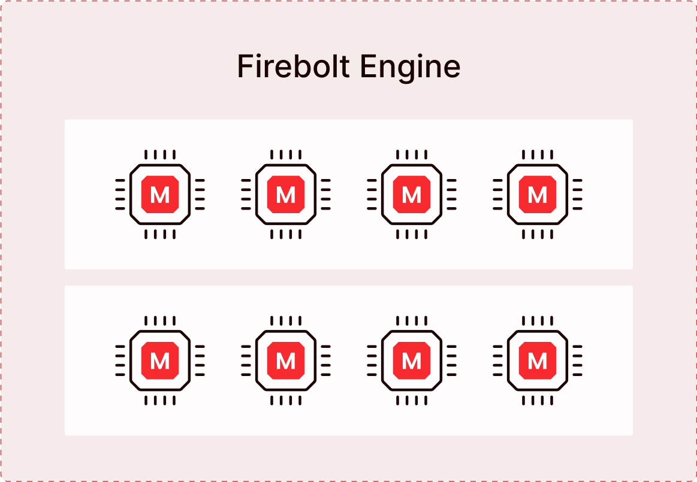

# Firebolt Engines
{: .no_toc}

 Engines are compute resources used to process data and serve queries in Firebolt. Engines will be used to ingest data into Firebolt and to execute DML queries on the ingested data. 

Firebolt Engines provide full workload isolation, enabling multiple workloads to run independent of each other while sharing access to the same data. In addition, engines are fully decoupled from databases, meaning an engine can be used with multiple databases and a given database can be used with multiple engines.

 Engines can be started, stopped and modified at any time using SQL API. In addition, you can dynamically modify the configuration of engines depending on the needs of your workloads without stopping the engines.


## Key Engine Concepts

**Type** <br />
This attribute represents a compute node used as a building block for the engine. Compute nodes come in Small, Medium, Large, or X-Large sizes. Vertical engine scaling (scale-up or scale-down) is supported through this attribute.

**Nodes** <br />
This attribute represents the number (1 - 128) of compute nodes, allowing granular horizontal scaling to fine-tune query performance characteristics while avoiding overprovisioning and unnecessary cost. Both scaling in and out are supported.

**Clusters [Preview]** <br />
A cluster is a collection of compute resources, described by “Type” and “Nodes” attributes. A given Firebolt engine can contain one or more clusters. The maximum number of clusters is specified by the Clusters attribute. Only homogeneous cluster configurations (clusters with the same number of Nodes and Type) are supported within a single engine. Users can leverage the “Clusters” attribute to support query concurrency scaling.

{: width="600" .centered}
 <br /> **An engine cluster with four nodes of type 'M'** 
 {: style="color: red; font-size: 90%; text-align: center;"}


{: width="600" .centered}
 <br /> **A Firebolt engine with two clusters, each cluster containing four nodes of type 'M'** 
 {: style="color: red; font-size: 90%; text-align: center;"}

<br />
The three attributes-  Type, Nodes and Clusters - together form the configuration or topology of an engine.

To create an engine, use the [CREATE ENGINE command](../sql_reference/commands/engines/create-engine.md), specifying the node type to be used for the engine, number of clusters and number of nodes per cluster. For example, the command below will create an engine with node type ‘S’,  one cluster and four nodes per cluster:

CREATE ENGINE IF NOT EXISTS MyEngine WITH
TYPE = M NODES=4 CLUSTERS=2;

For a full list of engine attributes, see [CREATE ENGINE](../sql_reference/commands/engines/create-engine.md)


## Multi-dimensional Elasticity
Firebolt engines enable dynamic and fully online scaling operations, meaning you do not need to stop your engines to scale them. In addition, Firebolt supports scaling operations  along any of the three dimensions - Scaling up/Down with engine Type, Scaling out/in with number of nodes and adding/removing Clusters for concurrency scaling. This multidimensional scaling allows you to fine-tune the price-performance characteristics of engines and dynamically scale your compute resources based on your workload requirements. 
Use the ALTER ENGINE command to modify the configuration of an engine. This command will dynamically scale the engine even while it is running, without impacting the workload. 

For example, to horizontally scale an engine, MyEngine, from two nodes to three nodes, use the ALTER command as shown below:

```sql
ALTER ENGINE MyEngine SET NODES = 3;
```

Similarly, you can change the type of node used in an engine from ‘M’ to ‘L’ as below:

```sql
ALTER ENGINE MyEngine SET TYPE = L;
```

You can modify more than one attribute at the same time as below:

```sql
ALTER ENGINE MyEngine SET NODES = 3 TYPE = L;
```

For more information on modifying engines, see [ALTER ENGINE](../sql_reference/commands/engines/alter-engine.md).

**NOTE**: Multi-cluster engines and online scaling are in preview. By default, engines are limited to a single cluster. You can dynamically modify a running engine to scale up or scale down, but currently running queries may not run to completion. If you would like to try multi-cluster engines or online scaling, reach out to Firebolt Support.


## Connecting to Engines
You can connect to an engine via the UI, Engine URL or via 3rd party connectors such as Airflow and DBT. The engine URL is based on your account name and org name, with the following format:

                                           <account-name>.<org-name>.region.firebolt.io 

The account-name + org-name should be limited to 62 characters.

For more information on how to connect to engines using third-party connectors, visit [Integrate with Firebolt](../Guides/integrations/integrations.md).


## Monitoring Engine Usage
You can use the following observability views to understand the current engine usage and utilization:  1) engine_metrics_history and 2) engine_running_queries. The information provided by these two information_schema views can be used to decide whether you need to change the engine configuration (Type, Nodes or Clusters) based on the needs of your workload.

The [engine_metrics_history](../sql_reference/information-schema/engine-metrics-history.md) view gathers engine resource utilization metrics such as CPU and RAM consumption at a given time (snapshot). Utilization snapshots are captured every 30 seconds and retained for 30 days, allowing users to understand engine utilization and consumption trends. 

The [engine_running_queries](../sql_reference/information-schema/engine-running-queries.md) view exposes information about queries currently running or waiting to be run in the system.  Based on the number of queries that are queued and waiting to be executed, you can modify the engine configuration that best fits your performance requirements.

To understand how this information can help with engine resizing, see [Working with Engines](../Guides/working-with-engines/sizing-engines.md).


## Engine Governance and Security
You can use account-level Isolation and [Role Based Access Control (RBAC)](../Guides/security/rbac.md)  to provide strict governance over data access and infrastructure costs.

You can create multiple accounts within a given organization, where each account can represent a fully isolated environment such as development, test, or production. This enables engines across different environments to be fully isolated from each other. In addition, the Firebolt RBAC model enables granular control over resources that are created within a given account. This allows administrators to fully control users' actions over engines within a given account - for example, control which users are allowed to modify the configuration of which engines or to control which users can create new engines. 

For more information on using RBAC for engines, see [Governing Engines](../Guides/working-with-engines/rbac-for-engines.md). 

## Viewing and understanding engine status
Use the [SHOW ENGINES](../sql_reference/commands/metadata/show-engines.md) command to list all the engines in your Firebolt account and view the status of these engines. The table below shows the statuses returned by the `SHOW ENGINES` command.

| `SHOW ENGINES` and UI |   Description                     
| :-------------------- | :------------------------------- | 
| Starting              | The engine start has been initialized. It is provisioning resources, and will be ready to use soon.   |
| Running               | The engine is running queries or available to run queries. Engine can be modified while it is running.|
| Resizing              | The engine is currently being resized after an ALTER ENGINE command. The engine will be in this state when the   user has issued a request to change the engine TYPE, number of nodes (NODES) or number of clusters (CLUSTERS).
| Stopping              | The engine is shutting down. It is finishing query tasks in process and is not available for new queries. |
| Stopped               | The engine is stopped. It is not available to run queries. |


