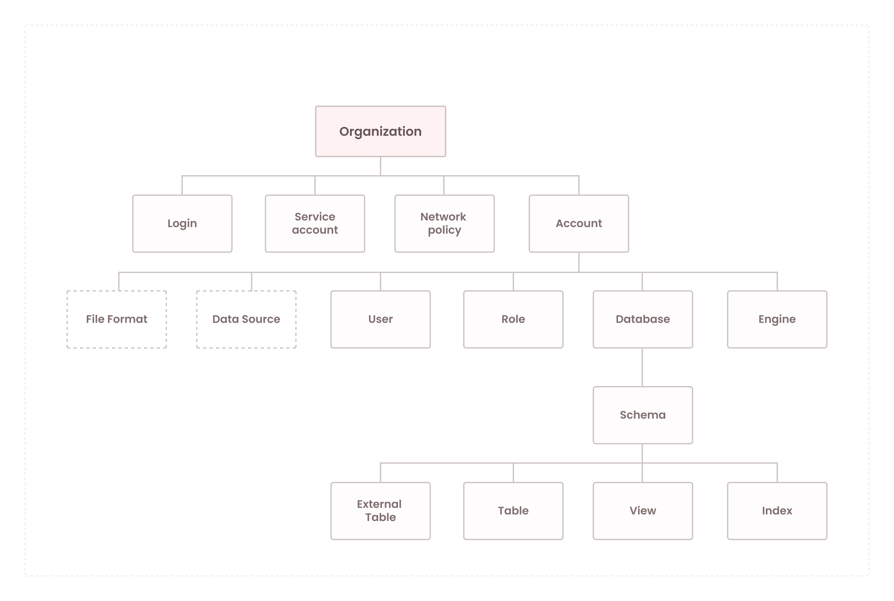

# Organizations and accounts
{: .no_toc}

Today, companies are challenged with establishing a solid governance model to manage their cloud data warehouse resources. Data security, cost management, resource isolation, and observability are among some of the challenges that various organizations face that a governance model must address.
For example, development, staging and production environments require isolation from each other to limit the blast radius of any development changes spilling into production by mistake, or to limit a developer's access to only their code base and data. Departments in a company need to isolate and provide access to only their teams while limiting access to other departments. Another requirement may be to provide consolidated billing, but with the ability to understand consumption by department or development environment.

To address these requirements, Firebolt supports concepts of organizations and accounts. Achieve a seamless separation between different accounts within your organization while additionally benefitting from consolidated billing, unified authentication, and efficient account management across all accounts. Organizations and accounts provide you with flexibility and structure to fit your needs. During the registering process, Firebolt allows creation of your organization and the first account while giving you the opportunity to create additional accounts either manually or programmatically as you go.

The Firebolt object model is hierarchical and comes with strong containment properties - parent objects can contain one or more child objects. Child objects are sole children of their parent objects (and cannot be shared). Furthermore, there are two classes of objects: global and regional. As the name suggests, global objects are managed globally and can contain objects that are deployed and grouped regionally. 

The picture below depicts a Firebolt object model.

Learn more about registering with Firebolt and creating your organization [here](../Guides/managing-your-organization/creating-an-organization.md).

* Topic ToC
{: toc}

## What is an organization?
An organization is a fundamental object in Firebolt, providing a logical structure for managing accounts, billing, and authentication. When registering to Firebolt, the organization name you’ll provide is the same as the domain name you use in your email. Organization names are globally unique—no two organizations can have the same name - but can contain multiple accounts. Each account, in turn, contains users, roles, databases, tables, views, engines, and more.

Organizations are used to create a structure that fits your needs: by setting up accounts within organizations, you establish a structured framework that aligns with your business needs, data management requirements, and geographical considerations. This allows for better resource allocation, access control, and overall management of your accounts, using:
 
- **Global authentication method:** Firebolt handles user authentication and access control at the organization level. A login (represented by an email) is created for each user accessing Firebolt.
- **Programmatic access:** [Service accounts](../Guides/managing-your-organization/service-accounts.md) enable programmatic access to Firebolt.
- **Network policy enforcement:** [Network policies](../Guides/managing-your-organization/network-policies.md) provide fine-grain control of IP ranges that are allowed or blocked from accessing an organization.

## What is an account?
An account in Firebolt is an object within an organization that encapsulates resources for storing, querying, and managing data. Accounts provide:
 
- **Access control:** Firebolt implements Role-based access control (RBAC). Every object in the Firebolt object model is a securable and it comes with a set of permissions. Permissions allow administrators to control functionality Firebolt users can exercise when logged-in.
- **Data modeling:** Through objects (such as databases, tables, views, indexes and others) developers and architects can design their data warehouses and properly describe various business entities without compromising to deliver on ever-demanding performance needs.
- **Cost control:** With engines, system administrators can deploy engines that fit the need while achieving desired price-performance characteristics. Engines can scale vertically (up and down) and horizontally (out and in) to meet demanding business needs while allowing granular cost control.
- **Workload management:** With compute, data, and metadata separation, Firebolt offers full workload isolation. Firebolt users can deploy, if desired, separate engines to support heterogeneous workloads, while having access to the same data. Whether you have a data intensive application that requires instantaneous access to the data, or a complex business-critical dashboard that requires timely refresh, or need to run a complex Extract-Load-Transform (ELT) process to ingest data, Firebolt engines are there to support all needs.

## Authentication and access control
Organizations help enforce advanced authentication security policies and ensure compliance across all accounts using network policies, multi-factor authentication, and SSO to make authentication secure and easy. Users can authenticate using logins to access the user interface and service accounts for programmatic access. 

Access control within an account is managed with roles. Roles determine users' access level within an account. By assigning roles to users, admins can control their permissions to perform actions on databases, tables, views, and other objects within the account. This set up allow data governance: regularly reviewing and updating [role-base access control (RBAC)](../Guides/managing-your-organization/rbac.md) at the account level helps you remain in conformance with industry regulations and internal standards, and ensures that data are handled, stored, and accessed in a manner that meets compliance requirements.

### Single Sign-On (SSO)
Firebolt offers [Single Sign-On (SSO)](../Guides/managing-your-organization/sso/sso.md) functionality, allowing users to log in to the organization using their existing enterprise credentials. This authentication option provides: 
- **Seamless login experience:** With SSO, users can log in to Firebolt using their enterprise credentials, eliminating the need to remember and manage separate login credentials.
- **Centralized user management:** SSO allows you to manage user access and authentication centrally, simplifying user onboarding and offboarding processes. 
- **Enhanced security:** SSO helps enforce strong authentication standards, and reduces the risk of unauthorized access by leveraging enterprise-grade authentication mechanisms. 

### Network Policies and Multi-Factor Authentication (MFA)
Firebolt enforces network policies and provides multi-factor authentication (MFA) at the organization level to enhance security. This allows: 

- **Network policies:** [Network policies](../Guides/managing-your-organization/network-policies.md) help you define and enforce rules regarding inbound and outbound network traffic. This allows you to restrict access to your Firebolt objects based on IP ranges (subnets) or other network-specific parameters. Network policies can be configured for the entire organization, per login, or per service account for more granular restrictions to protect against potential security threats.
- **Multi-Factor Authentication (MFA):** Firebolt supports [multi-factor authentication](../Guides/managing-your-organization/enabling-mfa.md) at the organization level, adding an extra layer of security to the authentication process and reducing the risk of unauthorized access even if passwords are compromised by requiring users to provide a verification code along with their login credentials. 

## Billing
Firebolt provides billing at the organization level, but gives you billing observability at both organization and account levels. This allows: 

- **Organization-level governance:** Monitor and analyze the overall billing for all accounts to gain insights into the organization's cost distribution and resource utilization at the organization level. 
- **Account-level observability:** Delve into detailed billing information specific to each account, allowing you to track individual accounts' usage, costs, storage, and compute consumption patterns.