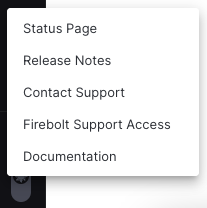
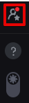

# Help menu
{:.no_toc}

The Firebolt help menu is found in the bottom left corner of the screen, appearing as a ```?``` sign.


## Menu options

This menu has four different options: 



### Status page
The status page allows you to view the operational status of systems in real time, as well as descriptions of historical incidents.

You can subscribe to notifications whenever Firebolt **creates**, **update** or **resolve** an incident via the following options:
1. **Email notification** - by providing your email address.
2. **Text notifications** - by providing your phone number.
*Please note that text messages will only notify you when Firebolt creates or resolves an incident.*
3. **Slack notifications** - by connecting via Slack.
*Please note - you can also get maintenance status through Slack* 
4. **RSS updates** - by connecting via your RSS/Atom application.

### Contact Support - Reaching out to Firebolt Support
Contact Support allows you to create a support case for Firebolt's support team.

To create a case: 

1. Click on "Contact Support"
2. A support form will appear, with the following information populated **automatically**:
    <br>a. **First Name**
    <br>b. **Last Name**
    <br>c. **Company** - this is the name of your Firebolt account
    <br>d. **Email**
4. Fill in the following:
    <br>**Severity** - please choose the severity of your case according to the following severity categories:

    - *Critical*: You are currently experiencing a loss of critical functionality when using Firebolt. For example, your engine is unable to start.
    - *Urgent*: Your critical functionality is being intermittently impacted. For example, your engine freezes, sometimes.
    - *Tolerable*: Your services remain usable, with only non-critical functionality being affected. For example, a certain SQL query is throwing an error.
    - *Question*: Your operations are running smoothly and are not affected. You might have a question or want to report a minor UI issue.
    
    <br>**Engine name** - please fill in the name of the engine where you have experienced the issue.
    <br>**Subject** - try to be as clear and descriptive as possible.
    <br>**Description** - please include any relevant information for the case. Especially:
    - What were you trying to achieve when the issue occurred? 
    - What was expected to happen? 
    - What has happened instead? 
    - Any error code or message.  
5. Click "Submit"
6. The case will be sent to our Support team, and you will receive a confirmation email. 


### Release Notes
The Release Notes link brings you to Firebolt's [latest version release notes](release-notes/release-notes.md).

### Firebolt Support Access
Firebolt Support Access allows you to control the access of Firebolt's support team to your account.

For new accounts support access is enabled by default, still you can revoke it at any time.

All activity of the support team is logged and can be viewed in the [query history](../sql_reference/information-schema/engine-query-history) same as for other users.

To grant access:
1. Select "Firebolt Support Access"
2. A support access form will appear, with the following information populated **automatically**:
    <br>a. **Account Name**
    <br>b. **Duration**
    <br>c. **Assign Roles**
3. Fill in the following:
    <br>**Duration** - please choose the duration of the support access. Once the duration expires, the access will be automatically revoked.
    <br>**Assign Roles** - please choose the role(s) you would like to assign to the support team. Their access will be limited to the roles you assign. You can create dedicated role following the [instructions here](../Guides/security/rbac#ui). Please, also notice that the support team will have full access to the organization level data.
4. Select "Grant Access"

Once granted, you will see additional icon in the bottom left corner of the screen, indicating that Firebolt's support team has access to your account.



To edit access:
1. Select the support access icon in the bottom left corner of the screen and click on "Manage access" button. (Alternatively you can open same screen by clicking on "Firebolt Support Access" in the Help menu)
2. Select "Edit Access" button.
3. Make the necessary changes and click "Update Access".

To revoke access:
1. Select the support access icon in the bottom left corner of the screen and click on "Manage access" button. (Alternatively you can open same screen by clicking on "Firebolt Support Access" in the Help menu)
2. Select "Revoke Access" button.

Once revoked, the support access icon will disappear from the bottom left corner of the screen.

### Documentation
The Documentation link brings you to Firebolt's docs (where you are now!)


### Documentation
The Documentation link brings you to Firebolt's docs (where you are now!)
